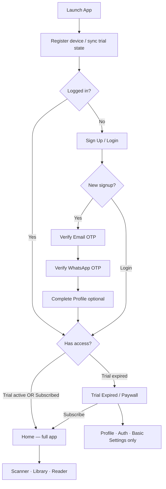
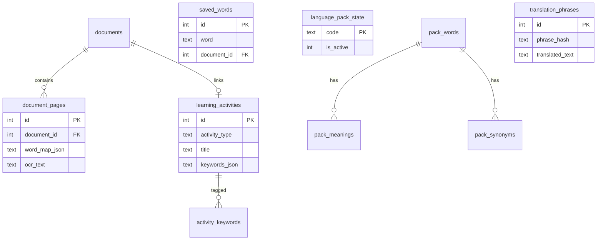

# AI Language Tutor — Complete App Build Specification

> **Cursor prompt file for Cheradip** — Single source of truth to build a production-quality, offline-first Android app with modern Material 3 UI, optional AI enhancement, and word-level learning from real-world text.

**App version:** 1.0.0 (shipping) · **v2.0.0 spec:** ready (local AI engine — do not implement until requested) · **Spec revision:** 1.4.3 · **Brand:** Cheradip · **Last updated:** June 2026

---

## How to Use This Document in Cursor

1. Attach or `@`-reference this file at the start of every build session.
2. Implement **one build phase at a time** (see [Build Order](#build-order-mandatory-sequence)).
3. Do not skip ahead — later phases depend on OCR word maps, SQLite lookup, and offline packs.
4. Treat **P0 requirements** as release blockers; P1/P2 can follow in later iterations.
5. When ambiguous, prefer: **offline > online**, **SQLite > network**, **batch AI > per-call AI**, **Compose > XML**.
6. **Auth + billing phases are release blockers** for Play Store monetization — do not ship publicly without **Phase 11–12**.
7. After each phase, run the **Phase Acceptance** checklist and a **performance spot-check** (see [Cursor Prompt Library](#cursor-prompt-library)).
8. Pin library versions from **Appendix A** — do not downgrade AGP, Billing 9.x, or Compose BOM without updating the spec.
9. **v2.0.0 is a separate release track.** Do not start v2 work unless the user explicitly asks to *upgrade to version 2.0.0*. When they do, follow [Version 2.0.0 — Local AI Engine](#version-200--local-ai-engine-future) and the [v2 Cursor Prompt Library](#v20-cursor-prompt-library--upgrade-to-200-only).

---

## Version roadmap

| Track | App `versionName` | AI backend | When to build |
|-------|-------------------|------------|---------------|
| **v1.0.0** | `1.0.0` | Optional cloud APIs via `cheradip.com/api/ailt/` (Gemini, Claude, OpenAI pool) + offline-first | **Now** — Play Store launch |
| **v2.0.0** | `2.0.0` | **Your personal PC** as primary AI engine; **5 curated AI modes** (not raw model picker); **3 tiers** Free / Pro / Plus | **Later** — only when user requests v2 upgrade |

### v1 → v2 upgrade rule (mandatory for agents)

When the user says **“upgrade to version 2.0.0”** or **“develop v2”**:

1. **Audit v1.0.0 first** — read `BUILD_STATUS.md`, run codebase audit prompt, list ✅ / 🔄 / ⬜.
2. **Do not delete v1 features** — extend or replace behind feature flags (`AiBackend.LOCAL_HOME`, `AiBackend.CLOUD_POOL`).
3. **Keep offline-first ADRs** — word meanings from SQLite packs; **no per-word AI** (see ADR below).
4. **Implement v2 phases V2-0…V2-8 in order** (see [v2 build order](#v20-build-order-mandatory-sequence)).
5. Bump `versionName` to `2.0.0` only after V2-8 acceptance.

---

## Cursor Prompt Library

Copy-paste one prompt per session. Always `@`-reference `ailanguagetutor.md`.

### Session starters (use every time)

```
@ailanguagetutor.md Read Product Identity, Architecture Decision Records, and the current
build phase. Summarize what is already implemented in this repo, then implement only the
next incomplete phase step. Match existing code style. Offline-first. No ads. Max 3 active packs.
```

```
@ailanguagetutor.md Audit this codebase against the spec. List gaps vs current phase exit
criteria, conflicts with ADRs, and missing tests. Do not implement yet — report only.
```

```
@ailanguagetutor.md Phase acceptance review: verify compile, API 26 + 35, light/dark theme,
offline path, and Performance Requirements for the work just completed. Fix blockers only.
```

### Build phases (complete set — one prompt per phase)

| Phase | Prompt |
|---|---|
| **0** | `@ailanguagetutor.md Phase 0 + Appendix A. Scaffold multi-module Gradle, Hilt, Compose BOM 2026.05.00, theme, nav, versionName 1.0.0.` |
| **1** | `@ailanguagetutor.md Phase 1. CameraX scanner, gallery import, crop, multi-page strip. Save to internal storage.` |
| **2** | `@ailanguagetutor.md Phase 2 + OCR Pipeline + WordMapBuilder. ML Kit 19.0.1, Tesseract fallback, word_map_json.` |
| **3** | `@ailanguagetutor.md Phase 3. Reader: TappableText, paragraph layout, reading settings, tap offset resolution.` |
| **4** | `@ailanguagetutor.md Phase 4 + Complete Database Schema (pack dictionary.db). PackDatabaseConnector, definition sheet < 50ms.` |
| **5** | `@ailanguagetutor.md Phase 5 + Audio Pronunciation System. Teen male/female voice, TeenVoiceResolver, Settings → Audio.` |
| **6** | `@ailanguagetutor.md Phase 6 + World Languages Catalog. Bundle world_languages.json (243 langs, flagEmoji), LanguageCatalogRepository, LanguageFlagBadge on all pickers, WorkManager pack download, max 3 active.` |
| **7** | `@ailanguagetutor.md Phase 7 + Offline Translation Engine. Phrase → sentence → word-pivot, cache, offline paragraph UI.` |
| **8** | `@ailanguagetutor.md Phase 8 + Interactive Practice Modes Hub. Say/Write/Scan, voice calibration (40-word), 1–3 langs, flags on selection, SyncedTextDisplay karaoke TTS.` |
| **9** | `@ailanguagetutor.md Phase 9 + Learning Activity Journal. Gemini 2.5 Flash titles (batch only), FTS, Write/Listen, practice session types.` |
| **10** | `@ailanguagetutor.md Phase 10. Onboarding: 1–3 languages with flags, pack download, teen voice, Settings hub, basic vs learning settings split.` |
| **11** | `@ailanguagetutor.md Phase 11 + Authentication. Email + WhatsApp OTP, profile, single-device session, SessionRevokedDialog.` |
| **12** | `@ailanguagetutor.md Phase 12 + Subscription & Monetization + Referral Program + Promo Codes + Admin Console. Trial, Billing 9.x, hard lock, referrer 20% credits, promo discount field on Paywall, admin promo CRUD (server + app gate).` |
| **13** | `@ailanguagetutor.md Phase 13 + AI Enhancement Layer. Batch-only AIManager, ai_cache, explainParagraph — never explainWord.` |
| **14** | `@ailanguagetutor.md Phase 14 + Testing Strategy + Deployment checklist. Tablet layout, unit tests, release AAB, verify no ad SDKs.` |

### v1.0.0 improvements (apply before or during v1 polish — safe now)

These close gaps from the v2 design **without** requiring the home AI server:

```
@ailanguagetutor.md Phase 8 + Answer Mode Engine + Translation Mode Engine. Add mandatory
ModeSelectionScreen before Reader/Practice processing: ANSWER (AI tutor) vs TRANSLATION (direct).
Wire AnswerModeEngine + TranslationModeEngine; offline path first, AI batch optional.
```

```
@ailanguagetutor.md Unified Input Pipeline. Typed text input + voice (SpeechToTextEngine) feed the
same ProcessTextUseCase as OCR output. Home → Input type (Scan | Type | Speak) → Mode select → process.
```

```
@ailanguagetutor.md Phase 13 + Admin AI providers. Admin dashboard: provider health, routing mode
(random free pool / paid fallback). Server keys never in APK. See server/README.md admin/ai/*.
```

```
@ailanguagetutor.md Phase 7 + Phase 8 Translation Mode. Translation Mode uses OfflineTranslationEngine
first; call cloud/local AI only when pack pivot misses. Never AI per sentence in a loop — batch paragraph.
```

```
@ailanguagetutor.md WordDefinitionSheet + Complete Database Schema. Word tap = SQLite pack lookup
top-3 meanings + example + TTS. FORBIDDEN: explainWord AI endpoint or per-tap API calls.
```

### v2.0.0 upgrade gate (run ONLY when user asks for v2.0.0)

```
@ailanguagetutor.md Version 2.0.0 upgrade gate. Audit v1.0.0 (BUILD_STATUS.md + repo). Summarize
gaps. Then implement next incomplete V2 phase only. Local home PC AI is primary; paid cloud burst optional.
Keep cheradip.com for auth/billing/packs. Match existing multi-module architecture — do not rewrite as monolith.
```

```
@ailanguagetutor.md V2-3 + AI Engine Modes. ModeSelectionScreen: Answer vs Translation intent;
AI mode picker: Pro users modes 1–3 (+ Mode 4 auto OCR); Plus users modes 1–3 and 5 (+ Mode 4 auto OCR).
Mode 5 hidden on Pro; PlusUpgradeSheet if Pro tries Mode 5.
See server/ai-modes.example.json.
```

```
@ailanguagetutor.md V2-7 + Subscription tiers. Paywall: Pro **$2/mo actual** ($1 effective with LAUNCH50) $20/yr;
Plus **$5/mo actual** $50/yr. Admin promo CRUD: name + discount %; 0 = expired. Play SKUs cheradip_alt_pro_* and cheradip_alt_plus_*.
CheckAppAccessUseCase: PRO_ACTIVE vs PLUS_ACTIVE. Mode 5 requires PLUS.
```

See full v2 phase table in [v2 Cursor Prompt Library](#v20-cursor-prompt-library--upgrade-to-200-only).

---

```
@ailanguagetutor.md "Language Pack Builder Tool". Implement tools/pack-builder CLI:
DictionaryImporter, TranslationImporter, PackZipper, validate, build-tier1 from catalog/world_languages.json.
```

```
@ailanguagetutor.md "Complete Database Schema" (app Room DB). Implement all CREATE TABLE statements,
FTS triggers for learning_activities, voice_calibration, practice_sessions. Migrations v1.
```

```
@ailanguagetutor.md "Synchronized Voice–Text Marker (Karaoke Mode)". Implement SentenceBoundaryDetector,
SynchronizedTtsEngine (one segment per utterance), SyncedTextDisplay, Play All in Order.
```

```
@ailanguagetutor.md "World Languages Catalog" + Language flag marker. LanguageFlagMarker, LanguageSelectChip,
flag on every picker/chip/reorder row. Never show language without flag + name.
```

```
@ailanguagetutor.md "Cheradip Server API". Implement Retrofit client stubs + DTOs for auth, billing,
/referral/*, /promo/*, /admin/* (promo CRUD), /languages/list — server logic optional for local mock.
```

```
@ailanguagetutor.md "Referral Program". Referrer shares email or WhatsApp username; referred user
enters reference at signup/Paywall; server credits 20% commission to referrer balance on each payment.
Fetch /referral/policy for live rules (author may change anytime). ReferralShareScreen + balance in Settings.
```

```
@ailanguagetutor.md "Promo Codes" + Paywall. Optional promo code field; POST /promo/validate before purchase;
include promoCode in POST /billing/verify. Show discounted price in UI; never trust client-only discount.
```

```
@ailanguagetutor.md "Admin Console". Server role=admin; bootstrap seed user (server env only — never APK).
After login, admin-only route: create/edit/deactivate promo codes (code + discountPercent + dates + maxUses).
Admin may update referral commission % via /admin/referral-policy. Gate with role check server + client.
```

### Complete spec-section prompts (every major feature)

Use these when a phase is large or you need to implement one spec chapter in isolation.

```
@ailanguagetutor.md "Complete Kotlin Architecture" + BUILD_STATUS.md. Wire module dependencies
per Gradle Module Map. feature → domain ← core; no core → feature deps. Hilt modules per layer.
```

```
@ailanguagetutor.md "UI/UX Design System". Implement CheradipTopBar, LanguageChip (flag+name),
EmptyStateView, OfflineBanner, LoadingSkeleton in :ui:components. Material 3 tokens from :ui:theme.
```

```
@ailanguagetutor.md "Screen Flows & Navigation". Implement AppNavHost with all Routes constants,
bottom nav (Home/Practice/Learning/Languages/Settings), stack destinations for scanner/reader.
```

```
@ailanguagetutor.md "Word-Level Learning System". LookupWordUseCase, WordDefinitionSheet,
top-3 meanings from pack DB only (never AI), 🔊 teen voice, save to saved_words.
```

```
@ailanguagetutor.md "Voice Input Calibration (Required for Say)". VoiceCalibrationRepository,
40-word paragraphs (mandatory 1 + optional 2–3 per lang), ≥85% STT match, gate Say until para 1 done.
```

```
@ailanguagetutor.md "Single-Language Mode" + Practice Combinations. 1 lang = intra-language only;
2–3 langs = A1–A4/T1–T4 matrix; resolveComboId(); flag on every language picker.
```

```
@ailanguagetutor.md "User Profile". CompleteProfile wizard, profile editor, mandatory vs optional
fields, native/target languages suggest PracticeLanguageConfig (max 3).
```

```
@ailanguagetutor.md "Authentication & Single-Device Session". AuthRepository, OTP flows,
SessionInterceptor, SESSION_REVOKED, deviceId in EncryptedSharedPreferences.
```

```
@ailanguagetutor.md "Subscription & Monetization" + AppAccessGate + Referral Program + Promo Codes.
CheckAppAccessUseCase, TRIAL_EXPIRED hard lock, Paywall with promo field, ReferralShareCard,
restore purchases, Billing 9.x verify server-side with optional promoCode + referrerUsername.
```

```
@ailanguagetutor.md "Deployment & Release" + Appendix B–D. Manifest permissions, Play product IDs,
release AAB, verify zero ad SDKs in dependencies.
```

```
@ailanguagetutor.md Appendix C. Bundle dev sample pack in assets/sample-pack/ for Phase 4 testing
without server download.
```

```
@ailanguagetutor.md "Complete Database Schema" — pack dictionary.db + translation.db READ_ONLY
schemas. PackDatabaseConnector.open(code); ATTACH or separate connections; max 3 active.
```

```
@ailanguagetutor.md "OCR Pipeline & Word-Position Mapping Algorithm" + OpenCV in :core:image.
Downscale >2048px edge, perspective warp, ML Kit script router from catalog ocrEngine field.
```

```
@ailanguagetutor.md "Document library" + scanner flow. Save/reopen/delete documents, multi-page
document_pages in Room, link to learning_activities on save.
```

```
@ailanguagetutor.md "Study list" (saved_words). Group by language, flag marker per language row.
```

```
@ailanguagetutor.md "Write Mode" + "Listen Mode" (Learning Activity Journal). Routes WRITE/LISTEN,
save → activity with AI metadata batch call; Listen uses teen voice from VoicePreference.
```

### Phase sub-task prompts (follow detailed steps in order)

Run **one sub-task per session** when a phase is complex. Check `BUILD_STATUS.md` before starting.

**Phase 0** (if not done): scaffold → theme → Routes → MainActivity → `:core:common` Sha256Helper → stub all modules.

**Phase 1:** CameraX preview → gallery import → crop UI → multi-page strip → persist to internal storage.

**Phase 2:** OpenCV preprocess → ML Kit → Tesseract fallback → WordMapBuilder → save word_map_json to Room.

**Phase 3:** TappableText annotated offsets → LookupWordUseCase binary search → reading font settings.

**Phase 4:** Sample pack → PackDatabaseConnector → DictionaryRepository → WordDefinitionSheet <50ms.

**Phase 5:** PronunciationEngine → TeenVoiceResolver → VoicePreference DataStore → Settings/Audio → word 🔊.

**Phase 6:** LanguageCatalogRepository (243 JSON) → LanguageFlagBadge on all pickers → WorkManager download → max 3 active enforce in repo.

**Phase 7:** OfflineTranslationEngine phrase/sentence/pivot → translation cache → paragraph UI badge.

**Phase 8:** SpeechToTextEngine → VoiceCalibrationWizard → PracticeHub adaptive 1/2/3 langs → AnswerModeEngine → SyncedTextDisplay.

**Phase 9:** learning_activities + FTS → ActivityMetadataGenerator (Gemini 2.5 Flash batch) → My Learning search/filters.

**Phase 10:** onboarding_complete → 1–3 langs with flags → pack download step → teen voice step → Settings hub split basic/learning.

**Phase 11:** Register/VerifyEmail/VerifyWhatsApp → Login → recovery → ProfileRepository → SessionRevokedDialog.

**Phase 12:** DeviceFingerprintProvider → trial countdown → BillingRepository PBL 9.x → NavInterceptor
→ Paywall promo code → ReferralShare + balance → admin promo CRUD (role-gated) → `/billing/verify` with promo + referrer.

**Phase 13:** AIProvider interface → ai_cache → explainParagraph/cleanOCR only — forbid explainWord.

**Phase 14:** Unit tests all modules → tablet two-pane → Performance Requirements pass → release checklist.

### Mandatory after every phase (run all 4 — do not skip)

```
@ailanguagetutor.md Testing Strategy — add unit tests for the phase just completed. MockK + Turbine.
Assert phase exit criteria from Build Order table. Update BUILD_STATUS.md checkboxes.
```

```
@ailanguagetutor.md Critical Constraints + "Never Do" — scan repo for violations (explainWord, AdMob,
TRIAL_EXPIRED leaks, language without flag, client-only billing unlock, >3 active packs). Fix all.
```

```
@ailanguagetutor.md Phase acceptance review + Phase Acceptance Template. Compile, API 26+35,
light/dark, offline where applicable, no P0 TODOs left in phase scope.
```

```
@ailanguagetutor.md Performance Requirements — if phase touched OCR/DB/packs/reader/translation/TTS:
run Optimization Checklist items for that area; report metrics or N/A.
```

### Performance & optimization prompts (run after Phases 2, 4, 6, 7, 8, 14)

```
@ailanguagetutor.md Performance Requirements + Optimization Checklist. Profile and fix:
OCR downscale before ML Kit (< 2s/page), word lookup < 50ms (warm pack DB), Room on Dispatchers.IO,
single read-only pool per active pack (max 3), lazy TTS/OpenCV init, Compose list stable keys,
no main-thread SQLite. Report before/after metrics.
```

```
@ailanguagetutor.md Performance Requirements. Reader scroll 60fps: audit LazyColumn/LazyVerticalGrid
for remember keys, derivedStateOf, avoid recomposition in TappableText word map. Fix jank only.
```

```
@ailanguagetutor.md Optimization Checklist. Release build: enable R8 shrinking, verify base APK
target < 50MB excluding packs, audit memory during reader + 1 pack (< 300MB active).
```

```
@ailanguagetutor.md Language Pack System. WorkManager resumable download: kill app mid-download,
verify resume + SHA-256 check. Pack extract on IO thread; never block main thread.
```

```
@ailanguagetutor.md Offline Translation Engine + Performance Targets. Phrase lookup < 10ms,
paragraph word-pivot < 200ms, cache hit < 5ms. Add indexes if needed; measure with unit benchmarks.
```

### Quality, tests & constraints

> **Prefer the [Mandatory after every phase](#mandatory-after-every-phase-run-all-4--do-not-skip) block** — it combines tests + constraints + acceptance + perf. Use these only for mid-phase spot checks:

```
@ailanguagetutor.md Testing Strategy — unit test one specific class (name it). MockK + Turbine only.
```

```
@ailanguagetutor.md Critical Constraints checklist — verify one constraint area (pack limit / trial lock / no AI per word).
```

### Debug / fix prompts

```
@ailanguagetutor.md OCR Pipeline. Tap offset misses words — debug WordMapBuilder offsets vs
TappableText layout; fix binary search in LookupWordUseCase without changing unrelated code.
```

```
@ailanguagetutor.md Interactive Practice Modes Hub. Say blocked incorrectly — trace VoiceCalibrationRepository,
paragraph1Completed gate, and SpeechRecognizer language locale vs catalog code.
```

```
@ailanguagetutor.md Subscription & Monetization. Trial lock or billing regression — trace
CheckAppAccessUseCase, NavInterceptor blocked routes, Billing 9.x purchase verify flow.
```

```
@ailanguagetutor.md Language Pack System. Download fails or checksum mismatch — trace WorkManager,
SHA-256 verify, extract path, PackDatabaseConnector.open.
```

```
@ailanguagetutor.md Referral Program + Promo Codes. Referrer not credited — trace POST /referral/attribute
timing vs /billing/verify; promo validate token expiry; commission must be server-side only.
```

---

### Master coverage checklist (nothing skipped)

Track in `BUILD_STATUS.md`. Every row must reach ✅ before v1.0.0 ship.

| # | Area | Primary prompt | Spec section |
|---|------|----------------|--------------|
| 1 | Gradle scaffold | Phase **0** | Build Order · Appendix A |
| 2 | Scanner | Phase **1** | Feature Scope P0 |
| 3 | OCR + WordMap | Phase **2** + OCR deep-dive | OCR Pipeline |
| 4 | Reader | Phase **3** | Word-Level Learning |
| 5 | Dictionary + pack DB | Phase **4** + pack schema prompt | Complete Database Schema |
| 6 | Teen TTS | Phase **5** | Audio Pronunciation System |
| 7 | 243 langs + flags + download | Phase **6** + World Languages prompt | World Languages Catalog |
| 8 | Pack builder CLI | Pack builder prompt | Language Pack Builder Tool |
| 9 | Offline translation | Phase **7** | Offline Translation Engine |
| 10 | Practice Hub + calibration | Phase **8** + Karaoke prompt | Interactive Practice Modes Hub |
| 11 | Journal + Write/Listen | Phase **9** | Learning Activity Journal |
| 12 | Onboarding + Settings | Phase **10** | Screen Flows · Settings |
| 13 | Room app DB | Room schema prompt | Complete Database Schema (app) |
| 14 | Auth + profile | Phase **11** + User Profile prompt | Authentication · User Profile |
| 15 | Trial + billing | Phase **12** | Subscription & Monetization |
| 16 | AI batch layer | Phase **13** | AI Enhancement Layer |
| 17 | Server API stubs | Cheradip Server API prompt | Cheradip Server API |
| 18 | Tests + perf + release | Phase **14** + Deployment prompt | Testing · Deployment |
| 19 | UI components | UI/UX Design System prompt | UI/UX Design System |
| 20 | Navigation + access gate | Navigation + AppAccessGate prompts | Screen Flows · Subscription |
| 21 | Document library | Document library prompt | Screen Flows |
| 22 | Study list | Study list prompt | Word-Level Learning |
| 23 | Constraint scan | Mandatory after every phase | Critical Constraints |
| 24 | Performance pass | Mandatory + perf prompts | Performance Requirements |
| 25 | Referral program (20% credits) | Referral Program prompt + Phase 12 | Referral Program |
| 26 | Promo codes on Paywall | Promo Codes prompt + Phase 12 | Promo Codes |
| 27 | Admin promo + policy | Admin Console prompt + Phase 12 | Admin Console |

### What was originally missing (now in this library)

| Was missing | Now covered by |
|---|---|
| Phases **1, 2, 4, 5, 6, 7, 13, 14** | Build phases table + phase sub-task prompts |
| **243-language catalog + flags** | Phase 6 + World Languages + LanguageChip prompt |
| **Teen voice / Audio** | Phase 5 + teen voice debug prompt |
| **Room app schema + migrations** | Room schema prompt + Phase 9/13 entities |
| **Karaoke TTS sync** | Feature deep-dive + Phase 8 sub-tasks |
| **Performance pass** | 5 perf prompts + mandatory after every phase |
| **Phase acceptance / audit** | Session starters + mandatory block |
| **Testing per phase** | Mandatory block #1 |
| **Server API stubs** | Cheradip Server API prompt |
| **Constraint violation scan** | Mandatory block #2 |
| **Pack builder CLI** | Pack builder prompt + checklist row 8 |
| **User profile** | User Profile prompt |
| **Voice calibration** | Voice Calibration prompt |
| **Single-language practice mode** | Single-Language Mode prompt |
| **Document library / study list** | Dedicated prompts |
| **Write/Listen modes** | Write/Listen prompt |
| **UI component library** | UI/UX Design System prompt |
| **Deployment / Play Store** | Deployment prompt |
| **OpenCV + OCR script routing** | OCR Pipeline prompt |
| **AppAccessGate / trial lock** | Subscription prompt + debug |
| **Referral 20% credits** | Referral Program prompt + checklist row 25 |
| **Promo code discounts** | Promo Codes prompt + checklist row 26 |
| **Admin promo management** | Admin Console prompt + checklist row 27 |

### Recommended session order (strict — follow every time)

1. **Session starter** — read spec + `BUILD_STATUS.md`, report repo state  
2. **One phase or sub-task prompt** — implement only that scope  
3. **Mandatory after every phase** — all **4** prompts (tests, constraints, acceptance, perf)  
4. **Update `BUILD_STATUS.md`** — mark phase/sub-task ✅  
5. **Next phase** — do not skip order 0→14  

### One-shot master prompt (full project — use only for planning, not coding)

```
@ailanguagetutor.md Read entire spec. Compare to repo + BUILD_STATUS.md. Produce a gap matrix:
every row in "Master coverage checklist" with status ✅/🔄/❌, file evidence, and the exact
next 3 prompts to run in order. Do not implement code — plan only.
```

---

## Table of Contents

1. [Product Identity](#product-identity)
2. [Project Vision & Core Philosophy](#project-vision--core-philosophy)
3. [Architecture Decision Records](#architecture-decision-records)
4. [Feature Scope (P0 / P1 / P2)](#feature-scope-p0--p1--p2)
5. [Complete Kotlin Architecture (MVVM + Modules)](#complete-kotlin-architecture-mvvm--modules)
6. [UI/UX Design System](#uiux-design-system)
7. [Screen Flows & Navigation](#screen-flows--navigation)
8. [Language Pack System](#language-pack-system)
9. [World Languages Catalog](#world-languages-catalog)
10. [Language Pack Builder Tool (Server-Side)](#language-pack-builder-tool-server-side)
11. [Complete Database Schema](#complete-database-schema)
12. [OCR Pipeline & Word-Position Mapping Algorithm](#ocr-pipeline--word-position-mapping-algorithm)
13. [Offline Translation Engine Design](#offline-translation-engine-design)
14. [Interactive Practice Modes Hub](#interactive-practice-modes-hub)
15. [Word-Level Learning System](#word-level-learning-system)
16. [Audio Pronunciation System](#audio-pronunciation-system)
17. [AI Enhancement Layer (Optional)](#ai-enhancement-layer-optional)
18. [Authentication & Single-Device Session](#authentication--single-device-session)
19. [User Profile](#user-profile)
20. [Learning Activity Journal](#learning-activity-journal)
21. [Subscription & Monetization](#subscription--monetization)
22. [Cheradip Server API](#cheradip-server-api)
23. [Performance Requirements](#performance-requirements)
24. [Critical Constraints](#critical-constraints)
25. [Recommended Tech Stack](#recommended-tech-stack)
26. [Build Order (Mandatory Sequence)](#build-order-mandatory-sequence)
27. [Testing Strategy](#testing-strategy)
28. [Deployment & Release](#deployment--release)
29. [Cursor Implementation Instructions](#cursor-implementation-instructions)
30. [Final Product Definition](#final-product-definition)
31. [Appendices](#appendix-a-sample-gradle-version-catalog)
32. [Cursor Prompt Library](#cursor-prompt-library)
33. [Version 2.0.0 — Local AI Engine (Future)](#version-200--local-ai-engine-future)

---

## Product Identity

| Field | Value |
|---|---|
| **App Name** | AI Language Tutor |
| **Subtitle** | Learn from real-world text in **243 world languages** — OCR, translation & audio |
| **Developer / Brand** | Cheradip |
| **Package** | `com.cheradip.ailanguagetutor` |
| **App version** | **1.0.0** (`versionName`) · `versionCode` **1** |
| **Platform** | Android phone + tablet (responsive) |
| **Min SDK** | 26 (Android 8.0) |
| **Target SDK** | 35 (Android 15) — Play Billing Library 9.x minimum |
| **Compile SDK** | 36 |
| **Primary Language** | Kotlin |
| **World language catalog** | **243 languages** (182 ISO 639-1 + 61 ISO 639-3) · `catalog/world_languages.json` |
| **Monetization** | **30-day free trial** → Pro **$2/month** actual (**~$1** with LAUNCH50) · **Referral + promo codes** · **No ads** |
| **Account model** | Single user · **one active device/session** at a time |

---

## Project Vision & Core Philosophy

### Vision

Build a powerful Android application that helps users learn any language directly from real-world content:

- Books · Notes · Documents · Images · PDFs

The app combines:

| Capability | Role |
|---|---|
| Document scanner | Capture real-world content (CamScanner-like) |
| OCR engine | Extract structured text + word positions |
| Offline dictionary | Top meanings, examples, synonyms from SQLite packs |
| Offline translation | Paragraph translation without network |
| Word interaction | Tap any word → learn instantly |
| Audio pronunciation | Teen male or female voice only — user choice |
| Optional AI layer | Batch enhancement only — never required |
| **Activity journal** | Auto AI titles + keywords + datetime — search & filter to revisit topics |
| **Practice Modes Hub** | Say/Write/Scan → Answer or Translate → text + voice in 1–3 selected languages |

### Core Philosophy (Non-Negotiable)

| # | Principle | Meaning |
|---|---|---|
| 1 | **Offline first** | Scan → OCR → read → define → pronounce works in airplane mode |
| 2 | **AI is optional** | Core UX identical with AI disabled |
| 3 | **SQLite is core** | Dictionary, caches, documents — all local |
| 4 | **Modular language packs** | **243-language catalog**; downloadable packs from Cheradip server; **max 3 active** at once |
| 5 | **Low-end friendly** | Smooth on 2 GB RAM budget devices |
| 6 | **No per-word AI** | AI batch-only at paragraph/page level |
| 7 | **Graceful degradation** | Missing pack, network, or AI never crashes the app |
| 8 | **Fair monetization** | 1-month full-access trial, then subscription — **never ads** |
| 9 | **Referral rewards** | Users share **email or WhatsApp username** as reference; referrer earns **20%** of referred user's subscription payments (policy server-controlled) |
| 10 | **Promo codes** | Discount codes validated server-side at subscribe; admin manages codes |
| 11 | **One device per account** | Login on a new device automatically ends the previous session |
| 12 | **Trial integrity** | Device + install history tracked server-side; reinstall does not reset trial |

---

## Architecture Decision Records

Explicit decisions for Cursor — do not second-guess these during implementation.

| Decision | Choice | Rationale |
|---|---|---|
| UI framework | **Jetpack Compose + Material 3 only** | Modern, responsive, less boilerplate than XML; matches "attractive UI" goal |
| Language flag marker | **Flag emoji on every language selection** | Each catalog entry has `flagEmoji`; shown in pickers, chips, lists, Practice Hub |
| Architecture | **MVVM + Clean Architecture** | Testable; clear separation UI / domain / data |
| Module strategy | **Multi-module from Phase 0** | `app`, `core:*`, `feature:*` — avoids costly refactor later |
| App database | **Room (SQLite wrapper)** | Type-safe migrations for app-owned data |
| Language pack DB | **Separate `dictionary.db` per pack** | Large, versioned, swappable; query via read-only connection or `ATTACH` |
| OCR primary | **Google ML Kit Text Recognition 19.0.1** (Latin, Play services) | Fast, on-device, maintained by Google |
| OCR fallback | **Tesseract4Android** | Rare scripts / ML Kit failure / user override |
| Image prep | **OpenCV Android** | Perspective correction, denoise — CamScanner-quality scans |
| DI | **Hilt + KSP** | Standard Android DI; KSP over kapt for build speed |
| Downloads | **WorkManager + OkHttp** | Resumable background language pack downloads |
| TTS primary | **Android TextToSpeech** | Offline, zero extra APK size |
| TTS voice choice | **Teenager only — Male or Female** | User picks gender; app never exposes adult or child voices |
| TTS extended | **Cheradip teen voice pack + eSpeak NG (P2)** | Bundled/downloadable teen voices when device TTS lacks suitable match |
| AI providers | **Pluggable interface + SQLite cache** | User brings own API key; app never depends on free tiers |
| Language codes | **ISO 639-1 primary, ISO 639-3 extended** | 243-language catalog; BCP 47 tags for variants (`zh-Hans`, `pt-BR`) |
| Max active packs | **3 at once** | User may **download any** of 243; activate up to 3 for learning |
| Voice input (Say) | **Calibration required** | 1×40-word paragraph per language (mandatory) + 2 optional paragraphs |
| Practice language pick | **1, 2, or 3 from catalog** | Settings UI adapts to count; must have active pack |
| Single-language mode | **Intra-language only** | If 1 language selected → answer/translate within that language only |
| Permissions | **Activity Result API** | Modern; no deprecated Accompanist permissions where avoidable |
| Payments | **Google Play Billing Library 9.x** | Required for Play Store subscriptions; server verifies purchase tokens |
| Auth | **Email + WhatsApp verification at signup** | Both channels verified via OTP before account activation |
| Login username | **Email OR WhatsApp** (user chooses primary) | Mandatory signup fields: full name, username, password |
| Session policy | **Single active device per account** | New login revokes previous refresh token server-side |
| Device ID | **Install-scoped UUID** in EncryptedSharedPreferences | Stable per install; sent on login/register |
| Entitlement cache | **Local Room + server sync** | Trial dates and subscription status cached locally |
| Free trial | **30 calendar days, full access** | Countdown runs **offline** from local + server anchors |
| Trial expiry | **Hard lock** | Only profile, auth, payment, basic settings remain |
| Reinstall policy | **No trial reset** | Server tracks device fingerprint + install history + user linkage |
| Ads | **Never** | No AdMob, no banners, no rewarded ads — subscription only |
| Activity metadata | **AI title + keywords on save** | One batch call per activity; cached; offline fallback title |

### Corrected AI Interface Note

The original draft included `explainWord(word, context)` on `AIProvider`. **That is rejected.** Per-word AI violates core constraints. The correct method is `explainParagraph(text, language)` — batch only. Word meanings always come from **offline SQLite**, never from AI.

---

## Feature Scope (P0 / P1 / P2)

### P0 — MVP (Must ship)

- Onboarding + permissions
- Camera scanner + gallery import + basic crop
- OCR (ML Kit) + word map + paragraph structure
- Text reader with tappable words
- Bundled sample language pack OR one downloadable pack for dev
- Offline dictionary lookup (top 3 meanings + examples)
- TTS pronunciation
- Document library (save / reopen / delete)
- Language pack download + activate/deactivate (max 3)
- Settings: theme, reading font size, **practice languages (1–3)**, teen tutor voice
- Material 3 UI, light/dark, phone layout

### P1 — Full v1.0.0 (Play Store launch)

- **30-day free trial** — full app access; countdown runs **offline** (30 calendar days)
- **Trial-expired hard lock** — block all learning features; keep profile, auth, payment, basic settings only
- **Device & install anti-abuse** — track fingerprint + install time; reinstall cannot reset trial
- **No advertisements** — subscription-only monetization
- **User accounts** — signup with **email OTP + WhatsApp OTP verification**
- **Rich user profile** — mandatory: full name, username (email or WhatsApp), password; optional profile fields
- **Login** by username (email or WhatsApp) + password
- **Password recovery** via verified email and/or verified WhatsApp
- **Single-device session** — new login kicks previous device with clear UI message
- **Google Play Billing Library 9.x** — Pro **$2/month** & **$20/year** actual subscriptions with server verification + promo stack
- **Paywall & subscription management** — upgrade screen, restore purchases, manage plan
- Multi-page scanning + PDF import
- OpenCV perspective correction + enhance filters
- Tesseract OCR fallback
- Offline paragraph translation
- Study list (saved words screen)
- **Learning Activity Journal** — AI-generated titles, keywords, datetime; search & filter by topic
- **Write & Listen modes** — compose text and TTS listen sessions logged as activities
- **Interactive Practice Modes Hub** — 1–3 language selection; voice calibration for Say; Say/Write/Scan; Answer + Translation; adaptive UI
- Tablet responsive two-pane reader
- Language pack update checks
- AI enhancement layer (batch, cached, user-configured)

### P2 — Future polish

- eSpeak NG optional **teen** voice pack (male/female)
- Streak / stats gamification
- Shared element transitions
- Lottie onboarding illustrations
- Baseline profile optimization
- Additional script-specific OCR models
- FCM push to instantly notify old device of session revocation
- Promotional offer codes via Play Console

---

## Complete Kotlin Architecture (MVVM + Modules)

### Architecture Overview

```
┌──────────────────────────────────────────────────────────────────────────┐
│                              :app                                        │
│  MainActivity · AppNavHost · CheradipTheme · Hilt Application            │
└─────────────────────────────────┬────────────────────────────────────────┘
                                  │ depends on
        ┌─────────────────────────┼─────────────────────────┐
        ▼                         ▼                         ▼
┌───────────────┐         ┌───────────────┐         ┌───────────────┐
│  :feature:*   │         │   :core:*     │         │    :ui        │
│  (presentation│         │  (data/domain │         │  (design sys) │
│   + VM)       │         │   infra)      │         │               │
└───────┬───────┘         └───────┬───────┘         └───────────────┘
        │                         │
        └──────────── domain ←────┘
                  (use cases + models)
```

**Dependency rule:** `feature → domain ← core` · `feature → ui` · `core` modules never depend on `feature`.

### Gradle Module Map

| Module | Type | Responsibility |
|---|---|---|
| `:app` | Application | DI graph entry, NavHost, merges all features |
| `:ui:theme` | Android lib | Material 3 theme, typography, colors |
| `:ui:components` | Android lib | Reusable Compose components |
| `:ui:navigation` | Android lib | Routes, NavGraph, AppAccessGate interceptor |
| `:core:common` | JVM/Kotlin | Result, extensions, dispatchers, hashing |
| `:core:model` | JVM/Kotlin | Domain models (`WordMap`, `LearningActivity`, `AppAccess`) |
| `:core:domain` | JVM/Kotlin | Use cases (pure Kotlin, no Android) |
| `:core:database` | Android lib | Room DB, DAOs, entities, migrations |
| `:core:network` | Android lib | Retrofit APIs, interceptors, DTOs |
| `:core:ocr` | Android lib | ML Kit, Tesseract, **WordMapBuilder** |
| `:core:image` | Android lib | OpenCV preprocessing |
| `:core:audio` | Android lib | TTS manager |
| `:core:ai` | Android lib | AIProvider, AIManager, metadata generator |
| `:core:auth` | Android lib | AuthRepository, token storage |
| `:core:billing` | Android lib | BillingClient, AppAccess state |
| `:core:device` | Android lib | Fingerprint, trial registration |
| `:core:translation` | Android lib | **OfflineTranslationEngine** |
| `:core:pack` | Android lib | Language pack loader, dictionary DB connector |
| `:feature:scanner` | Android lib | Camera, crop, scan UI |
| `:feature:reader` | Android lib | TappableText, Reader VM |
| `:feature:dictionary` | Android lib | Word definition sheet |
| `:feature:languages` | Android lib | Pack download UI |
| `:feature:journal` | Android lib | Activity journal, Write, Listen |
| `:feature:auth` | Android lib | Login, signup, OTP screens |
| `:feature:profile` | Android lib | Profile editor |
| `:feature:billing` | Android lib | Paywall, trial expired |
| `:feature:practice` | Android lib | **Practice Modes Hub** — session UI, mode picker |
| `:feature:settings` | Android lib | Settings screens |
| `:core:speech` | Android lib | STT (SpeechRecognizer) for **Say** input |
| `:feature:onboarding` | Android lib | First-run flow |
| `:feature:home` | Android lib | Dashboard |

### Layer Responsibilities (Clean Architecture)

| Layer | Package suffix | Depends on | Contains |
|---|---|---|---|
| **Presentation** | `*.presentation.*` | domain, ui | Composable screens, ViewModels, UiState |
| **Domain** | `*.domain.*` | model, common | Use cases, repository interfaces |
| **Data** | `*.data.*` | domain interfaces | Repository impls, DAOs, API, mappers |

### MVVM Pattern (Per Feature)

```kotlin
// 1. UiState — immutable screen state
data class ReaderUiState(
    val isLoading: Boolean = false,
    val paragraphs: List<ParagraphBlock> = emptyList(),
    val wordMap: WordMap? = null,
    val selectedWord: WordLookupResult? = null,
    val error: String? = null
)

// 2. ViewModel — exposes StateFlow, handles events
@HiltViewModel
class ReaderViewModel @Inject constructor(
    private val getDocumentPageUseCase: GetDocumentPageUseCase,
    private val lookupWordUseCase: LookupWordUseCase,
    private val checkAppAccessUseCase: CheckAppAccessUseCase,
    savedStateHandle: SavedStateHandle
) : ViewModel() {

    private val _uiState = MutableStateFlow(ReaderUiState(isLoading = true))
    val uiState: StateFlow<ReaderUiState> = _uiState.asStateFlow()

    fun onWordTap(charOffset: Int) {
        viewModelScope.launch {
            val result = lookupWordUseCase(_uiState.value.wordMap, charOffset)
            _uiState.update { it.copy(selectedWord = result) }
        }
    }
}

// 3. Screen — collects state, emits events
@Composable
fun ReaderScreen(viewModel: ReaderViewModel = hiltViewModel()) {
    val state by viewModel.uiState.collectAsStateWithLifecycle()
    ReaderContent(state = state, onWordTap = viewModel::onWordTap)
}
```

### Core Use Cases (Domain Layer)

| Use Case | Input | Output | Module |
|---|---|---|---|
| `BuildWordMapUseCase` | OCR raw blocks | `WordMap` | core:domain |
| `LookupWordUseCase` | offset + WordMap | `WordLookupResult` | core:domain |
| `TranslateParagraphUseCase` | text, src, tgt | `TranslationResult` | core:domain |
| `ActivateLanguagePackUseCase` | language code | `Result<Unit>` | core:domain |
| `SaveLearningActivityUseCase` | `ActivityDraft` | `LearningActivity` | core:domain |
| `CheckAppAccessUseCase` | route/feature | `Boolean` | core:domain |
| `RunPracticeSessionUseCase` | `PracticeRequest` | `PracticeResult` | core:domain |
| `ResolvePracticeOutputsUseCase` | mode + langs | output queue | core:domain |

### Repository Interfaces (Domain)

```kotlin
interface DictionaryRepository {
    suspend fun lookup(word: String, languageCode: String): WordDefinition?
    suspend fun getSynonyms(wordId: Long): List<String>
}

interface OfflineTranslationRepository {
    suspend fun translate(text: String, source: String, target: String): TranslationResult
}

interface WordMapRepository {
    suspend fun saveWordMap(pageId: Long, wordMap: WordMap)
    suspend fun getWordMap(pageId: Long): WordMap?
}

interface LanguagePackRepository {
    suspend fun download(code: String): Flow<DownloadProgress>
    suspend fun activate(code: String): Result<Unit>
    suspend fun deactivate(code: String): Result<Unit>
    fun observeActivePacks(): Flow<List<LanguagePackState>>
}
```

### Hilt Dependency Graph (Key Bindings)

```kotlin
@Module
@InstallIn(SingletonComponent::class)
abstract class RepositoryModule {
    @Binds @Singleton
    abstract fun bindDictionary(impl: DictionaryRepositoryImpl): DictionaryRepository

    @Binds @Singleton
    abstract fun bindTranslation(impl: OfflineTranslationRepositoryImpl): OfflineTranslationRepository
}

@Module
@InstallIn(SingletonComponent::class)
object DatabaseModule {
    @Provides @Singleton
    fun provideAppDatabase(@ApplicationContext ctx: Context): AppDatabase =
        Room.databaseBuilder(ctx, AppDatabase::class.java, "ailanguagetutor.db")
            .addMigrations(MIGRATION_1_2)
            .build()
}
```

### Project Directory Tree

```
ailanguagetutor/
├── app/
│   └── src/main/java/com/cheradip/ailanguagetutor/
│       ├── AILanguageTutorApp.kt
│       ├── MainActivity.kt
│       └── navigation/AppNavHost.kt
├── core/
│   ├── common/
│   ├── model/
│   ├── domain/
│   ├── database/
│   ├── network/
│   ├── ocr/          ← WordMapBuilder.kt
│   ├── image/
│   ├── audio/
│   ├── ai/
│   ├── auth/
│   ├── billing/
│   ├── device/
│   ├── translation/  ← OfflineTranslationEngine.kt
│   └── pack/           ← PackDatabaseConnector.kt
├── feature/
│   ├── home/ · scanner/ · reader/ · dictionary/
│   ├── languages/ · journal/ · auth/ · profile/
│   ├── practice/ · billing/ · settings/ · onboarding/
├── ui/
│   ├── theme/ · components/ · navigation/
├── tools/
│   └── pack-builder/   ← server-side CLI (see Pack Builder section)
├── gradle/libs.versions.toml
└── ailanguagetutor.md
```

### Threading & Coroutines

| Operation | Dispatcher | Notes |
|---|---|---|
| UI state updates | Main | via `viewModelScope` |
| Room / pack SQLite | IO | `withContext(Dispatchers.IO)` |
| OCR / OpenCV | Default | CPU-bound; `@WorkerThread` |
| Network | IO | Retrofit suspend |
| TTS callbacks | Main | post to Main for UI |

### Error Handling Convention

```kotlin
sealed class AppError {
    data object Offline : AppError()
    data object PackNotFound : AppError()
    data object TrialExpired : AppError()
    data class Unknown(val message: String) : AppError()
}

typealias AppResult<T> = Result<T>  // use kotlin.Result or sealed AppResult
```

Map errors to user strings in ViewModel — never expose stack traces in UI.

### End-to-End Data Flow

```
Capture → OpenCV → OCR (ML Kit/Tesseract)
  → WordMapBuilder.build() → WordMap JSON
  → Room (document_pages) → ReaderViewModel
  → Tap → LookupWordUseCase → Pack DB (dictionary.db)
  → TranslateParagraphUseCase → OfflineTranslationEngine
  → SaveLearningActivityUseCase → journal + AI metadata
  → Practice Hub → Say/Write/Scan → AnswerModeEngine | TranslationModeEngine
  → Ordered TTS outputs (selected languages 1–3, drag order)
```

---

## UI/UX Design System

### Design Goals

| Goal | Implementation |
|---|---|
| Modern & attractive | Material 3 expressive + Cheradip blue seed color |
| Responsive | `WindowSizeClass`: compact / medium / expanded |
| Accessible | 48dp targets, TalkBack, 200% font scale, contrast ≥ 4.5:1 |
| User friendly | Home → Scan → Read → Tap word in ≤ 4 taps |
| Offline transparent | `OfflineBanner` when no network; never block core flow |

### Cheradip Brand Tokens

```kotlin
// Light
val CheradipPrimary       = Color(0xFF1B5E96)  // trust, learning
val CheradipSecondary     = Color(0xFF2E7D52)  // progress
val CheradipTertiary      = Color(0xFFF57C00)  // CTA accent
val CheradipSurface       = Color(0xFFFAFAFA)
val CheradipSurfaceVariant = Color(0xFFE8EDF2)

// Dark
val CheradipPrimaryDark   = Color(0xFF90CAF9)
val CheradipSecondaryDark = Color(0xFF81C784)
val CheradipSurfaceDark   = Color(0xFF121212)
```

- Android 12+: support **dynamic color** with Cheradip blue fallback seed
- Shapes: cards **16dp**, bottom sheets **28dp**, chips **12dp**
- Motion: **300ms** standard; spring for word definition sheet

### Typography

| Token | Size | Weight | Use |
|---|---|---|---|
| Display | 32sp | Bold | Onboarding hero |
| Headline | 24sp | SemiBold | Screen titles |
| Title | 18sp | Medium | Section headers |
| Body | 16sp | Regular | UI copy |
| ReadingBody | 18–22sp | Regular | Reader text (user-adjustable) |
| Label | 14sp | Medium | Buttons, nav |
| Caption | 12sp | Regular | Timestamps, hints |

### Responsive Layout

| Class | Width | Layout |
|---|---|---|
| Compact | < 600dp | Bottom nav, single column, word sheet = bottom sheet |
| Medium | 600–840dp | Navigation rail optional, word sheet = side panel |
| Expanded | > 840dp | Two-pane reader + definition panel |

### Reusable Compose Components

| Component | Purpose |
|---|---|
| `CheradipTopBar` | Branded top app bar |
| `CheradipPrimaryButton` | Primary CTA with loading state |
| `CheradipSecondaryButton` | Outlined / text actions |
| `DocumentCard` | Library list/grid item |
| `LanguageChip` | Active language indicator — **flag + name** (max 3 visible) |
| `LanguageFlagBadge` | Flag emoji marker for any language code (24dp circle background) |
| `TappableText` | Clickable annotated text from word map |
| `WordDefinitionSheet` | Meanings + TTS + save |
| `ScanOverlay` | Document edge corners on camera preview |
| `OcrProgressIndicator` | Preprocess → Recognize → Structure steps |
| `DownloadProgressCard` | Pack download with pause/cancel |
| `EmptyStateView` | Illustration + message + action |
| `OfflineBanner` | Non-blocking network status |
| `LoadingSkeleton` | Shimmer for lists |
| `SubscriptionPlanCard` | Monthly/yearly plan with strikethrough original price |
| `PaywallScreen` | Premium CTAs + **two promo fields** (see [Paywall promo fields](#paywall-promo-fields-two-slots)) |
| `PaywallPromoSlot1` | Auto **LAUNCH50** — read-only when active; **hidden** when LAUNCH50 discount = 0 |
| `PaywallPromoSlot2` | Manual second code (referrer username, WELCOME10, COMEBACK20, etc.) |
| `ReferralShareCard` | Copy/share user's email or WhatsApp as reference ID |
| `ReferralBalanceCard` | Balance, commission %, earnings history link |
| `AdminPromoCodeListScreen` | Admin-only promo CRUD (role-gated) |
| `SessionRevokedDialog` | "Signed in on another device" — forces re-login |
| `PremiumBadge` | Lock icon overlay on gated features |
| `TrialBanner` | "X days left in free trial" — shown during trial |
| `TrialExpiredScreen` | Full-screen subscribe prompt when trial ended |
| `AppAccessGate` | Wrapper that blocks learning routes when trial expired |
| `OtpInputField` | 6-digit code entry for email/WhatsApp verification |
| `VerificationStepIndicator` | Signup progress: Details → Email → WhatsApp → Profile |
| `ProfileAvatarPicker` | Photo upload with Coil + circular crop |
| `UsernameTypeSelector` | Toggle: login with Email or WhatsApp |
| `ActivityJournalCard` | AI title, type icon, datetime, keyword chips |
| `KeywordFilterBar` | Horizontal scrollable keyword filter chips |
| `ActivityTypeFilter` | Scan · Read · Translate · Write · Listen toggles |
| `PlayAllOrderedButton` | Queue TTS in selected language order |
| `PracticeModeSelector` | Answer vs Translation toggle |
| `InputChannelBar` | Say / Write / Scan |
| `LanguageOutputCard` | Practice result text + voice |
| `VoiceGenderSelector` | Teen male / teen female segmented control + preview |
| `VoicePreviewButton` | Plays sample sentence with selected teen voice |

### Screen Specifications

#### Onboarding (first launch only)
Flow: **Welcome → Select 1–3 practice languages → Download packs → Choose tutor voice (teen male/female) → Permissions → 3-slide tutorial**

- Explain: Scan · Tap words · Practice · Learn offline
- Pre-fill `PracticeLanguageConfig.selectedLanguages` from onboarding picks
- Profile **native language** (optional, post-signup) may suggest first practice language — does not override user's 1–3 selection
- Skip if `onboarding_complete` in DataStore
- Block entry to scanner until ≥ 1 language pack active

#### Home
- Primary CTAs: **Practice** · **Scan New Document**
- Recent practice sessions + recent documents
- Active language chips (1–3 selected, ordered) — each chip: **🇫🇷 French** · **🇧🇩 Bengali**
- Language summary: `🇺🇸 EN · 🇫🇷 FR · 🇪🇸 ES`
- Bottom nav: **Home · Practice · My Learning · Languages · Settings**

#### Scanner (CamScanner-like)
- CameraX full-screen preview
- Edge overlay + manual/auto capture
- Flash, gallery import, multi-page strip
- Post-capture: crop, rotate, perspective fix, filters (B&W, enhance)
- Finish → OCR processing

#### OCR Processing
- Step progress UI with cancel
- Error: retry · switch to Tesseract
- Success → Reader

#### Reader (core learning screen)
- Structured paragraphs, adjustable reading size
- Tap word → definition sheet (< 50ms offline lookup)
- Overflow: re-OCR, export text, AI enhance (P1)

**Word definition sheet layout:**

```
┌──────────────────────────────┐
│  bonjour            🔊  ⭐   │
│  /bɔ̃.ʒuʁ/                    │
├──────────────────────────────┤
│  1. hello (most common)      │
│     "Bonjour, comment..."    │
│  2. good morning             │
│  3. hi (informal)            │
│  Synonyms: salut, coucou     │
├──────────────────────────────┤
│  [Add to Study List]         │
└──────────────────────────────┘
```

#### Language Packs
- Grid: **flag**, name, native name, size, version, status
- Actions: Download · Update · Activate · Deactivate
- Enforce max 3 active with clear dialog

#### Library / Activity Journal (P1)

Renamed UX label: **My Learning** (route stays `library`).

Every **scan, read, translate, write, or listen** session is saved as a **Learning Activity** with:

- **AI-generated title** — short, descriptive, topic-focused (via free AI API)
- **Date & time** — when the activity happened (`activity_at`)
- **Keywords** — 3–8 topic tags for search and filter
- **Activity type** badge — Scan · Read · Translate · Write · Listen
- **Language** chip
- **Content preview** — first ~120 characters

**Journal UI:**

```
┌──────────────────────────────────────────┐
│  🔍 Search topics, keywords…             │
├──────────────────────────────────────────┤
│  [All] [Scan] [Read] [Translate] [Write] [Listen]   │
├──────────────────────────────────────────┤
│  Keywords: [french] [menu] [travel] [×]  │
├──────────────────────────────────────────┤
│  Today                                   │
│  ┌────────────────────────────────────┐  │
│  │ 📷 Ordering at a Paris Café        │  │
│  │ Scan · French · 2:34 PM            │  │
│  │ #restaurant #dialogue #food        │  │
│  └────────────────────────────────────┘  │
│  ┌────────────────────────────────────┐  │
│  │ 🎧 Morning News Headlines          │  │
│  │ Listen · English · 9:15 AM         │  │
│  │ #news #listening #comprehension    │  │
│  └────────────────────────────────────┘  │
│  Yesterday                               │
│  …                                       │
└──────────────────────────────────────────┘
```

**Interactions:**
- Tap activity → reopen in Reader / Translator / Write editor / Listen player
- Search bar → FTS on title + keywords (instant, offline)
- Tap keyword chip → filter all activities with that keyword
- Multi-keyword filter (AND logic)
- Sort: **newest first** (default) · oldest · title A–Z · activity type
- Swipe delete with undo
- Long-press → edit title manually or add/remove keywords

#### Write Mode (P1)

Route: `write` — user composes or pastes text for language practice.

- Simple editor with language selector
- Save → creates `WRITE` activity → AI title + keywords generated
- Optional grammar check via AI enhancement

#### Listen Mode (P1)

Route: `listen` — paste or import text → TTS plays full passage using **selected teen male/female voice**.

- Play / pause / speed control (speech rate respects Settings → Audio)
- Save session → creates `LISTEN` activity with AI title + keywords
- Logged when user finishes or saves (not on every TTS word)

#### Study List (P1)
- Saved words grouped by language
- Tap → definition + source activity link

#### Sign Up (multi-step, P1)

**Step 1 — Account details** (`register`)

| Field | Required | Validation |
|---|---|---|
| Full name | ✅ Mandatory | 2–80 chars, letters + spaces |
| Email | ✅ Mandatory | Valid RFC email; unique |
| WhatsApp number | ✅ Mandatory | E.164 format (e.g. +8801XXXXXXXXX); unique |
| Password | ✅ Mandatory | Min 8 chars, 1 letter + 1 number |
| Confirm password | ✅ Mandatory | Must match |
| Login username | ✅ Mandatory | Radio: **Use email** or **Use WhatsApp** as login ID |
| Terms & Privacy | ✅ Mandatory | Checkbox |

**Step 2 — Verify email** (`verify_email/{pendingId}`)

- Send 6-digit OTP to email (expires 10 min)
- Resend with 60s cooldown
- On success → Step 3

**Step 3 — Verify WhatsApp** (`verify_whatsapp/{pendingId}`)

- Send 6-digit OTP via WhatsApp Business API (expires 10 min)
- Resend with 60s cooldown
- On success → account created, JWT issued → Step 4 or Home

**Step 4 — Complete profile** (`complete_profile`) — skippable

- Prompt to fill optional rich profile fields (see [User Profile](#user-profile))
- **Skip for now** → Home (mandatory fields already saved)

#### Login (P1)

- **Username** — email address OR WhatsApp number (single field, auto-detect format)
- **Password**
- Links: → Sign up · **Forgot password?**
- Notice: *Only one device can be signed in at a time.*
- On success → sync subscription → Home or Paywall

#### Forgot password (P1)

Route: `forgot_password` → `reset_password`

1. Enter username (email or WhatsApp)
2. Server returns available **verified** recovery channels
3. User picks: **Send code to email** or **Send code to WhatsApp**
4. Enter 6-digit OTP + new password + confirm
5. Success → Login screen with snackbar

#### Profile (P1)

- View/edit rich profile from Settings → Account
- Change password (current password required)
- Add/change recovery email or WhatsApp (re-verification required)

#### Paywall / Subscription (P1)

Shown when trial expires or user taps **Upgrade**.

- Headline: **Your free month has ended** (expired) or **Upgrade to keep learning** (optional during trial)
- Two plan cards:

| Plan | Actual price (Play) | After LAUNCH50 (auto, everyone) |
|---|---|---|
| Pro monthly | **$2.00/month** | **$1.00/month** |
| Pro yearly | **$20.00/year** | **$10.00/year** |

- Bullets: unlimited documents · language packs · offline translation · study list · AI enhance
- **Promo fields (max 2 codes):** see [Paywall promo fields](#paywall-promo-fields-two-slots) — load visibility from `GET /promo/paywall-config`
- Primary CTA: **Subscribe now** — pass both promo slots + tokens to `POST /billing/verify`
- Secondary: **Restore purchases**
- **No "Maybe later"** after trial expired — user must subscribe to unlock learning features
- During active trial: optional dismiss back to app
- Footer: auto-renewal disclaimer + Terms & Privacy · referral terms link
- **No ads** anywhere in the app — ever

#### Trial expired — allowed vs blocked (P1)

When trial ends and user is **not subscribed**, the app enters **Locked mode**:

| Still allowed | Blocked until subscription |
|---|---|
| Sign up · Login · Verify email/WhatsApp | Scanner · Camera · OCR |
| Forgot / reset password | Reader · Word tap · TTS learning |
| Profile view & edit · Change password | Document library |
| Paywall · Subscribe · Restore purchases | Language pack download/manage |
| **Basic settings only** (see below) | Study list · **Practice Hub** · AI · Translation |
| Logout · About · Terms & Privacy | Multi-page scan · PDF import |

**Basic settings (allowed when locked):** theme (light/dark/system), app version/about, account & subscription links, logout.

**Blocked settings when locked:** Practice languages, voice calibration, OCR engine, reading font, audio/TTS, AI config, language pack preferences, storage/cache for learning data.

Locked screens show `TrialExpiredScreen` overlay or redirect to Paywall — never show ad placeholders.

#### Subscription Management (in Settings, P1)
- Current plan, renewal date, price
- **Manage subscription** → deep link to Play Store subscriptions
- **Restore purchases** for reinstall / new device
- **Referrals & credits** — share your reference (email/WhatsApp), pending balance, earnings history, current **referral policy** (commission %, valid until next notice)

#### Referrals (Settings → Referrals, P1)

- **Your reference ID:** display verified **email** or **WhatsApp** (user picks which to share via toggle if both verified)
- **Share** button → system share sheet: *"Use my reference when you subscribe to AI Language Tutor: {emailOrWhatsApp}"*
- **Balance:** `$X.XX` referral credits (20% of referred users' payments — see live policy)
- **History:** list of referred users (masked), payment date, commission earned
- Policy footer: *"Referral terms may change at any time. Current rate shown above."* — load from `GET /referral/policy`

#### Admin Console (admin role only, P1)

Visible only when logged-in user has `role = admin` (server JWT claim).

- **Manage promo codes:** admin **adds and edits** each code manually — **Promo code name** + **Discount %** (no fixed layer list)
- Set **Discount % to 0** → code is **expired**; users see: *"Promo code is expired. No discount available."*
- Optional flags per code: auto-apply for all, stack with other promos, requires another promo first, comeback-only
- **Edit referral policy:** referrer **buyer discount %** when username used as promo (default **20%**) + **commission %** to referrer balance (default **20%** of amount paid)
- **Audit log** (read-only): who changed promo/policy and when
- Normal users never see Admin routes — `403` if non-admin calls `/admin/*`

> **Security:** Admin password and seed credentials live **only on the Cheradip server** (env / DB seed). **Never** embed admin password in the Android APK, `BuildConfig`, or git.

#### Settings
Sections: **Account & Profile** · **Subscription** · **Practice** (1–3 languages, order, voice calibration, default Answer/Translation) · **Learning journal** · Languages · Reading · OCR · Audio · AI · Storage · About

#### AI Enhancement Panel (P1, optional)
Manual per page/paragraph only: **Clean OCR · Fix grammar · Explain paragraph · Translate paragraph**
Show "Cached" badge when `ai_cache` hit.

---

## Screen Flows & Navigation

### Navigation Graph

```kotlin
// Route constants
const val ONBOARDING = "onboarding"
const val HOME = "home"
const val PRACTICE_HUB = "practice"
const val PRACTICE_INPUT = "practice/input/{comboId}/{channel}"
const val PRACTICE_RESULT = "practice/result/{sessionId}"
const val PRACTICE_SETTINGS = "settings/practice"
const val VOICE_CALIBRATION = "voice_calibration"
const val VOICE_CALIBRATION_LANG = "voice_calibration/{languageCode}"
const val VOICE_CALIBRATION_PARAGRAPH = "voice_calibration/{languageCode}/{paragraphIndex}"
const val LIBRARY = "library"
const val WRITE = "write"
const val LISTEN = "listen"
const val ACTIVITY_DETAIL = "activity/{activityId}"
const val LANGUAGES = "languages"
const val SETTINGS = "settings"
const val SETTINGS_AUDIO = "settings/audio"
const val SCANNER = "scanner"
const val OCR_PROCESSING = "ocr/{documentId}"
const val READER = "reader/{documentId}"
const val STUDY_LIST = "study"
const val AI_ENHANCE = "ai/{documentId}/{pageIndex}"
const val LOGIN = "login"
const val REGISTER = "register"
const val VERIFY_EMAIL = "verify_email/{pendingId}"
const val VERIFY_WHATSAPP = "verify_whatsapp/{pendingId}"
const val COMPLETE_PROFILE = "complete_profile"
const val FORGOT_PASSWORD = "forgot_password"
const val RESET_PASSWORD = "reset_password/{recoveryToken}"
const val PROFILE = "profile"
const val CHANGE_PASSWORD = "change_password"
const val PAYWALL = "paywall"
const val SUBSCRIPTION = "subscription"
const val REFERRAL = "referral"
const val REFERRAL_SHARE = "referral/share"
const val ADMIN = "admin"
const val ADMIN_PROMO = "admin/promo"
const val ADMIN_REFERRAL_POLICY = "admin/referral-policy"
const val TRIAL_EXPIRED = "trial_expired"
const val SETTINGS_BASIC = "settings_basic"
```

### User Journey (Primary)



### Bottom Navigation (Compact)

| Tab | Root Route | Start Action |
|---|---|---|
| Home | `home` | Practice + Scan CTAs |
| Practice | `practice` | Configure Say/Write/Scan session |
| My Learning | `library` | Search & reopen activities |
| Languages | `languages` | Select 1–3 practice languages |
| Settings | `settings` | Preferences |

Scanner, OCR, and Reader are **stack destinations** pushed above the bottom nav host.

---

## Language Pack System

### Server Role (Cheradip Backend)

The server is **only** a language pack distribution system:

- Serve ZIP files
- Provide metadata and version info
- Support resumable downloads

**Do NOT** use the server for OCR, dictionary lookup, translation, or AI processing.

### Pack Path Convention

```
/language-packs/{language-code}/v{version}.zip
```

Example: `/language-packs/fr/v1.0.0.zip`

### ZIP Contents

```
dictionary.db       # SQLite: words, meanings, synonyms, pronunciation
translation.db      # SQLite: phrase_translations, word_translations
metadata.json       # Pack manifest
frequency.json      # Optional frequency boosts
pronunciation/      # Optional extended IPA assets
teen-voices/        # Optional bundled teenager male/female voice assets
```

### metadata.json

```json
{
  "code": "bn",
  "name": "Bengali",
  "nativeName": "বাংলা",
  "script": "Beng",
  "region": "South Asia",
  "catalogTier": 1,
  "version": "1.0.0",
  "minAppVersion": "1.0.0",
  "wordCount": 85000,
  "sizeBytes": 15728640,
  "checksumSha256": "abc123...",
  "supportedTranslations": ["en", "hi", "as"],
  "updatedAt": "2026-01-15T00:00:00Z"
}
```

### Client Lifecycle

```
Fetch list → User taps Download → WorkManager job
  → Stream to temp file → Verify SHA-256
  → Extract to files/language-packs/{code}/
  → User taps Activate (if active count < 3)
  → Open read-only DB connection for lookups
```

**Storage path:** `context.filesDir/language-packs/{code}/`

**Activation rules:**
- Maximum **3** active packs — enforce in `LanguagePackRepository`
- Deactivate before activating a 4th
- Removing pack deletes files after confirmation

---

## World Languages Catalog

Cheradip supports **243 rich languages of the world** — the broadest practical offline-learning catalog for v1.0. Users browse, download, and activate packs from this list (**max 3 active** at once for dictionary/OCR/practice).

### Coverage summary

| Bucket | Count | Description |
|---|---|---|
| **ISO 639-1** | **182** | All standard two-letter world language codes in active use |
| **ISO 639-3 extended** | **61** | Major languages without ISO 639-1 (Cantonese, Cebuano, Bhojpuri, Tamazight, Nigerian Pidgin, etc.) |
| **Total catalog** | **243** | Machine-readable: [`catalog/world_languages.json`](catalog/world_languages.json) |

### Release tiers (pack availability)

| Tier | Count | `packStatus` | Meaning |
|---|---|---|---|
| **Tier 1 — Launch** | **84** | `launch` | Full dictionary + translation packs targeted for **App v1.0.0** store release |
| **Tier 2 — Expansion** | **81** | `planned` | Scheduled post-launch waves (same app version; server enables download) |
| **Tier 3 — Extended** | **78** | `extended` | Smaller communities, historical, or regional — packs roll out continuously |

**Important:** The **app supports all 243 from day one** in UI, OCR routing, TTS/STT locale mapping, and pack paths. Tier controls **which packs Cheradip has built**, not which codes the app accepts.

### Regional distribution

| Region | Languages | Examples |
|---|---|---|
| Europe | 58 | en, fr, de, es, ru, uk, pl, tr, el, sq, sr, ga, cy |
| South Asia | 32 | hi, bn, ur, ta, te, mr, gu, pa, ne, si, mai, bho, sat |
| East Asia | 22 | zh, ja, ko, yue, wuu, nan, hak, mn, bo, ug |
| Southeast Asia | 28 | id, ms, th, vi, tl, fil, my, km, lo, ceb, jv, su |
| Middle East & Central Asia | 24 | ar, fa, he, ps, ku, ckb, tr, az, kk, uz |
| Africa | 45 | sw, ha, yo, am, so, om, zu, xh, rw, ff, tzm, pcm |
| Americas | 18 | en, es, pt, qu, gn, ht, nv, oj, chr, moh, quc |
| Oceania | 12 | mi, sm, fj, ty, bi, tpi, haw |
| Global / constructed | 4 | en, es, fr, eo |

### Language code rules

```kotlin
// Primary: ISO 639-1 (e.g. "fr", "bn", "ja")
// Extended: ISO 639-3 when no 639-1 (e.g. "yue", "ceb", "ckb")
// Optional BCP 47 variant suffix in pack path: "pt-BR", "zh-Hans", "sr-Latn"
data class LanguageCatalogEntry(
    val code: String,
    val name: String,
    val nativeName: String,
    val script: String,           // ISO 15924
    val region: String,
    val iso639_1: String?,
    val iso639_3: String?,
    val tier: Int,                // 1 | 2 | 3
    val ocrEngine: String,        // mlkit_* | tesseract
    val packStatus: String,       // launch | planned | extended
    val flagCountry: String?,      // ISO 3166-1 alpha-2 (e.g. "FR", "BD")
    val flagEmoji: String         // Unicode flag emoji (e.g. "🇫🇷") — **always shown in UI**
)
```

### Language flag marker (required UI pattern)

Every place the user **selects, views, or reorders** a language must show that language's **flag emoji** from the catalog as a visual marker — not text code alone.

| Surface | Flag usage |
|---|---|
| **Languages screen** | Leading flag on every row |
| **Onboarding** language pick (1–3) | Flag + name in picker chips |
| **Settings → Practice** | Flag on each slot + drag-reorder row |
| **Practice Hub** | Input dropdown + output checkboxes show flag |
| **Home** active chips | Compact `🇫🇷 French` chips |
| **Voice calibration** | Header: `Voice Setup — 🇫🇷 French (1 of 3)` |
| **Practice result cards** | Card header: `🇫🇷 French (1st — text + voice)` |
| **Write / Listen** mode | Language selector shows flag |
| **Reader / OCR** | Active scan language badge with flag |

**Fallback:** if `flagCountry` is null (rare) → show `🏳️` + language name. Constructed languages (`eo`, `ia`) → `🌐`.

```kotlin
object LanguageFlagMarker {
    fun emoji(code: String, catalog: LanguageCatalogRepository): String =
        catalog.get(code)?.flagEmoji ?: "🏳️"

    fun label(code: String, catalog: LanguageCatalogRepository): String {
        val entry = catalog.get(code) ?: return code
        return "${entry.flagEmoji} ${entry.name}"
    }

    fun compact(code: String, catalog: LanguageCatalogRepository): String {
        val entry = catalog.get(code) ?: return code.uppercase()
        return "${entry.flagEmoji} ${entry.code.uppercase()}"
    }
}
```

**Compose component:**

```kotlin
@Composable
fun LanguageFlagBadge(
    languageCode: String,
    size: Dp = 24.dp,
    showTooltip: Boolean = true,
    modifier: Modifier = Modifier
) {
    val entry = rememberLanguageEntry(languageCode)
    Surface(
        modifier = modifier.size(size),
        shape = CircleShape,
        color = MaterialTheme.colorScheme.surfaceVariant
    ) {
        Box(contentAlignment = Alignment.Center) {
            Text(entry.flagEmoji, fontSize = (size.value * 0.55).sp)
        }
    }
}

@Composable
fun LanguageSelectChip(
    entry: LanguageCatalogEntry,
    selected: Boolean,
    onClick: () -> Unit
) {
    FilterChip(
        selected = selected,
        onClick = onClick,
        label = { Text("${entry.flagEmoji} ${entry.name}") },
        leadingIcon = { LanguageFlagBadge(entry.code, size = 20.dp) }
    )
}
```

**Drag reorder row (Settings → Practice):**

```
≡  🇫🇷  French · Français          [1st]
≡  🇧🇩  Bengali · বাংলা            [2nd]
≡  🇪🇸  Spanish · Español          [3rd]
```

Flag stays fixed to the language when user reorders — flag + order badge update together.

Store in app: bundle `catalog/world_languages.json` in `assets/` · sync updates from `GET /languages/list`.

### OCR engine per script

| Script family | OCR engine | ML Kit module |
|---|---|---|
| Latin, Cyrillic, Greek | ML Kit | `play-services-mlkit-text-recognition` 19.0.1 |
| Chinese (Hans/Hant) | ML Kit | `play-services-mlkit-text-recognition-chinese` |
| Japanese | ML Kit | `play-services-mlkit-text-recognition-japanese` |
| Korean | ML Kit | `play-services-mlkit-text-recognition-korean` |
| Devanagari | ML Kit | `play-services-mlkit-text-recognition-devanagari` |
| Bengali / Gujarati / Gurmukhi / Malayalam | ML Kit | script-specific ML Kit modules |
| Arabic, Persian, Urdu | ML Kit | `play-services-mlkit-text-recognition-arabic` |
| Thai, Tamil, Telugu | ML Kit | script-specific modules |
| Ethiopic, Tibetan, Myanmar, Cherokee, Yi, etc. | Tesseract | `tesseract4android` + traineddata per script |

`OcrEngineRouter` selects engine from `LanguageCatalogEntry.ocrEngine` for the active pack language.

### Languages screen UI

```
┌─────────────────────────────────────────────┐
│  Languages (243)              🔍 Search     │
├─────────────────────────────────────────────┤
│  Filters: [All] [Downloaded] [Active 2/3]   │
│  Region ▾ · Script ▾ · Tier ▾               │
├─────────────────────────────────────────────┤
│  🇫🇷 French · Français          ✓ Active   │
│  🇧🇩 Bengali · বাংলা             ↓ 42 MB   │
│  🇭🇰 Cantonese · 廣東話          Coming soon│
│  ... scroll 243 entries ...                 │
└─────────────────────────────────────────────┘
```

- Search matches **English name, native name, code, flag country** (e.g. "bangla" → `bn`, "🇧🇩")
- **Flag emoji** from `flagEmoji` in catalog — primary visual marker on every row
- **Coming soon** when `packStatus != launch` and no ZIP on server yet

### Translation pairs strategy

Each pack's `supportedTranslations` / `translationPairs` lists **top pivot languages** (always includes `en` when pack exists). Offline translation between any two **downloaded** packs uses:

1. Direct pair in `translation.db` if present  
2. Else pivot via **English** (or first shared pivot)  
3. Else show "Download translation pair" CTA

Cheradip target for Tier 1 packs: **≥ 10 translation pairs each** (en + major regional languages).

### `LanguageCatalogRepository`

```kotlin
interface LanguageCatalogRepository {
    fun getAll(): List<LanguageCatalogEntry>          // 243 from assets + server merge
    fun search(query: String): List<LanguageCatalogEntry>
    fun filter(region: String?, script: String?, tier: Int?): List<LanguageCatalogEntry>
    fun get(code: String): LanguageCatalogEntry?
    suspend fun syncFromServer(): Result<Int>         // updates packStatus, version, size
}
```

---

## Language Pack Builder Tool (Server-Side)

CLI tool in `tools/pack-builder/` for Cheradip to build `dictionary.db`, `translation.db`, and release ZIPs. Cursor should implement this as a **Kotlin JVM CLI** (or Python script — Kotlin preferred for shared models).

### Tool Structure

```
tools/pack-builder/
├── build.gradle.kts
├── src/main/kotlin/com/cheradip/packbuilder/
│   ├── Main.kt                 # CLI entry
│   ├── PackBuilder.kt          # Orchestrator
│   ├── DictionaryImporter.kt   # CSV/JSON → dictionary.db
│   ├── TranslationImporter.kt  # phrase pairs → translation.db
│   ├── FrequencyImporter.kt    # frequency.json generator
│   ├── PackZipper.kt           # ZIP + SHA-256
│   └── ManifestWriter.kt       # metadata.json
├── input/
│   ├── fr/
│   │   ├── words.csv
│   │   ├── translations_en.csv
│   │   └── frequency.csv
│   └── en/
└── output/
    └── fr/v1.0.0.zip
```

### CLI Commands

```bash
# Build one language pack (from catalog)
./gradlew :tools:pack-builder:run --args="build --lang bn --version 1.0.0"

# Build all Tier 1 launch languages from catalog
./gradlew :tools:pack-builder:run --args="build-tier1 --catalog catalog/world_languages.json --version 1.0.0"

# Validate existing pack
./gradlew :tools:pack-builder:run --args="validate --zip output/fr/v1.0.0.zip"

# Build all languages
./gradlew :tools:pack-builder:run --args="build-all --version 1.0.0"
```

### Input: `words.csv`

```csv
word,lemma,language,frequency_score,meaning_1,example_1,meaning_2,example_2,meaning_3,example_3,synonyms
bonjour,bonjour,fr,9800,hello,"Bonjour, comment allez-vous?",good morning,,hi,,"salut,coucou"
```

### Input: `translations_en.csv`

```csv
source_phrase,source_lang,target_lang,translated_text
"Bonjour le monde",fr,en,"Hello world"
"Comment allez-vous?",fr,en,"How are you?"
```

### Input: `qa_pairs.csv` (optional, for Answer mode)

```csv
question_text,source_lang,answer_text,answer_lang
"What does bonjour mean?",en,"Bonjour means hello or good morning in French.",en
"Comment allez-vous?",fr,"Comment allez-vous signifie How are you?",fr
```

Importer computes `question_hash = sha256(normalized question + source_lang)`.

### Build Pipeline

```
1. Parse words.csv → insert into dictionary.db (words, meanings, synonyms)
2. Parse translations_{target}.csv → insert into translation.db
3. Parse qa_pairs.csv (if present) → insert into translation.db qa_pairs
4. Copy voice-calibration/*.txt (3 × 40-word paragraphs) into ZIP voice-calibration/
5. Copy teen-voices/ (male + female teenager assets) when present
6. Compute frequency.json from frequency_score column
7. Write metadata.json (wordCount, sizeBytes, checksum placeholder)
8. ZIP: dictionary.db + translation.db + metadata.json + frequency.json + pronunciation/ + **voice-calibration/** + **teen-voices/**
9. Compute SHA-256 of ZIP → update metadata.json → re-zip or append manifest
10. Output to output/{lang}/v{version}.zip
```

### PackBuilder.kt (Skeleton)

```kotlin
class PackBuilder(
    private val dictionaryImporter: DictionaryImporter,
    private val translationImporter: TranslationImporter,
    private val manifestWriter: ManifestWriter,
    private val packZipper: PackZipper
) {
    fun build(config: PackBuildConfig): PackBuildResult {
        val workDir = Files.createTempDirectory("pack-${config.languageCode}")
        val dictDb = workDir.resolve("dictionary.db")
        val transDb = workDir.resolve("translation.db")

        dictionaryImporter.import(config.inputWordsCsv, dictDb, config.languageCode)
        config.translationCsvs.forEach { (targetLang, csv) ->
            translationImporter.import(csv, transDb, config.languageCode, targetLang)
        }

        val wordCount = dictionaryImporter.countWords(dictDb)
        val manifest = manifestWriter.create(config, wordCount)
        val zipPath = packZipper.zip(workDir, config.outputPath, manifest)
        val checksum = packZipper.sha256(zipPath)

        return PackBuildResult(zipPath, checksum, wordCount)
    }
}
```

### dictionary.db DDL (created by importer)

See [Complete Database Schema — Pack dictionary.db](#b-language-pack-dictionarydb).

### translation.db DDL (created by importer)

See [Complete Database Schema — Pack translation.db](#c-language-pack-translationdb).

### metadata.json (generated)

```json
{
  "code": "fr",
  "name": "French",
  "nativeName": "Français",
  "version": "1.0.0",
  "schemaVersion": 1,
  "minAppVersion": "1.0.0",
  "wordCount": 85000,
  "translationPairs": ["en", "bn"],
  "sizeBytes": 0,
  "checksumSha256": "",
  "builtAt": "2026-06-06T12:00:00Z"
}
```

### Validation Rules (`validate` command)

- [ ] ZIP contains `dictionary.db`, `metadata.json`
- [ ] `dictionary.db` schema version matches expected
- [ ] All words have language code matching pack code
- [ ] Every meaning rank is 1, 2, or 3
- [ ] `checksumSha256` matches computed hash
- [ ] `wordCount` matches actual row count
- [ ] No duplicate `(word, language)` pairs

### CI Integration (Cheradip server)

```yaml
# .github/workflows/build-language-packs.yml
- run: ./gradlew :tools:pack-builder:run --args="build-all --version ${{ env.VERSION }}"
- run: aws s3 sync tools/pack-builder/output/ s3://cheradip-language-packs/
```

---

## Complete Database Schema

Three database tiers: **app DB** (Room on device), **language pack DBs** (read-only, in ZIP), **server DB** (Cheradip backend).

### Entity Relationship Diagram



---

### A. App Database (`ailanguagetutor.db`)

**Room version:** 1 · **File:** `context.getDatabasePath("ailanguagetutor.db")`

```sql
-- ─── Documents & OCR ───
CREATE TABLE documents (
    id              INTEGER PRIMARY KEY AUTOINCREMENT,
    title           TEXT NOT NULL DEFAULT '',
    language_code   TEXT NOT NULL,
    created_at      INTEGER NOT NULL,
    updated_at      INTEGER NOT NULL,
    page_count      INTEGER NOT NULL DEFAULT 0,
    thumbnail_path  TEXT,
    activity_id     INTEGER REFERENCES learning_activities(id) ON DELETE SET NULL
);

CREATE TABLE document_pages (
    id              INTEGER PRIMARY KEY AUTOINCREMENT,
    document_id     INTEGER NOT NULL REFERENCES documents(id) ON DELETE CASCADE,
    page_index      INTEGER NOT NULL,
    image_path      TEXT,
    ocr_text        TEXT NOT NULL DEFAULT '',
    word_map_json   TEXT NOT NULL DEFAULT '{}',
    ocr_engine      TEXT NOT NULL DEFAULT 'mlkit',
    UNIQUE(document_id, page_index)
);

-- ─── Learning journal ───
CREATE TABLE learning_activities (
    id              INTEGER PRIMARY KEY AUTOINCREMENT,
    activity_type   TEXT NOT NULL CHECK(activity_type IN (
        'scan','read','translate','write','listen',
        'practice_answer','practice_translate'
    )),
    title           TEXT NOT NULL,
    ai_title        TEXT,
    keywords_json   TEXT NOT NULL DEFAULT '[]',
    language_code   TEXT NOT NULL,
    content_preview TEXT NOT NULL DEFAULT '',
    content_body    TEXT,
    document_id     INTEGER REFERENCES documents(id) ON DELETE SET NULL,
    activity_at     INTEGER NOT NULL,
    created_at      INTEGER NOT NULL,
    updated_at      INTEGER NOT NULL,
    metadata_source TEXT NOT NULL DEFAULT 'offline',
    metadata_json   TEXT
);

CREATE VIRTUAL TABLE learning_activities_fts USING fts4(
    title, keywords, content='learning_activities', content_rowid='id'
);

CREATE TABLE activity_keywords (
    activity_id     INTEGER NOT NULL REFERENCES learning_activities(id) ON DELETE CASCADE,
    keyword         TEXT NOT NULL,
    PRIMARY KEY(activity_id, keyword)
);
CREATE INDEX idx_activity_keywords_keyword ON activity_keywords(keyword);

-- ─── Study list ───
CREATE TABLE saved_words (
    id              INTEGER PRIMARY KEY AUTOINCREMENT,
    word            TEXT NOT NULL,
    language_code   TEXT NOT NULL,
    meaning_rank    INTEGER NOT NULL DEFAULT 1,
    document_id     INTEGER REFERENCES documents(id) ON DELETE SET NULL,
    saved_at        INTEGER NOT NULL,
    UNIQUE(word, language_code, document_id)
);

-- ─── Caches ───
CREATE TABLE translations_cache (
    id              INTEGER PRIMARY KEY AUTOINCREMENT,
    source_text_hash TEXT NOT NULL,
    source_language TEXT NOT NULL,
    target_language TEXT NOT NULL,
    translated_text TEXT NOT NULL,
    engine          TEXT NOT NULL DEFAULT 'offline',
    created_at      INTEGER NOT NULL,
    UNIQUE(source_text_hash, source_language, target_language)
);

CREATE TABLE ai_cache (
    id              INTEGER PRIMARY KEY AUTOINCREMENT,
    input_hash      TEXT NOT NULL,
    operation       TEXT NOT NULL,
    ai_response     TEXT NOT NULL,
    provider        TEXT NOT NULL,
    timestamp       INTEGER NOT NULL,
    UNIQUE(input_hash, operation)
);

-- ─── Language packs (client state) ───
CREATE TABLE language_pack_state (
    code            TEXT PRIMARY KEY,
    version         TEXT NOT NULL,
    is_active       INTEGER NOT NULL DEFAULT 0,
    installed_at    INTEGER NOT NULL,
    local_path      TEXT NOT NULL,
    dictionary_path TEXT NOT NULL,
    translation_path TEXT
);

-- ─── Subscription & trial ───
CREATE TABLE subscription_entitlement (
    id                  INTEGER PRIMARY KEY CHECK(id = 1),
    access_state        TEXT NOT NULL DEFAULT 'trial_active',
    is_premium          INTEGER NOT NULL DEFAULT 0,
    plan                TEXT,
    trial_started_at    INTEGER,
    trial_ends_at       INTEGER,
    expires_at          INTEGER,
    last_synced_at      INTEGER NOT NULL,
    purchase_token      TEXT,
    trial_consumed      INTEGER NOT NULL DEFAULT 0
);

CREATE TABLE device_install_record (
    id                          INTEGER PRIMARY KEY CHECK(id = 1),
    install_id                  TEXT NOT NULL,
    device_fingerprint_hash     TEXT NOT NULL,
    first_install_at            INTEGER NOT NULL,
    last_install_at             INTEGER NOT NULL,
    server_registered           INTEGER NOT NULL DEFAULT 0
);

-- ─── Referral & promo (cached from server) ───
CREATE TABLE referral_cache (
    id                      INTEGER PRIMARY KEY CHECK(id = 1),
    commission_percent      INTEGER NOT NULL DEFAULT 20,
    notice_text             TEXT NOT NULL,
    balance_usd             REAL NOT NULL DEFAULT 0,
    lifetime_earned_usd     REAL NOT NULL DEFAULT 0,
    share_reference         TEXT,
    last_synced_at          INTEGER NOT NULL
);

CREATE TABLE applied_promo (
    id                      INTEGER PRIMARY KEY CHECK(id = 1),
    code                    TEXT,
    discount_percent        INTEGER,
    promo_token             TEXT,
    product_id              TEXT,
    validated_at            INTEGER
);

-- ─── Practice modes hub ───
CREATE TABLE practice_sessions (
    id              INTEGER PRIMARY KEY AUTOINCREMENT,
    combo_id        TEXT NOT NULL,
    session_type    TEXT NOT NULL CHECK(session_type IN ('answer','translation')),
    input_channel   TEXT NOT NULL CHECK(input_channel IN ('say','write','scan')),
    input_text      TEXT NOT NULL,
    input_language  TEXT NOT NULL,
    outputs_json    TEXT NOT NULL,
    output_order    TEXT NOT NULL,
    activity_id     INTEGER REFERENCES learning_activities(id) ON DELETE SET NULL,
    created_at      INTEGER NOT NULL
);
CREATE INDEX idx_practice_sessions_at ON practice_sessions(created_at DESC);

-- ─── Voice calibration (Say input) ───
CREATE TABLE voice_calibration (
    language_code       TEXT NOT NULL,
    paragraph_index     INTEGER NOT NULL CHECK(paragraph_index BETWEEN 1 AND 3),
    completed           INTEGER NOT NULL DEFAULT 0,
    words_matched       INTEGER NOT NULL DEFAULT 0,
    audio_sample_path   TEXT,
    completed_at        INTEGER,
    PRIMARY KEY (language_code, paragraph_index)
);

-- ─── Indexes ───
CREATE INDEX idx_documents_updated ON documents(updated_at DESC);
CREATE INDEX idx_activities_at ON learning_activities(activity_at DESC);
CREATE INDEX idx_activities_type ON learning_activities(activity_type);
CREATE INDEX idx_saved_words_lang ON saved_words(language_code);
```

**FTS sync triggers** (Room `@Fts4` handles automatically, or manual):

```sql
CREATE TRIGGER activities_ai AFTER INSERT ON learning_activities BEGIN
    INSERT INTO learning_activities_fts(rowid, title, keywords)
    VALUES (new.id, new.title, json_extract(new.keywords_json, '$'));
END;
```

---

### B. Language Pack `dictionary.db`

**Read-only · Schema version:** 1 · Opened via `PackDatabaseConnector`

```sql
CREATE TABLE pack_meta (
    key     TEXT PRIMARY KEY,
    value   TEXT NOT NULL
);
INSERT INTO pack_meta VALUES ('schema_version', '1');
INSERT INTO pack_meta VALUES ('language_code', 'fr');

CREATE TABLE words (
    id              INTEGER PRIMARY KEY AUTOINCREMENT,
    word            TEXT NOT NULL,
    lemma           TEXT NOT NULL,
    language        TEXT NOT NULL,
    frequency_score REAL NOT NULL DEFAULT 0,
    ipa             TEXT,
    UNIQUE(word, language)
);
CREATE INDEX idx_words_lemma ON words(lemma, language);
CREATE INDEX idx_words_freq ON words(frequency_score DESC);

CREATE TABLE meanings (
    id              INTEGER PRIMARY KEY AUTOINCREMENT,
    word_id         INTEGER NOT NULL REFERENCES words(id) ON DELETE CASCADE,
    meaning         TEXT NOT NULL,
    usage_example   TEXT,
    rank            INTEGER NOT NULL CHECK(rank BETWEEN 1 AND 3),
    UNIQUE(word_id, rank)
);

CREATE TABLE synonyms (
    id              INTEGER PRIMARY KEY AUTOINCREMENT,
    word_id         INTEGER NOT NULL REFERENCES words(id) ON DELETE CASCADE,
    synonym         TEXT NOT NULL
);
CREATE INDEX idx_synonyms_word ON synonyms(word_id);

CREATE TABLE pronunciation (
    word_id         INTEGER PRIMARY KEY REFERENCES words(id) ON DELETE CASCADE,
    ipa             TEXT,
    phoneme         TEXT
);
```

**Dictionary lookup (word tap):**

```sql
SELECT w.id, w.word, w.lemma, w.ipa, m.rank, m.meaning, m.usage_example
FROM words w
JOIN meanings m ON m.word_id = w.id
WHERE w.lemma = ? AND w.language = ?
ORDER BY m.rank ASC LIMIT 3;
```

---

### C. Language Pack `translation.db`

Separate file in ZIP for offline translation engine.

```sql
CREATE TABLE pack_meta (
    key     TEXT PRIMARY KEY,
    value   TEXT NOT NULL
);

-- Exact phrase match (paragraph level)
CREATE TABLE phrase_translations (
    id              INTEGER PRIMARY KEY AUTOINCREMENT,
    phrase_hash     TEXT NOT NULL,
    source_phrase   TEXT NOT NULL,
    source_lang     TEXT NOT NULL,
    target_lang     TEXT NOT NULL,
    translated_text TEXT NOT NULL,
    UNIQUE(phrase_hash, source_lang, target_lang)
);
CREATE INDEX idx_phrase_hash ON phrase_translations(phrase_hash, source_lang, target_lang);

-- Word-level offline pivot (source → English → target)
CREATE TABLE word_translations (
    id              INTEGER PRIMARY KEY AUTOINCREMENT,
    source_word     TEXT NOT NULL,
    source_lang     TEXT NOT NULL,
    target_word     TEXT NOT NULL,
    target_lang     TEXT NOT NULL,
    frequency       REAL DEFAULT 0,
    UNIQUE(source_word, source_lang, target_lang)
);
CREATE INDEX idx_word_trans_src ON word_translations(source_word, source_lang, target_lang);

-- Offline Q&A for Answer mode (optional but recommended)
CREATE TABLE qa_pairs (
    id              INTEGER PRIMARY KEY AUTOINCREMENT,
    question_hash   TEXT NOT NULL,
    question_text   TEXT NOT NULL,
    source_lang     TEXT NOT NULL,
    answer_text     TEXT NOT NULL,
    answer_lang     TEXT NOT NULL,
    UNIQUE(question_hash, source_lang, answer_lang)
);
CREATE INDEX idx_qa_hash ON qa_pairs(question_hash, source_lang);
```

---

### D. Server Database (Cheradip PostgreSQL / MySQL)

```sql
CREATE TABLE users (
    id                  VARCHAR(36) PRIMARY KEY,
    full_name           VARCHAR(80) NOT NULL,
    email               VARCHAR(255) NOT NULL UNIQUE,
    whatsapp            VARCHAR(20) NOT NULL UNIQUE,
    password_hash       VARCHAR(255) NOT NULL,
    username_type       ENUM('email','whatsapp') NOT NULL,
    email_verified      BOOLEAN NOT NULL DEFAULT FALSE,
    whatsapp_verified   BOOLEAN NOT NULL DEFAULT FALSE,
    display_username    VARCHAR(50) UNIQUE,
    avatar_url          TEXT,
    profile_json        JSON,
    created_at          TIMESTAMP NOT NULL,
    updated_at          TIMESTAMP NOT NULL
);

CREATE TABLE pending_registrations (
    id                  VARCHAR(36) PRIMARY KEY,
    full_name           VARCHAR(80) NOT NULL,
    email               VARCHAR(255) NOT NULL,
    whatsapp            VARCHAR(20) NOT NULL,
    password_hash       VARCHAR(255) NOT NULL,
    username_type       ENUM('email','whatsapp') NOT NULL,
    email_verified      BOOLEAN DEFAULT FALSE,
    whatsapp_verified   BOOLEAN DEFAULT FALSE,
    expires_at          TIMESTAMP NOT NULL
);

CREATE TABLE otp_codes (
    id                  BIGINT PRIMARY KEY AUTO_INCREMENT,
    target              VARCHAR(255) NOT NULL,
    channel             ENUM('email','whatsapp') NOT NULL,
    code_hash           VARCHAR(64) NOT NULL,
    purpose             ENUM('signup','recovery','change') NOT NULL,
    expires_at          TIMESTAMP NOT NULL,
    attempts            INT DEFAULT 0
);

CREATE TABLE sessions (
    user_id             VARCHAR(36) PRIMARY KEY REFERENCES users(id),
    device_id           VARCHAR(36) NOT NULL,
    refresh_token_hash  VARCHAR(64) NOT NULL,
    updated_at          TIMESTAMP NOT NULL
);

CREATE TABLE device_installations (
    id                  BIGINT PRIMARY KEY AUTO_INCREMENT,
    fingerprint_hash    VARCHAR(64) NOT NULL,
    install_id          VARCHAR(36) NOT NULL,
    user_id             VARCHAR(36) REFERENCES users(id),
    first_install_at    BIGINT NOT NULL,
    registered_at       TIMESTAMP NOT NULL,
    trial_started_at    TIMESTAMP,
    trial_ends_at       TIMESTAMP,
    trial_consumed      BOOLEAN DEFAULT FALSE,
    INDEX idx_fingerprint (fingerprint_hash)
);

CREATE TABLE subscriptions (
    user_id             VARCHAR(36) PRIMARY KEY REFERENCES users(id),
    product_id          VARCHAR(100) NOT NULL,
    purchase_token      TEXT NOT NULL,
    expires_at          TIMESTAMP,
    auto_renewing       BOOLEAN DEFAULT TRUE
);
```

---

## OCR Pipeline & Word-Position Mapping Algorithm

### OCR Processing Flow

| Step | Action | Thread |
|---|---|---|
| 1 | Capture or import image/PDF page | Main |
| 2 | Downscale if longest edge > 2048px | Default |
| 3 | OpenCV preprocess: grayscale, denoise, edge detect, perspective warp | Default |
| 4 | ML Kit text recognition (primary) | Default |
| 5 | On failure/low confidence → Tesseract fallback | Default |
| 6 | **WordMapBuilder.build(rawOcrBlocks)** | Default |
| 7 | Detect language → suggest pack if missing | Default |
| 8 | Save `ocr_text` + `word_map_json` to `document_pages` | IO |
| 9 | Navigate to Reader | Main |

---

### Word-Position Mapping Algorithm

**Goal:** Map every tap in `TappableText` to exactly one dictionary token with stable `[start, end)` offsets in `fullText`.

**Input:** ML Kit / Tesseract blocks → lines → elements → symbols  
**Output:** `WordMap` JSON stored in `document_pages.word_map_json`

#### Data Models (`core:model`)

```kotlin
data class WordMap(
    val fullText: String,
    val words: List<WordSpan>,
    val blocks: List<TextBlock>
)

data class WordSpan(
    val text: String,
    val start: Int,           // inclusive char offset in fullText
    val end: Int,             // exclusive
    val box: BoundingBox?,    // optional for overlay highlight
    val confidence: Float = 1f
)

data class TextBlock(
    val type: BlockType,      // PARAGRAPH | HEADING | LIST_ITEM
    val start: Int,
    val end: Int
)

data class BoundingBox(val left: Int, val top: Int, val right: Int, val bottom: Int)
```

#### Algorithm Steps (`WordMapBuilder.kt`)

```
ALGORITHM BuildWordMap(ocrBlocks: List<OcrBlock>): WordMap

1. SORT blocks top-to-bottom, left-to-right (by bounding box center Y, then X)

2. GROUP blocks into lines
   - Blocks within LINE_MERGE_THRESHOLD (8dp converted to px) vertically → same line

3. MERGE lines into paragraphs
   - If vertical gap between lines > PARAGRAPH_GAP_THRESHOLD (1.5× line height) → new paragraph

4. BUILD fullText StringBuilder
   - For each paragraph:
       For each line:
           For each ocrElement in line.elements:
               token = normalizeToken(ocrElement.text)
               if token.isBlank(): continue
               start = fullText.length
               append token
               end = fullText.length
               words.add(WordSpan(token, start, end, ocrElement.box, ocrElement.confidence))
               append single space between elements
           trim trailing space; append "\n" between lines
       append "\n\n" between paragraphs
   - fullText = result.trimEnd()

5. NORMALIZE offsets after whitespace collapse
   - Re-scan fullText with regex \S+ to verify word boundaries align
   - If drift detected: rebuild words list from regex matches (fallback)

6. BUILD blocks metadata
   - Record paragraph start/end offsets in fullText

7. RETURN WordMap(fullText, words, blocks)
```

#### Token Normalization

```kotlin
fun normalizeToken(raw: String): String =
    raw.replace(Regex("""[\u200B-\u200D\uFEFF]"""), "")  // zero-width chars
       .replace(Regex("""^[^\p{L}\p{N}]+|[^\p{L}\p{N}]+$"""), "")  // edge punctuation
       .trim()
```

#### Tap → Word Resolution (`LookupWordUseCase`)

```kotlin
fun resolveWordAtOffset(wordMap: WordMap, offset: Int): WordSpan? {
    if (offset < 0 || offset >= wordMap.fullText.length) return null
    // Binary search on words sorted by start offset — O(log n)
    return wordMap.words.firstOrNull { offset in it.start until it.end }
        ?: wordMap.words.minByOrNull { minOf(
            kotlin.math.abs(offset - it.start),
            kotlin.math.abs(offset - it.end)
        )}
}
```

#### Compose Rendering (`TappableText.kt`)

```kotlin
@Composable
fun TappableText(wordMap: WordMap, onWordTap: (WordSpan) -> Unit) {
    val annotated = buildAnnotatedString {
        append(wordMap.fullText)
        wordMap.words.forEach { word ->
            addStyle(SpanStyle(textDecoration = TextDecoration.Underline), word.start, word.end)
            addLink(LinkAnnotation.Clickable(tag = "${word.start}") {
                onWordTap(word)
            }, word.start, word.end)
        }
    }
    Text(text = annotated, style = MaterialTheme.typography.bodyLarge)
}
```

#### word_map_json Schema (stored)

```json
{
  "version": 1,
  "fullText": "Bonjour le monde.\n\nComment allez-vous?",
  "words": [
    { "text": "Bonjour", "start": 0, "end": 7, "box": {"left":10,"top":20,"right":90,"bottom":45}, "confidence": 0.97 },
    { "text": "le", "start": 8, "end": 10, "box": {"left":95,"top":20,"right":115,"bottom":45}, "confidence": 0.99 },
    { "text": "monde", "start": 11, "end": 16, "box": {"left":120,"top":20,"right":180,"bottom":45}, "confidence": 0.96 }
  ],
  "blocks": [
    { "type": "paragraph", "start": 0, "end": 17 },
    { "type": "paragraph", "start": 19, "end": 38 }
  ]
}
```

#### OCR Quality Thresholds

- ML Kit average confidence < **0.6** → offer Tesseract retry
- Empty result → show capture tips
- Target: **< 2 seconds** per page on Snapdragon 6xx

---

## Offline Translation Engine Design

### Architecture

```
TranslateParagraphUseCase
        │
        ▼
OfflineTranslationEngine  ← singleton in core:translation
        │
        ├── 1. PhraseLookupStrategy      (exact hash match in translation.db)
        ├── 2. SentenceSegmentStrategy   (split paragraph → sentences)
        ├── 3. WordPivotStrategy         (unknown words → word_translations → EN pivot)
        ├── 4. AppTranslationsCache      (translations_cache table)
        └── 5. [Optional] AITranslation    (batch, user-initiated only)
```

### Translation Priority

| Priority | Strategy | Source |
|---|---|---|
| 1 | App cache | `translations_cache` (any prior result) |
| 2 | Exact phrase | `phrase_translations` in pack `translation.db` |
| 3 | Sentence compose | Split paragraph → lookup each sentence → join |
| 4 | Word pivot | Tokenize → `word_translations` direct or via English |
| 5 | AI batch (optional) | User triggers; cached |
| 6 | Fallback | Return source text + "Translation unavailable offline" badge |

### Core Interface

```kotlin
interface OfflineTranslationEngine {
    suspend fun translate(
        text: String,
        sourceLang: String,
        targetLang: String
    ): TranslationResult
}

data class TranslationResult(
    val translatedText: String,
    val source: TranslationSource,
    val coverage: Float          // 0.0–1.0 fraction of words translated
)

enum class TranslationSource {
    CACHE, PHRASE_EXACT, SENTENCE_COMPOSE, WORD_PIVOT, AI, UNAVAILABLE
}
```

### Phrase Hash (Exact Match)

```kotlin
fun phraseHash(text: String, sourceLang: String, targetLang: String): String {
    val normalized = text.lowercase().trim().replace(Regex("""\s+"""), " ")
    return sha256("$normalized|$sourceLang|$targetLang")
}
```

```sql
SELECT translated_text FROM phrase_translations
WHERE phrase_hash = ? AND source_lang = ? AND target_lang = ?;
```

### Sentence Segmentation

```kotlin
fun segmentSentences(text: String, languageCode: String): List<String> {
    // Unicode-aware: split on . ! ? … plus language-specific rules
    return SentenceDetectorFactory.getInstance(languageCode).split(text)
}
```

For each sentence: try phrase lookup → if miss, fall through to word pivot for that sentence.

### Word Pivot Strategy

```kotlin
suspend fun translateByWordPivot(
    text: String,
    sourceLang: String,
    targetLang: String,
    transDb: SQLiteDatabase
): String {
    val tokens = tokenize(text, sourceLang)
    val translated = tokens.map { token ->
        if (token.isPunctuation) return@map token.text
        lookupWordTranslation(transDb, token.text, sourceLang, targetLang)
            ?: lookupViaEnglishPivot(transDb, token.text, sourceLang, targetLang)
            ?: token.text  // keep original if no match
    }
    return detokenize(translated, targetLang)
}
```

```sql
-- Direct pair
SELECT target_word FROM word_translations
WHERE source_word = ? AND source_lang = ? AND target_lang = ?
ORDER BY frequency DESC LIMIT 1;

-- English pivot: source → en → target
SELECT t2.target_word
FROM word_translations t1
JOIN word_translations t2 ON t1.target_word = t2.source_word
WHERE t1.source_word = ? AND t1.source_lang = ? AND t1.target_lang = 'en'
  AND t2.source_lang = 'en' AND t2.target_lang = ?;
```

### PackDatabaseConnector

```kotlin
class PackDatabaseConnector @Inject constructor(
    @ApplicationContext private val context: Context
) {
    private val connections = mutableMapOf<String, PackConnections>()

    data class PackConnections(
        val dictionary: SQLiteDatabase,  // READ_ONLY
        val translation: SQLiteDatabase? // READ_ONLY, nullable
    )

    fun open(languageCode: String): PackConnections {
        return connections.getOrPut(languageCode) {
            val base = File(context.filesDir, "language-packs/$languageCode")
            PackConnections(
                dictionary = SQLiteDatabase.openDatabase(
                    File(base, "dictionary.db").path, null, SQLiteDatabase.OPEN_READONLY
                ),
                translation = File(base, "translation.db").takeIf { it.exists() }?.let {
                    SQLiteDatabase.openDatabase(it.path, null, SQLiteDatabase.OPEN_READONLY)
                }
            )
        }
    }

    fun closeInactive(activeCodes: Set<String>) {
        (connections.keys - activeCodes).forEach { code ->
            connections.remove(code)?.let { it.dictionary.close(); it.translation?.close() }
        }
    }
}
```

### Caching Flow

Every successful translation → insert into `translations_cache`:

```kotlin
suspend fun cacheTranslation(
    source: String, sourceLang: String, targetLang: String,
    result: String, engine: String
) {
    val hash = phraseHash(source, sourceLang, targetLang)
    dao.upsert(TranslationCacheEntity(hash, sourceLang, targetLang, result, engine, now()))
}
```

### UI Badge

| Source | Badge text |
|---|---|
| PHRASE_EXACT | "Offline translation" |
| SENTENCE_COMPOSE | "Offline translation (sentence)" |
| WORD_PIVOT | "Offline translation (word)" |
| AI | "AI translation (cached)" |
| UNAVAILABLE | "Translation unavailable — connect or download pack" |

### Performance Targets

| Operation | Target |
|---|---|
| Phrase lookup | < 10 ms |
| Paragraph (100 words) word pivot | < 200 ms |
| Cache hit | < 5 ms |

---

## Interactive Practice Modes Hub

**Major feature (P1).** Unified practice screen where users **Say**, **Write**, or **Scan** content, then receive results in **text + voice (TTS)** according to **Answer mode** or **Translation mode**.

User selects **1, 2, or 3 languages** in Settings. **Language settings and Practice Hub UI adapt** to the selection count. **Say** input requires **voice calibration** (read 40-word paragraphs) per selected language before first use.

### Language Selection Model (1 / 2 / 3)

| Selection count | Settings UI | Practice behaviour |
|---|---|---|
| **1 language** | Single language picker | **Answer + Translation within that language only** — no cross-language output |
| **2 languages** | Two ordered pickers + drag reorder | Cross-language answer/translate between Lang1 ↔ Lang2 |
| **3 languages** | Three ordered pickers + drag reorder | Full multi-language output (any input → any selected output) |

```
1 language:  [ 🇺🇸 English ]
2 languages: [ 🇺🇸 English ] → [ 🇫🇷 French ]     (drag reorder text + voice)
3 languages: [ 🇺🇸 English ] → [ 🇫🇷 French ] → [ 🇪🇸 Spanish ]
```

**Max 3 languages** — same limit as active language packs. Each selected language must have an **active pack** (or native TTS-only if device supports).

Store in DataStore `practice_language_config`:

```kotlin
data class PracticeLanguageConfig(
    val selectedLanguages: List<String>,   // size 1..3; codes from World Languages Catalog (243)
    val primaryLanguage: String,             // selectedLanguages.first() — default input
)

// Replaces native/foreignPrimary/foreignSecondary split
fun languageCount(): Int = selectedLanguages.size
```

### Single-Language Mode (1 language selected)

When only **one** language is active in Practice settings:

| Session type | Behaviour |
|---|---|
| **Answer mode** | User asks question in Lang X → answer in **Lang X only** (text + voice) |
| **Translation mode** | User provides text in Lang X → **same text read back** in Lang X (echo + TTS sync) |

- No cross-language checkboxes shown
- No second/third output cards
- Combo IDs reduced to **A1-single** and **T1-single** only
- Write and Scan input still available; OCR language = selected language

### Two-Language & Three-Language Modes

When **2 or 3** languages selected, full cross-language matrix applies (see 8 combinations below). Input language = any selected language; output = one or more **other** selected languages (+ optional same-language echo).

Output order (text cards + voice) follows **drag reorder** in Settings among selected languages.

---

### Voice Input Calibration (Required for Say)

Before **Say** works for a language, user must **read aloud** calibration paragraphs so the app learns their voice for that language's STT.

#### Calibration requirements

| Paragraph | Word count | Required? | Per language |
|---|---|---|---|
| **Paragraph 1** | Exactly **40 words** | ✅ **Mandatory** | User must complete for **each** selected language (1, 2, or 3) |
| **Paragraph 2** | Exactly **40 words** | Optional | Improves STT accuracy |
| **Paragraph 3** | Exactly **40 words** | Optional | Further improves accuracy |

**Total minimum:** 1 × 40 words × (number of selected languages)  
**Example (3 languages):** 3 mandatory reads (120 words total) + up to 6 optional reads

#### Calibration content source

```
assets/voice-calibration/{languageCode}/
  paragraph_1.txt   # exactly 40 words — bundled per language
  paragraph_2.txt   # exactly 40 words — optional
  paragraph_3.txt   # exactly 40 words — optional
```

Pack builder or Cheradip CMS may also ship updated calibration paragraphs inside language packs under `voice-calibration/`.

#### Calibration flow UI

```
┌─────────────────────────────────────────────┐
│  Voice Setup — 🇫🇷 French (1 of 3 languages)  │
├─────────────────────────────────────────────┤
│  Step 1 of 1 required · Paragraph 1         │
│  Read this aloud (40 words):                  │
│  ┌─────────────────────────────────────┐    │
│  │ "Le matin, je me lève tôt et..."    │    │
│  └─────────────────────────────────────┘    │
│  [ 🎤 Start Reading ]                       │
│  Progress: ████████░░ 32/40 words detected  │
├─────────────────────────────────────────────┤
│  Optional: 2 more paragraphs for better accuracy │
│  [ ] Paragraph 2  [ ] Paragraph 3           │
├─────────────────────────────────────────────┤
│  [ Skip optional · Continue to Spanish ]    │
└─────────────────────────────────────────────┘
```

**Rules:**
- **Say is blocked** until mandatory Paragraph 1 is completed for **current input language**
- If user adds a new language to selection → calibration required for that language before Say in it
- Write and Scan **do not** require calibration
- Show calibration status in Settings: `French ✓1 required · ✓2 optional · Spanish ✓1 required · ○2 optional`

#### Voice calibration data model

```kotlin
data class VoiceCalibrationState(
    val languageCode: String,
    val paragraph1Completed: Boolean,      // mandatory
    val paragraph2Completed: Boolean,
    val paragraph3Completed: Boolean,
    val audioSamplePaths: List<String>,    // app-private storage
    val sttProfileJson: String?,           // optional adaptation hints
    val completedAt: Instant?
)

interface VoiceCalibrationRepository {
    suspend fun getState(languageCode: String): VoiceCalibrationState
    suspend fun recordParagraph(languageCode: String, paragraphIndex: Int, audioPath: String): Result<CalibrationResult>
    fun isSayAllowed(languageCode: String): Boolean  // paragraph1Completed
    fun observeAllStates(): Flow<List<VoiceCalibrationState>>
}

data class CalibrationResult(
    val wordsMatched: Int,     // target 40
    val success: Boolean,      // true if ≥ 85% words recognized
    val paragraphIndex: Int
)
```

**Validation:** STT result must match **≥ 85%** of the 40 reference words (fuzzy match) to mark paragraph complete.

#### Navigation routes (calibration)

Routes: `VOICE_CALIBRATION`, `VOICE_CALIBRATION_LANG`, `VOICE_CALIBRATION_PARAGRAPH` — defined once in [Screen Flows & Navigation](#screen-flows--navigation).

Trigger: first tap **Say** without calibration · Settings → Practice → Voice Setup · after adding language to selection.

---

### Session Type (Settings + per session)

| Mode | User intent | Engine |
|---|---|---|
| **Answer mode** | Ask a **question** → get an **answer** | `AnswerModeEngine` (offline QA + optional AI batch) |
| **Translation mode** | Provide text → get **same meaning** translated/repeated | `OfflineTranslationEngine` + echo for same-language |

User sets **default session type** in Settings → Practice; can override on Practice Hub each time.

### Input Channels

| Channel | Icon | Implementation |
|---|---|---|
| **Say** | 🎤 | `SpeechToTextEngine` — **requires voice calibration** for input language |
| **Write** | ⌨️ | Compose `TextField`; multi-line |
| **Scan** | 📷 | Camera/gallery → OCR pipeline → extracted text as input |

All three produce `inputText: String` + `inputLanguage: String` before processing.

### Practice Combinations (by language count)

**Applies when 2 or 3 languages selected.** When **1 language** selected, only single-language mode (above) applies.

**Input language** = any selected language. **Output** = text card(s) + 🔊 TTS per selected output language.

#### Answer Mode (2+ languages)

| ID | Input | Output (text + voice) |
|---|---|---|
| **A1** | Lang A question | Answer in **Lang A** only |
| **A2** | Lang A question | Answer in **other selected** lang(s) — order from drag reorder |
| **A3** | Lang B (or C) question | Answer in **Lang A** (or other selected) |
| **A4** | Lang B question | Answer in **same or other** selected language(s) |

#### Translation Mode (2+ languages)

| ID | Input | Output (text + voice) |
|---|---|---|
| **T1** | Lang A text | **Same** in Lang A (echo/read-back) |
| **T2** | Lang A text | Translated to **other selected** lang(s) — drag order |
| **T3** | Lang B text | Translated to **Lang A** (or other selected) |
| **T4** | Lang B text | **Same** in B OR translated to other selected lang(s) |

Labels in UI use **language names** (English, French) — not "native/foreign".

### Mode Matrix UI — adapts to language count

**1 language selected:**

```
┌─────────────────────────────────────────────┐
│  Practice (🇺🇸 English only)               │
├─────────────────────────────────────────────┤
│  Session: (•) Answer  ( ) Translation       │
│  Input: [🎤 Say*] [⌨️ Write] [📷 Scan]        │
│  *Say requires voice calibration ✓          │
│  Output: English only                       │
│  [ Start ]                                  │
└─────────────────────────────────────────────┘
```

**2–3 languages selected:**

```
┌─────────────────────────────────────────────┐
│  Practice                          ⚙ Setup  │
├─────────────────────────────────────────────┤
│  Session type:  (•) Answer  ( ) Translation │
├─────────────────────────────────────────────┤
│  Input:  [🎤 Say] [⌨️ Write] [📷 Scan]       │
├─────────────────────────────────────────────┤
│  I speak/write in:  [ 🇺🇸 English ▼ ]       │
├─────────────────────────────────────────────┤
│  Respond / translate into:                  │
│    [✓] 🇺🇸 English  (1st)  [✓] 🇫🇷 French  (2nd)│
│    [ ] 🇪🇸 Spanish (3rd)                     │
├─────────────────────────────────────────────┤
│  [ Start Practice ]                         │
└─────────────────────────────────────────────┘
```

Validation rules:
- **1 language:** output locked to that language; no cross-lang options
- **2–3 languages:** at least one output language selected (can include input language for echo)
- If input = Say → **voice calibration complete** for input language (mandatory para 1)
- Display + voice order follows Settings **drag reorder** among selected languages
- Cannot select language without active pack

### Output Language Order (Text + Voice Unified)

Drag reorder in **Settings → Practice → Selected languages order** controls **both** text card stack and TTS queue for **all selected languages** (1–3).

| What reorders | Example order: English → French → Spanish |
|---|---|
| **Text cards** on Practice Result | Top to bottom matches list order |
| **TTS Play All** | Speaks in same order |
| **Single-language mode** | Reorder hidden (only one language) |

```kotlin
fun buildOutputOrder(
    config: PracticeLanguageConfig,
    inputLanguage: String,
    selectedOutputs: Set<String>
): List<String> {
    if (config.selectedLanguages.size == 1) {
        return listOf(config.selectedLanguages.first())  // intra-language only
    }
    return config.selectedLanguages
        .filter { it in selectedOutputs }
        .sortedBy { config.selectedLanguages.indexOf(it) }
}
```

```
┌─────────────────────────────────────────────┐
│  Question (🇺🇸 English · Say)               │
│  "What does bonjour mean?"                  │
├─────────────────────────────────────────────┤
│  🇫🇷 French (1st — text + voice)             │
│  "Bonjour signifie bonjour ou salut."       │
│  ▶ highlighted sentence while speaking      │
│  [🔊 Play] [⏸]                              │
├─────────────────────────────────────────────┤
│  🇪🇸 Spanish (2nd — text + voice)            │
│  "Bonjour significa hola o saludo."        │
│  [🔊 Play] [⏸]                              │
├─────────────────────────────────────────────┤
│  [ 🔊 Play All in Order ]  [ Save to Journal]│
└─────────────────────────────────────────────┘
```

- **Play All in Order** — TTS queue follows card order; synchronized text marker active on active card only
- Each card independently scrollable and copyable; auto-scroll to highlighted sentence
- Staggered reveal animation when both languages processing

### Synchronized Voice–Text Marker (Karaoke Mode)

While TTS plays, a **moving text marker** highlights the exact words being spoken so users can follow along. The marker **resets at every sentence/line boundary** defined by ending punctuation.

#### Behaviour rules

| Rule | Detail |
|---|---|
| **Sync with voice** | Highlight moves in real time with TTS on the **active output card** |
| **One active card** | During Play All: only the card currently speaking shows the marker; others dim slightly |
| **Sentence boundary reset** | When a sentence ends (ending sign detected), marker **vanishes**, brief 150ms pause, then marker **restarts at first word of next sentence** synced with voice |
| **Line = sentence** | A "line" for marking purposes is a **sentence segment** ending with locale-aware terminators |
| **User follow-along** | Auto-scroll keeps highlighted sentence in center third of card |

#### Sentence-ending signs (locale-aware)

```kotlin
object SentenceBoundaryDetector {

    // Universal + script-specific terminators
    private val ENDERS = setOf(
        '.', '?', '!', '…',           // Latin/Cyrillic
        '。', '？', '！',               // CJK
        '।', '॥',                      // Devanagari (Hindi, Sanskrit)
        '؟', '؛',                      // Arabic
        '।',                          // Bengali danda (U+09E7)
        '|', '‖',                      // pipe-style breaks (user-requested)
        ':', ';'                       // optional clause breaks (configurable)
    )

    fun segmentIntoSentences(text: String, languageCode: String): List<TextSegment> {
        // Split on ENDERS + language-specific rules (ICU BreakIterator fallback)
        // Returns ordered segments with char offsets [start, end)
    }
}

data class TextSegment(
    val index: Int,
    val text: String,
    val start: Int,
    val end: Int,
    val endsWithTerminator: Boolean
)
```

Configurable in Settings: **Strict (`.?!`|`)** vs **Extended (+`:;`)** vs **ICU sentence break** (recommended default).

#### TTS + marker algorithm

```
ALGORITHM SynchronizedPlayback(text, languageCode)

1. segments = SentenceBoundaryDetector.segmentIntoSentences(text, languageCode)

2. FOR EACH segment IN segments:
     utteranceId = "seg-${segment.index}"
     TTS.speak(segment.text, utteranceId, QUEUE_ADD)

     onStart(utteranceId):
         uiState.activeSegmentIndex = segment.index
         uiState.highlightRange = segment.start .. segment.end   // show marker
         scrollToSegment(segment)

     onDone(utteranceId):
         uiState.highlightRange = null                           // marker VANISHES
         delay(150ms)                                            // breath pause
         // next segment onStart will restart marker on next line

3. onAllDone:
         uiState.isPlaying = false
         if PlayAllInOrder: advance to next LanguageOutputCard
```

#### Visual marker design (`SyncedTextHighlighter`)

```kotlin
@Composable
fun SyncedTextDisplay(
    fullText: String,
    segments: List<TextSegment>,
    activeSegmentIndex: Int?,
    modifier: Modifier = Modifier
) {
    val annotated = buildAnnotatedString {
        append(fullText)
        segments.forEachIndexed { index, seg ->
            if (index == activeSegmentIndex) {
                addStyle(
                    SpanStyle(
                        background = CheradipPrimary.copy(alpha = 0.35f),
                        fontWeight = FontWeight.SemiBold
                    ),
                    seg.start, seg.end
                )
            }
        }
    }
    Text(text = annotated, style = MaterialTheme.typography.bodyLarge)
}
```

- Active sentence: **Cheradip blue translucent background** + semi-bold
- Previous sentences: normal style (marker cleared — not left highlighted)
- Optional thin **caret bar** at segment start (accessibility)

#### Core audio extension (`core:audio`)

Implement `SynchronizedTtsEngine` in `:core:audio` — full interface and `TeenVoiceResolver` are defined in [Audio Pronunciation System](#audio-pronunciation-system).

Implementation uses `TextToSpeech.setOnUtteranceProgressListener`:
- `onStart(utteranceId)` → map to segment → invoke `onSegmentStart` → UI marker ON
- `onDone(utteranceId)` → invoke `onSegmentEnd` → UI marker OFF → queue next segment

**Important:** Speak **one segment per utterance** (not full text at once) — required for sentence-level sync on all Android versions.

#### Play All in Order with marker handoff

```
French card: seg0 highlight → seg0 end (marker off) → seg1 highlight → … → French done
  → 300ms gap
Spanish card: seg0 highlight → seg0 end → … → done
```

Only **one card** shows marker at any time. Previous card returns to static text.

#### UI Components (add)

| Component | Purpose |
|---|---|
| `SyncedTextDisplay` | Annotated text with active sentence highlight |
| `SyncedTextHighlighter` | Marker style + vanish/restart logic |
| `SentenceBoundaryDetector` | Locale-aware sentence split |
| `SynchronizedTtsEngine` | Segment-by-segment TTS with callbacks |
| `PracticePlaybackController` | Coordinates Play All, marker handoff, scroll |

#### Settings (add)

| Setting | Control | Default |
|---|---|---|
| Selected language order | Drag reorder (text + voice) | Selection order |
| Sentence boundary mode | Strict / Extended / ICU | ICU |
| Highlight style | Background / underline / both | Background |
| Auto-scroll during playback | Toggle | On |
| Pause between sentences | 100–300 ms slider | 150 ms |

### Cross-language output (2–3 languages, A4 / T4)

| User selection | Behavior |
|---|---|
| Answer in **same** language as input | Answer generated in input language |
| Answer in **other** selected language only | Translate answer to that language |
| Answer in **multiple** selected languages | Generate pivot answer, translate to each output in drag order |

Implementation: when multiple outputs, generate primary answer in **first selected language pivot**, then translate outward — ensures consistency.

### Answer Mode Engine

```kotlin
interface AnswerModeEngine {
    suspend fun answer(
        question: String,
        questionLanguage: String,
        outputLanguages: List<String>   // ordered for display + TTS
    ): PracticeAnswerResult
}

data class PracticeAnswerResult(
    val outputs: List<LanguageOutput>,  // ordered
    val source: AnswerSource
)

data class LanguageOutput(
    val languageCode: String,
    val text: String,
    val playOrder: Int
)

enum class AnswerSource { OFFLINE_QA, DICTIONARY_COMPOSE, AI_BATCH, MIXED }
```

**Offline path (no AI):**
1. Check `qa_pairs` in pack `translation.db` for exact/fuzzy question match
2. Else extract keywords → dictionary definitions → compose template answer
3. Translate composed answer to requested output languages via `OfflineTranslationEngine`

**AI path (optional, batch):**
1. Single AI call: question + desired output langs → JSON array of answers
2. Cache in `ai_cache` operation `practice_answer`
3. Never call AI per output language separately — **one batch call per session**

### Translation Mode Engine

```kotlin
interface TranslationModeEngine {
    suspend fun translate(
        text: String,
        inputLanguage: String,
        outputLanguages: List<String>
    ): PracticeTranslationResult
}

// Same-language output (T1, T4 same-lang): echo input text, TTS read-back
// Cross-language: OfflineTranslationEngine.translate()
```

### Speech Input (`core:speech`)

```kotlin
interface SpeechToTextEngine {
    suspend fun listen(languageCode: String): Result<String>
    fun isAvailable(): Boolean
    fun observeListeningState(): Flow<ListeningState>
}
```

- Use `SpeechRecognizer` + `RecognitionListener` with `EXTRA_LANGUAGE` / `EXTRA_LANGUAGE_PREFERENCE` for input language
- Prefer on-device recognition when `SpeechRecognizer.isOnDeviceRecognitionAvailable()` returns true
- If STT offline unavailable → show banner: *"Say requires network on this device — use Write or Scan"*
- Partial results shown live in input field

### Practice Session Flow

```
PracticeHubScreen → user configures mode + input channel
  → InputCapture (Say/Write/Scan)
  → Build PracticeRequest(sessionType, inputText, inputLang, outputLangs, voiceOrder)
  → RunPracticeSessionUseCase
      → if ANSWER: AnswerModeEngine
      → if TRANSLATION: TranslationModeEngine
  → PracticeResultScreen (stacked LanguageOutput cards)
  → TTS queue in order
  → SaveLearningActivityUseCase (type: practice_answer | practice_translate)
  → AI metadata title: "French Q&A: greeting meanings"
```

### Domain Models

```kotlin
enum class PracticeSessionType { ANSWER, TRANSLATION }

enum class PracticeInputChannel { SAY, WRITE, SCAN }

enum class PracticeComboId { A1, A2, A3, A4, T1, T2, T3, T4 }

data class PracticeRequest(
    val comboId: PracticeComboId,
    val sessionType: PracticeSessionType,
    val inputChannel: PracticeInputChannel,
    val inputText: String,
    val inputLanguage: String,
    val outputLanguages: List<String>,  // ordered; same as input when count=1
)

data class PracticeResult(
    val request: PracticeRequest,
    val outputs: List<LanguageOutput>,
    val processedAt: Instant
)
```

### Helper: Resolve combo from UI selections

```kotlin
fun resolveComboId(
    config: PracticeLanguageConfig,
    sessionType: PracticeSessionType,
    inputLanguage: String,
    outputLanguages: List<String>
): PracticeComboId {
    if (config.selectedLanguages.size == 1) {
        return if (sessionType == ANSWER) A1 else T1  // intra-language only
    }
    val inputIsFirst = inputLanguage == config.selectedLanguages.first()
    val crossOutputCount = outputLanguages.count { it != inputLanguage }
    return when (sessionType) {
        ANSWER -> when {
            crossOutputCount == 0 -> A1
            inputIsFirst && crossOutputCount >= 1 -> A2
            !inputIsFirst && outputLanguages.contains(config.selectedLanguages.first()) -> A3
            else -> A4
        }
        TRANSLATION -> when {
            crossOutputCount == 0 -> T1
            inputIsFirst && crossOutputCount >= 1 -> T2
            !inputIsFirst && outputLanguages.contains(config.selectedLanguages.first()) -> T3
            else -> T4
        }
    }
}
```

### Settings → Practice (detailed)

Settings UI **changes layout** based on `selectedLanguages.size`:

| Setting | 1 language | 2 languages | 3 languages |
|---|---|---|---|
| Language pickers | 1 slot | 2 slots + reorder | 3 slots + reorder |
| Cross-language outputs | Hidden | Shown | Shown |
| Voice calibration | 1 lang × (1 req + 2 opt) | 2 langs × (1 req + 2 opt) | 3 langs × (1 req + 2 opt) |
| Drag reorder | Hidden | Shown | Shown |

| Setting | Control | Default |
|---|---|---|
| Selected languages | 1–3 pickers (active packs) | First language from onboarding or profile |
| Language order (text + voice) | Drag reorder (2–3 langs) | Selection order |
| Default session type | Answer / Translation | Answer |
| Voice calibration status | Per-lang: ✓ req / ○ optional | — |
| Auto-play TTS responses | Toggle | On |
| Say → calibration gate | Automatic | On |
| Practice STT engine | Auto / Google | Auto |

**Constraint:** max **3 languages** — show *"Maximum 3 languages. Remove one to add another."*

When user **reduces** language count (3→2), hide third language outputs; calibration data kept for if re-added.

### Navigation Routes (Practice)

Practice routes are defined in [Screen Flows & Navigation](#screen-flows--navigation). Practice-specific behaviour:

- Add **Practice** bottom-nav tab
- **Say** → if calibration incomplete → redirect to `VOICE_CALIBRATION_LANG`

### UI Components

| Component | Purpose |
|---|---|
| `PracticeModeSelector` | Answer vs Translation toggle |
| `InputChannelBar` | Say / Write / Scan — Say disabled until calibrated |
| `SelectedLanguagePicker` | 1–3 slots — **flag + name** per language (adaptive UI) |
| `LanguageOrderList` | Drag reorder — **flag** + name; controls text + voice (2–3 langs) |
| `OutputLanguageSelector` | Checkboxes with **flag marker** per output lang (hidden if count=1) |
| `VoiceCalibrationWizard` | 40-word paragraph read flow per language |
| `CalibrationProgressCard` | **Flag + lang name** · ✓1 required · ○2 optional |
| `LanguageOutputCard` | Text + TTS + `SyncedTextDisplay` |
| `SyncedTextDisplay` | Karaoke sentence marker |
| `PracticePlaybackController` | Play All, marker handoff |

### Database Additions

Canonical table definitions live in [Complete Database Schema](#complete-database-schema). Practice adds:

- `practice_sessions` · `voice_calibration` (already in app schema)
- Extend `learning_activities.activity_type` CHECK: `'practice_answer'`, `'practice_translate'`

### Pack DB addition (`translation.db`)

```sql
CREATE TABLE qa_pairs (
    id              INTEGER PRIMARY KEY AUTOINCREMENT,
    question_hash   TEXT NOT NULL,
    question_text   TEXT NOT NULL,
    source_lang     TEXT NOT NULL,
    answer_text     TEXT NOT NULL,
    answer_lang     TEXT NOT NULL,
    UNIQUE(question_hash, source_lang, answer_lang)
);
```

Pack builder: optional `qa_pairs.csv` for offline Answer mode.

### Access Control

- Practice Hub requires **trial active OR subscribed** (same as scanner)
- Locked when trial expired — Practice blocked like other learning features

### Performance

| Step | Target |
|---|---|
| STT capture | Real-time partial results |
| Answer offline | < 500 ms |
| Answer AI batch | < 3 s (cached instant) |
| Multi-language TTS queue | Gap < 300 ms between languages |

---

## Word-Level Learning System

### Tap-to-Learn Flow

```
Tap offset in TappableText
  → Find word in word_map_json
  → Normalize token (lemma, lowercase, strip punctuation)
  → DictionaryRepository.lookup(word, activeLanguage)
  → If hit: WordDefinitionSheet within 50ms
  → If miss: "Not in offline dictionary" + suggest spelling variants
  → TTS.speak(word) on 🔊 tap — uses **teen male/female voice** from Settings
  → Save to saved_words on ⭐ tap
```

### Definition Sheet Content

1. Word + optional IPA from pack
2. Top 3 ranked meanings with examples
3. Synonyms row (if present in pack)
4. Pronounce + Save actions

**Important:** Word meanings come **only** from pack SQLite — never from AI.

---

## Audio Pronunciation System

All spoken output — word tap 🔊, **Listen** mode, **Practice Hub** answers, **SyncedTextDisplay** karaoke — uses the user's chosen **teenager voice** (male or female). The app **never** offers adult or child voice options in UI.

### Voice preference (user-facing)

| Option | Description |
|---|---|
| **Teen male** | Young male teenager voice — default if user skips choice |
| **Teen female** | Young female teenager voice |

- Binary choice only — no "default system voice", no adult, no child
- Setting applies **globally** to all TTS in the app
- Per-language: resolver picks the best **teen** voice match for each active language pack
- **Preview** button plays a short sample sentence in the selected gender before saving

### Settings → Audio (detailed)

| Setting | Control | Default |
|---|---|---|
| Voice gender | Segmented: **Teen male** \| **Teen female** | Teen male |
| Speech rate | Slider 0.5×–1.5× | 1.0× |
| Preview voice | Button — plays 10-word sample in current practice language | — |

Route: `settings/audio` · listed under Settings → **Audio**

```
┌─────────────────────────────────────────────┐
│  Audio                                      │
├─────────────────────────────────────────────┤
│  Voice (teenager only)                      │
│  ( ● Teen male )  ( ○ Teen female )         │
│  [ 🔊 Preview ]                             │
│  "Hi, I'm your language tutor. Let's learn."│
├─────────────────────────────────────────────┤
│  Speech rate  ────●────  1.0×               │
└─────────────────────────────────────────────┘
```

On first launch after onboarding, show one-time **Choose your tutor voice** sheet (teen male / teen female + preview). Persist to DataStore; user can change anytime in Settings → Audio.

### Voice resolution algorithm

```kotlin
enum class TeenVoiceGender { MALE, FEMALE }

data class VoicePreference(
    val gender: TeenVoiceGender = TeenVoiceGender.MALE,
    val speechRate: Float = 1.0f
)

interface TeenVoiceResolver {
    /** Returns Voice/engine config for languageCode + gender. Teen voices only. */
    suspend fun resolveVoice(
        languageCode: String,
        gender: TeenVoiceGender
    ): ResolvedVoice

    fun listAvailableTeenVoices(languageCode: String): List<ResolvedVoice>
}

data class ResolvedVoice(
    val displayName: String,
    val languageCode: String,
    val gender: TeenVoiceGender,
    val source: VoiceSource,       // BUNDLED | DEVICE | SYNTHESIZED
    val androidVoice: Voice?,      // null if using bundled engine
    val bundledAssetPath: String?  // pack teen-voices/ path if bundled
)

enum class VoiceSource { BUNDLED, DEVICE, SYNTHESIZED }
```

**Resolution priority (per language):**

1. **Bundled teen voice** — language pack `teen-voices/{male|female}/` (P1; see Language Pack System)
2. **Device TTS teen match** — filter `TextToSpeech.getVoices()` where locale matches and features/metadata indicate **teen/young** + requested gender (exclude `age:adult`, `age:child`)
3. **Synthesized teen fallback** — pick closest gender-matched device voice + apply teen pitch profile (`pitch ≈ 1.15` male teen, `≈ 1.25` female teen, `speechRate` from user setting). Show non-blocking hint: *"Using adjusted voice — download pack for native teen voice"*

**Hard rule:** If only adult/child voices exist on device and no bundled teen voice → use **synthesized teen fallback**; never expose adult/child as selectable options.

### Engine stack

| Engine | Priority | Notes |
|---|---|---|
| Android `TextToSpeech` + `TeenVoiceResolver` | P0 primary | Lazy init; apply resolved teen voice before every speak |
| Cheradip bundled teen voices | P1 | Shipped in language pack or optional download |
| eSpeak NG teen variants | P2 optional | Fallback engine when Android TTS lacks language entirely |

```kotlin
interface PronunciationEngine {
    suspend fun speak(text: String, languageCode: String)
    fun isLanguageAvailable(languageCode: String): Boolean
    fun setSpeechRate(rate: Float)
    fun setVoiceGender(gender: TeenVoiceGender)
    suspend fun previewSample(languageCode: String, gender: TeenVoiceGender)
}

interface SynchronizedTtsEngine {
    suspend fun speakWithSync(
        segments: List<TextSegment>,
        languageCode: String,
        gender: TeenVoiceGender,   // from VoicePreference
        onSegmentStart: (TextSegment) -> Unit,
        onSegmentEnd: (TextSegment) -> Unit,
        onComplete: () -> Unit
    )
    fun stop()
}
```

Store preference in DataStore `voice_preference`:

```kotlin
// Proto or Preferences DataStore key: voice_gender = "male" | "female"
// speech_rate = Float
```

### Language pack teen voices (optional assets)

```
teen-voices/
  male/
    voice.json          # metadata: engine, pitch, sample rate
    model/              # or link to downloadable voice pack
  female/
    voice.json
    model/
```

Pack builder copies `teen-voices/` into ZIP when present. `TeenVoiceResolver` loads on pack activate.

### Where teen voice applies

| Feature | Uses teen voice |
|---|---|
| Word definition 🔊 | ✅ |
| Listen mode | ✅ |
| Practice Hub — answer/translate TTS | ✅ |
| SyncedTextDisplay / Play All | ✅ |
| Voice calibration prompts | ✅ (instructional TTS only; STT still uses user's real voice) |

**Note:** Voice calibration (Say input) records the **user's own voice** for STT — not the teen tutor voice. The teen voice is for **output** (TTS) only.

---

## AI Enhancement Layer (Optional)

AI is **NOT required** for core app functionality.

### Allowed Uses (P1)

| Operation | Input scope | Cached as |
|---|---|---|
| Clean OCR | Page plain text | `clean_ocr` |
| Grammar fix | Paragraph | `grammar` |
| Explain | Paragraph | `explain` |
| Translate | Paragraph | `translate` |
| **Activity metadata** | **Full activity content (batch)** | **`activity_metadata`** |

**Auto metadata exception:** `activity_metadata` runs **automatically on activity save** (one call per scan/read/translate/write/listen session). Still batch-only, still cached — not per-word.

### Strict Rules

| Rule | Detail |
|---|---|
| No per-word AI | `explainWord` is **forbidden** |
| Batch only | Paragraph or full page |
| User initiated | Manual button — never auto on tap |
| Always cache | `ai_cache` before any network call |
| Graceful fallback | Return original text if AI unavailable |
| Secure keys | Encrypted DataStore / EncryptedSharedPreferences |

### Provider Interface (Final)

```kotlin
interface AIProvider {
    val id: String
    fun isAvailable(): Boolean

    suspend fun cleanOCR(text: String, language: String): Result<String>
    suspend fun fixGrammar(text: String, language: String): Result<String>
    suspend fun explainParagraph(text: String, language: String): Result<String>
    suspend fun translate(
        text: String,
        sourceLang: String,
        targetLang: String
    ): Result<String>

    suspend fun generateActivityMetadata(
        content: String,
        activityType: ActivityType,
        language: String
    ): Result<ActivityMetadata>
}
```

### Implementations

| Class | Provider |
|---|---|
| `OpenAIProvider` | OpenAI (`gpt-4o-mini` or latest cost-efficient model) |
| `GeminiProvider` | **Gemini 2.5 Flash** — default for free title generation |
| `GroqProvider` | Groq free tier (Llama 3) — fallback free AI |
| `ClaudeProvider` | Anthropic Claude Haiku |
| `OfflineProvider` | Rule-based title + keyword token extraction |

### AI Manager (Cache-First)

```kotlin
class AIManager(
    private val providers: Map<String, @JvmSuppressWildcards AIProvider>,
    private val cache: AICacheRepository,
    private val settings: AISettingsRepository
) {
    suspend fun cleanOCR(text: String, lang: String): Result<String> {
        val hash = hashOf(text, lang, "clean_ocr")
        cache.get(hash)?.let { return Result.success(it) }
        if (!settings.isAiEnabled()) return Result.success(text)
        val provider = resolveProvider()
            ?: return Result.success(text) // graceful: return original
        return provider.cleanOCR(text, lang)
            .onSuccess { cache.put(hash, it, provider.id, "clean_ocr") }
            .recover { Result.success(text) }
    }
}
```

---

## Authentication & Single-Device Session

### Signup Requirements (Mandatory)

Every new account **must** provide and verify:

| Field | Required | Notes |
|---|---|---|
| **Full name** | ✅ | Display name across app |
| **Email** | ✅ | Verified via OTP before activation |
| **WhatsApp number** | ✅ | E.164 format; verified via WhatsApp OTP |
| **Password** | ✅ | Min 8 chars; stored as bcrypt/argon2 hash server-side |
| **Login username** | ✅ | User chooses **email** or **WhatsApp** as primary login ID |

Account is **inactive** until **both** email and WhatsApp OTP verifications succeed.

### Signup Flow (Client)

```
RegisterStep1 (details)
  → POST /auth/register/init
  → Returns pendingRegistrationId
  → Navigate verify_email

VerifyEmailScreen
  → POST /auth/verify/email/send (auto on enter)
  → User enters 6-digit OTP
  → POST /auth/verify/email/confirm
  → Navigate verify_whatsapp

VerifyWhatsAppScreen
  → POST /auth/verify/whatsapp/send
  → User enters 6-digit OTP from WhatsApp
  → POST /auth/verify/whatsapp/confirm
  → Account activated; receive JWT + refreshToken
  → Navigate complete_profile (optional) or Home

CompleteProfileScreen (skippable)
  → PATCH /auth/profile
  → Home
```

### Login Flow

```
LoginScreen
  → User enters username (email OR WhatsApp) + password
  → POST /auth/login { username, password, deviceId, deviceName }
  → Store tokens → sync subscription → Home or Paywall
```

**Username detection:** if input contains `@` → treat as email; if starts with `+` or digits → normalize to E.164 WhatsApp.

### Password Recovery Flow

```
ForgotPasswordScreen
  → User enters username (email or WhatsApp)
  → POST /auth/recovery/options { username }
  → Response: [ "email", "whatsapp" ] (only verified channels)

User selects channel
  → POST /auth/recovery/send { username, channel }
  → Navigate ResetPasswordScreen

ResetPasswordScreen
  → User enters OTP + new password + confirm
  → POST /auth/recovery/reset { username, channel, otp, newPassword }
  → Success → LoginScreen
```

Recovery is available only through **previously verified** email and/or WhatsApp.

### Single-Device Session Policy

Each account allows **exactly one active session on one device** at a time.

| Event | Server action | Previous device | New device |
|---|---|---|---|
| Login success | Store `userId + deviceId + refreshToken`; invalidate old refresh tokens | Next API call → `401 SESSION_REVOKED` | Receives JWT + refresh token |
| Signup complete | Same as login | N/A | Logged in |
| Logout | Delete active session for `deviceId` | N/A | Tokens cleared locally |
| Token refresh | Validate `deviceId` matches active session | Fails refresh if revoked | Extends session |

### Device Identity

```kotlin
data class DeviceIdentity(
    val deviceId: String,      // UUID v4, generated once per install
    val deviceName: String,    // Build.MANUFACTURER + Build.MODEL
    val appVersion: String
)
```

Send `deviceId` on: register init · verify confirm · login · refresh · logout · purchase verify.

### OTP Rules (Email & WhatsApp)

| Rule | Value |
|---|---|
| Code length | 6 digits |
| Expiry | 10 minutes |
| Resend cooldown | 60 seconds |
| Max attempts | 5 per code; then invalidate and require resend |
| Rate limit | Max 10 OTP sends per hour per IP + identifier |

**Email delivery:** Cheradip SMTP or transactional provider (SendGrid, AWS SES, Resend).

**WhatsApp delivery:** Meta WhatsApp Business Cloud API (template message with OTP) or approved BSP (Twilio, MessageBird). Use pre-approved authentication template.

### Session Revoked UX (Previous Device)

When any authenticated API returns `401` with code `SESSION_REVOKED`:

1. Clear local tokens (keep offline documents and profile cache)
2. Show non-dismissible dialog: **"Signed in on another device"**
3. Body: *Your account was signed in elsewhere. Only one device can be active at a time.*
4. Single action: **OK** → navigate to Login

Implement in OkHttp `SessionInterceptor`.

### Local Auth Storage

| Key | Storage | Content |
|---|---|---|
| `access_token` | EncryptedSharedPreferences | JWT (~15 min TTL) |
| `refresh_token` | EncryptedSharedPreferences | Opaque refresh token (~30 days) |
| `device_id` | EncryptedSharedPreferences | Install UUID |
| `user_id` | DataStore | Cached user id |
| `profile_summary` | DataStore | Full name, avatar URL for quick display |

### Domain Interfaces

```kotlin
enum class LoginUsernameType { EMAIL, WHATSAPP }

enum class RecoveryChannel { EMAIL, WHATSAPP }

data class PendingRegistration(
    val pendingId: String,
    val email: String,
    val whatsapp: String,
    val emailVerified: Boolean,
    val whatsappVerified: Boolean
)

data class User(
    val id: String,
    val fullName: String,
    val email: String,
    val whatsapp: String,
    val usernameType: LoginUsernameType,
    val profile: UserProfile?
)

interface AuthRepository {
    suspend fun initRegistration(
        fullName: String,
        email: String,
        whatsapp: String,
        password: String,
        usernameType: LoginUsernameType
    ): Result<PendingRegistration>

    suspend fun sendEmailOtp(pendingId: String): Result<Unit>
    suspend fun confirmEmailOtp(pendingId: String, otp: String): Result<Unit>
    suspend fun sendWhatsAppOtp(pendingId: String): Result<Unit>
    suspend fun confirmWhatsAppOtp(pendingId: String, otp: String): Result<User>

    suspend fun login(username: String, password: String): Result<User>
    suspend fun logout(): Result<Unit>
    suspend fun refreshSession(): Result<User>

    suspend fun getRecoveryOptions(username: String): Result<List<RecoveryChannel>>
    suspend fun sendRecoveryOtp(username: String, channel: RecoveryChannel): Result<Unit>
    suspend fun resetPassword(
        username: String,
        channel: RecoveryChannel,
        otp: String,
        newPassword: String
    ): Result<Unit>

    suspend fun changePassword(currentPassword: String, newPassword: String): Result<Unit>

    fun observeAuthState(): Flow<AuthState>
}

sealed interface AuthState {
    data object LoggedOut : AuthState
    data class LoggedIn(val user: User) : AuthState
    data object SessionRevoked : AuthState
    data class PendingVerification(val pending: PendingRegistration) : AuthState
}
```

---

## User Profile

Rich profile enhances personalization. **Only full name, username (email/WhatsApp), and password are mandatory at signup** — all other fields are optional and can be filled later.

### Profile Fields

| Field | Required | Editable | Notes |
|---|---|---|---|
| Full name | ✅ Mandatory | ✅ | Shown in app bar, account screen |
| Email | ✅ Mandatory | ✅* | *Change requires re-verification OTP |
| WhatsApp | ✅ Mandatory | ✅* | *Change requires re-verification OTP |
| Login username type | ✅ Mandatory | ❌ | Email or WhatsApp — set once at signup |
| Password | ✅ Mandatory | ✅ | Via change-password screen |
| Profile photo | Optional | ✅ | Camera/gallery; upload to Cheradip CDN or S3 |
| Display username | Optional | ✅ | Public handle (@johndoe); unique if set |
| Date of birth | Optional | ✅ | For age-appropriate content |
| Gender | Optional | ✅ | Prefer not to say / custom inclusive options |
| Country | Optional | ✅ | ISO country picker |
| Native language | Optional | ✅ | ISO 639-1; pre-fills learning settings |
| Target languages | Optional | ✅ | Multi-select; syncs with language pack UI |
| Bio | Optional | ✅ | Max 300 chars |
| Learning goal | Optional | ✅ | Travel · Work · School · Exam · Casual |
| Daily goal (minutes) | Optional | ✅ | 5 · 10 · 15 · 30 |
| Timezone | Optional | ✅ | Auto-detect; used for streaks (P2) |

### Profile Data Model

```kotlin
data class UserProfile(
    val userId: String,
    val fullName: String,
    val email: String,
    val emailVerified: Boolean,
    val whatsapp: String,
    val whatsappVerified: Boolean,
    val usernameType: LoginUsernameType,
    val displayUsername: String?,
    val avatarUrl: String?,
    val dateOfBirth: LocalDate?,
    val gender: String?,
    val countryCode: String?,
    val nativeLanguageCode: String?,
    val targetLanguageCodes: List<String>,
    val bio: String?,
    val learningGoal: LearningGoal?,
    val dailyGoalMinutes: Int?,
    val timezone: String?,
    val createdAt: Instant,
    val updatedAt: Instant
)

enum class LearningGoal { TRAVEL, WORK, SCHOOL, EXAM, CASUAL }
```

### Profile Screens

| Screen | Route | Purpose |
|---|---|---|
| Complete profile | `complete_profile` | Post-signup optional wizard (skippable) |
| View / Edit profile | `profile` | Full profile editor from Settings |
| Change password | `change_password` | Current + new + confirm |

### Profile UI Layout (`profile` screen)

```
┌─────────────────────────────────┐
│         [ Avatar + Edit ]       │
│         Full Name               │
│         @displayUsername        │
├─────────────────────────────────┤
│  Account                        │
│    Email ✓ verified             │
│    WhatsApp ✓ verified          │
│    Login with: Email              │
│    Change password              │
├─────────────────────────────────┤
│  About you                      │
│    Date of birth · Gender       │
│    Country · Bio                │
├─────────────────────────────────┤
│  Learning                       │
│    Native language              │
│    Target languages             │
│    Learning goal · Daily goal   │
├─────────────────────────────────┤
│  [ Save Changes ]               │
└─────────────────────────────────┘
```

### ProfileRepository

```kotlin
interface ProfileRepository {
    suspend fun getProfile(): Result<UserProfile>
    suspend fun updateProfile(update: ProfileUpdate): Result<UserProfile>
    suspend fun uploadAvatar(uri: Uri): Result<String>  // returns avatarUrl
    fun observeProfile(): Flow<UserProfile?>
}

data class ProfileUpdate(
    val fullName: String? = null,
    val displayUsername: String? = null,
    val dateOfBirth: LocalDate? = null,
    val gender: String? = null,
    val countryCode: String? = null,
    val nativeLanguageCode: String? = null,
    val targetLanguageCodes: List<String>? = null,
    val bio: String? = null,
    val learningGoal: LearningGoal? = null,
    val dailyGoalMinutes: Int? = null,
    val timezone: String? = null
)
```

Use profile `nativeLanguageCode` and `targetLanguageCodes` to **suggest** initial `PracticeLanguageConfig.selectedLanguages` (max 3) — user always confirms in Practice settings.

---

## Learning Activity Journal

Automatically records every learning session so users can **find and reopen topics** by title, keyword, date, or activity type.

### Activity Types

| Type | Trigger | Content stored |
|---|---|---|
| **SCAN** | OCR completes on scanned/imported page | OCR text, document link, thumbnail |
| **READ** | User opens Reader or finishes reading session | Document/page text, reading duration |
| **TRANSLATE** | User translates a paragraph or page | Source + translated text, languages |
| **WRITE** | User saves text in Write mode | Composed text |
| **LISTEN** | User saves a Listen (TTS) session | Passage text, listen duration |

One activity record per saved session — **never** one record per word or per TTS utterance.

### AI-Generated Title & Keywords

When an activity is saved, generate metadata in **one batch AI call** (cached in `ai_cache` as `activity_metadata`).

#### Priority: free AI providers

| Priority | Provider | Notes |
|---|---|---|
| 1 | **Google Gemini 2.5 Flash** | Free tier with daily quota — preferred default |
| 2 | **Groq** (Llama 3) | Free tier, fast inference |
| 3 | User-configured provider | OpenAI / Claude / Gemini API key in Settings |
| 4 | **Offline fallback** | Rule-based title + keyword extraction — no network |

User may enable **“Use free AI for titles”** in Settings (on by default during trial/subscription).

#### AI prompt template (server-side or client-side)

```
Given this {activityType} content in {language}, return JSON only:
{
  "title": "short descriptive title max 60 chars",
  "keywords": ["keyword1", "keyword2", ...]  // 3-8 lowercase topic tags
}

Content preview:
{first 500 chars of text}
```

#### Offline fallback (no AI)

```kotlin
fun offlineTitle(type: ActivityType, language: String, at: Instant): String {
    val label = when (type) {
        SCAN -> "Scan"
        READ -> "Reading"
        TRANSLATE -> "Translation"
        WRITE -> "Writing"
        LISTEN -> "Listening"
    }
    return "$label · ${language.uppercase()} · ${at.format(dateTimeFormatter)}"
}

fun offlineKeywords(text: String, language: String): List<String> {
    // Top 5 non-stopword tokens by frequency + language tag
    return extractTopTokens(text, max = 5) + listOf(language)
}
```

Replace with AI title asynchronously when network + free AI available; update journal card in place.

### Date & Time

| Field | Meaning |
|---|---|
| `activity_at` | When user performed the action (primary sort/display) |
| `created_at` | When record saved to SQLite |
| `updated_at` | Last title/keyword edit or AI refresh |

Display format: **Today 2:34 PM** · **Yesterday** · **Mon, Jun 3 · 9:15 AM**

Group journal list by calendar day headers.

### Search & Filter

| Feature | Implementation |
|---|---|
| **Text search** | Room FTS4 virtual table on `title + keywords` |
| **Keyword filter** | Tap chip → `WHERE keywords LIKE '%keyword%'` or junction table |
| **Multi-keyword** | AND filter — activities matching all selected keywords |
| **Activity type filter** | Toggle chips: Scan / Read / Translate / Write / Listen |
| **Language filter** | Optional dropdown from active packs |
| **Date range** | P2: Today / This week / This month / Custom |

Search is **100% offline** — all data local in SQLite.

```kotlin
interface ActivityJournalRepository {
    fun observeActivities(filter: ActivityFilter): Flow<List<LearningActivity>>
    suspend fun search(query: String, filter: ActivityFilter): List<LearningActivity>
    suspend fun getAllKeywords(): List<KeywordCount>  // for filter bar
    suspend fun saveActivity(draft: ActivityDraft): Result<LearningActivity>
    suspend fun refreshAiMetadata(activityId: Long): Result<LearningActivity>
    suspend fun updateTitleAndKeywords(id: Long, title: String, keywords: List<String>)
}

data class ActivityFilter(
    val types: Set<ActivityType> = emptySet(),
    val keywords: Set<String> = emptySet(),
    val languageCode: String? = null,
    val searchQuery: String = ""
)

data class LearningActivity(
    val id: Long,
    val type: ActivityType,
    val title: String,
    val aiTitle: String?,
    val keywords: List<String>,
    val languageCode: String,
    val contentPreview: String,
    val activityAt: Instant,
    val documentId: Long?,
    val metadataJson: String?
)
```

### When Activities Are Created

```
SCAN   → OCR success → save document → create SCAN activity → generate title + keywords
READ   → User leaves Reader (onDispose) or explicit Save → READ activity
TRANSLATE → Translation displayed → user taps Save → TRANSLATE activity
WRITE  → User taps Save in Write mode → WRITE activity
LISTEN → User taps Save or finishes playback → LISTEN activity
```

Each flow calls `ActivityMetadataGenerator.generate(content, type, language)` → cache → persist.

### ActivityMetadataGenerator

```kotlin
interface ActivityMetadataGenerator {
    suspend fun generate(
        content: String,
        type: ActivityType,
        languageCode: String
    ): ActivityMetadata
}

data class ActivityMetadata(
    val title: String,
    val keywords: List<String>,
    val source: MetadataSource  // AI_FREE · AI_USER_KEY · OFFLINE
)

enum class MetadataSource { AI_FREE, AI_USER_KEY, OFFLINE }
```

Extend `AIProvider`:

```kotlin
suspend fun generateActivityMetadata(
    content: String,
    activityType: ActivityType,
    language: String
): Result<ActivityMetadata>
```

**Exception to user-initiated rule:** metadata generation runs **automatically on activity save** — one call per activity, always cached.

### Reopen Flow

Tap journal card → navigate by type:

| Type | Destination |
|---|---|
| SCAN / READ | `reader/{documentId}` |
| TRANSLATE | Reader with translation panel open |
| WRITE | `write?activityId={id}` |
| LISTEN | `listen?activityId={id}` |

---

## Subscription & Monetization

### Monetization Model (No Ads)

| Rule | Detail |
|---|---|
| Revenue | **Subscription only** — Pro **$2/month** or **$20/year** actual (Play); effective price lower after promos |
| Ads | **Strictly forbidden** — no AdMob, banners, interstitials, or rewarded ads |
| Free period | **30 calendar days** full access from first qualifying install |
| After trial | **Hard lock** — only profile, auth, payment, basic settings |
| Reinstall | **Does not reset trial** — device fingerprint + install history tracked |

### Pricing (Google Play)

> **v2.0.0** adds a **Plus** tier (**$5/mo**, **$50/yr** actual) for AI Mode 5. v1 ships **Pro** only below.

#### v1.0.0 — Pro (maps to v2 Pro)

| Product ID | Billing period | **Actual price (Play Console)** | Effective after LAUNCH50 (50%) |
|---|---|---|---|
| `cheradip_alt_premium_monthly` | Monthly | **$2.00 / month** | **$1.00 / month** |
| `cheradip_alt_premium_yearly` | Yearly | **$20.00 / year** | **$10.00 / year** |

Paywall shows **actual price** crossed out when promos apply, plus **effective price** after `POST /promo/validate`.

#### v2.0.0 — Plus (new at v2 launch)

| Product ID | Billing period | **Actual price (Play Console)** | Example after LAUNCH50 (50%) |
|---|---|---|---|
| `cheradip_alt_plus_monthly` | Monthly | **$5.00 / month** | **$2.50 / month** |
| `cheradip_alt_plus_yearly` | Yearly | **$50.00 / year** | **$25.00 / year** |

v2 renames premium SKUs to `cheradip_alt_pro_*` (same **actual** prices as above). **Plus** unlocks AI Engine Mode 5 (High Accuracy).

Configure **actual** prices in **Google Play Console → Monetize → Subscriptions**. Promo discounts are validated server-side; UI shows effective price. Google Play may charge list price — server records promo delta via account credit or extended entitlement (see [Promo Codes](#promo-codes-admin-managed-discounts)).

### 30-Day Free Trial

#### Trial rules

| Rule | Implementation |
|---|---|
| Duration | **30 calendar days** (720 hours) from `trial_started_at` |
| Offline counting | Trial end computed locally from stored timestamps — **no network required** |
| Full access during trial | All learning features unlocked (scanner, OCR, reader, packs, etc.) |
| One trial per device/user | Server enforces; reinstall on same device does not grant new trial |
| After expiry | `access_state = trial_expired` until user subscribes |

#### Trial start logic

```
First app launch (any network state)
  → Generate install_id (new UUID this install)
  → Compute device_fingerprint_hash (see below)
  → Read PackageManager.firstInstallTime
  → POST /device/register { installId, fingerprint, firstInstallAt, deviceName }
      → Online: server returns { trialStartedAt, trialEndsAt, trialAllowed, accessState }
      → Offline: start local trial ONLY if no prior trial_consumed flag locally
                 trial_started_at = now; trial_ends_at = now + 30 days
  → Persist to device_install_record + subscription_entitlement
  → On next online sync: server reconciles and may end trial early if abuse detected
```

#### Offline trial countdown

```kotlin
fun isTrialActive(now: Instant = Instant.now()): Boolean {
    val ent = entitlementRepository.getLocal()
    if (ent.isPremium) return false // subscribed replaces trial
    if (ent.trialConsumed) return false
    return now.isBefore(ent.trialEndsAt)
}

fun daysRemaining(now: Instant = Instant.now()): Int {
    val ent = entitlementRepository.getLocal()
    return ChronoUnit.DAYS.between(now, ent.trialEndsAt).toInt().coerceAtLeast(0)
}
```

Show `TrialBanner` on Home when `daysRemaining` ≤ 30: *"14 days left in your free month"*.

When `now >= trialEndsAt` and not subscribed → **Locked mode** immediately, even offline.

### Reinstall & Device Anti-Abuse

Users may uninstall and reinstall to try resetting the trial. **Prevent this** server-side.

#### Device fingerprint (client)

```kotlin
data class DeviceFingerprint(
    val installId: String,              // new each install — tracks this installation
    val fingerprintHash: String,        // stable-ish across reinstalls
    val firstInstallTime: Long,         // PackageManager.firstInstallTime
    val lastInstallTime: Long,          // current install timestamp
    val manufacturer: String,
    val model: String,
    val osVersion: Int
)

// fingerprintHash = SHA-256 of:
//   ANDROID_ID + Build.MANUFACTURER + Build.MODEL + Build.FINGERPRINT
// (ANDROID_ID is scoped to app signing key on Android 8+)
```

#### Server tracking (`device_installations` table)

| Column | Purpose |
|---|---|
| fingerprint_hash | Identify same physical device across reinstalls |
| install_id | Unique per install attempt |
| first_install_at | From client PackageManager |
| registered_at | Server receipt time |
| user_id | Linked when user signs up or logs in |
| trial_started_at | First trial start for this fingerprint (immutable) |
| trial_ends_at | trial_started_at + 30 days |
| trial_consumed | true after trial ends or subscription starts |

#### Anti-abuse rules (server)

| Scenario | Server response |
|---|---|
| New fingerprint, first install | Grant trial: 30 days |
| Known fingerprint, trial_consumed | `trialAllowed: false`, `accessState: trial_expired` |
| Same fingerprint, new install_id, trial not consumed | Resume existing trial window (do not extend) |
| User account linked to consumed trial | No new trial even on new device |
| Clock tamper (client trial_end >> server time + slack) | Server wins on sync; clamp to server `trial_ends_at` |

Link `user_id` to all `device_installations` on signup/login so trial follows the user across devices.

### Access States

```kotlin
enum class AccessState {
    TRIAL_ACTIVE,    // Full app — within 30-day window
    TRIAL_EXPIRED,   // Locked — profile/auth/payment/basic settings only
    SUBSCRIBED       // Full app — active Play subscription
}

data class AppAccess(
    val state: AccessState,
    val trialDaysRemaining: Int?,
    val subscriptionExpiresAt: Instant?
)
```

### Locked Mode (Trial Expired, Not Subscribed)

**Allowed navigation routes:**

```
login, register, verify_email, verify_whatsapp, forgot_password, reset_password,
complete_profile, profile, change_password, paywall, subscription, trial_expired,
settings_basic, about
```

**Blocked routes** — intercept in `AppAccessGate` NavInterceptor:

```
home, scanner, ocr, reader, library, languages, study, ai_enhance, practice, practice/input, practice/result, voice_calibration
```

Attempting blocked route → navigate to `trial_expired` or `paywall` with message:

*"Your free month has ended. Subscribe from $1/month with launch promo to continue learning."*

**No ads** — do not show ad SDK placeholders or "watch ad to unlock".

### Trial vs Subscribed Feature Matrix

| Feature | Trial (30 days) | Trial expired | Subscribed |
|---|---|---|---|
| Scanner + OCR + reader | ✅ | ❌ | ✅ |
| **Practice Modes Hub** | ✅ | ❌ | ✅ |
| Word tap + TTS | ✅ | ❌ | ✅ |
| Language pack download | ✅ | ❌ | ✅ |
| Document library · Activity journal | ✅ | ❌ | ✅ |
| AI auto titles & keyword search | ✅ | ❌ | ✅ |
| Write · Listen modes | ✅ | ❌ | ✅ |
| Offline translation | ✅ | ❌ | ✅ |
| Study list · AI | ✅ | ❌ | ✅ |
| Profile · Auth | ✅ | ✅ | ✅ |
| Paywall · Subscribe | ✅ | ✅ | ✅ |
| Basic settings | ✅ | ✅ | ✅ |
| Learning settings | ✅ | ❌ | ✅ |
| Advertisements | ❌ never | ❌ never | ❌ never |

### Purchase Flow

```
PaywallScreen → user selects plan
  → BillingRepository.launchPurchase(activity, productId)
  → Google Play purchase dialog
  → onPurchaseSuccess(purchaseToken)
  → POST /billing/verify { purchaseToken, productId, deviceId, promoCode?, referrerUsername? }
  → Server validates with Google Play Developer API
  → Returns { isPremium, accessState: subscribed, expiresAt, plan }
  → Cache in subscription_entitlement; set trial_consumed = true
  → Unlock full app — exit Locked mode
```

Always call `BillingClient.queryPurchasesAsync` on app start to restore active subscriptions.

**Play Billing Library 9.x:** use `billing-ktx`, `ProductDetails` / `queryProductDetails()`, and coroutine `PurchasesUpdatedListener`. Follow Google's PBL 9 migration guide — do not use deprecated SKU APIs.

### BillingRepository Interface

```kotlin
interface BillingRepository {
    suspend fun connect(): Result<Unit>
    fun observeProducts(): Flow<List<SubscriptionProduct>>
    suspend fun launchPurchase(activity: Activity, productId: String): Result<Unit>
    suspend fun restorePurchases(): Result<AppAccess>
    suspend fun verifyWithServer(purchase: Purchase): Result<AppAccess>
    fun observeAppAccess(): Flow<AppAccess>
    suspend fun syncTrialWithServer(): Result<AppAccess>
}

data class SubscriptionProduct(
    val productId: String,
    val priceFormatted: String,
    val billingPeriod: BillingPeriod,
    val marketingOriginalPrice: String
)

data class AppAccess(
    val state: AccessState,
    val trialDaysRemaining: Int?,
    val trialEndsAt: Instant?,
    val subscriptionExpiresAt: Instant?,
    val lastSyncedAt: Instant
)
```

### AppAccessGate (Central Enforcement)

Replace scattered checks with one gate used by NavHost and feature ViewModels:

```kotlin
class CheckAppAccessUseCase(
    private val billing: BillingRepository
) {
    suspend fun hasFullAccess(): Boolean {
        return when (billing.observeAppAccess().first().state) {
            AccessState.TRIAL_ACTIVE, AccessState.SUBSCRIBED -> true
            AccessState.TRIAL_EXPIRED -> false
        }
    }

    suspend fun canAccessRoute(route: String): Boolean {
        if (hasFullAccess()) return true
        return route in LOCKED_MODE_ALLOWED_ROUTES
    }
}

private val LOCKED_MODE_ALLOWED_ROUTES = setOf(
    "login", "register", "verify_email", "verify_whatsapp",
    "forgot_password", "reset_password", "complete_profile",
    "profile", "change_password", "paywall", "subscription",
    "trial_expired", "settings_basic", "about"
)
```

When blocked → navigate to `TRIAL_EXPIRED` with no ad fallback.

### Restore & Reinstall

- **Restore purchases** on Paywall + Settings → re-unlocks full app if subscription active
- Reinstall with consumed trial → server returns `trialAllowed: false` → immediate Locked mode
- Reinstall with active subscription + same account → restore via Play + `/billing/sync`

### Referral Program (20% Commission — Policy Server-Controlled)

Users earn **referral credits** when someone they referred pays for a subscription.

| Rule | Detail |
|---|---|
| **Reference ID** | Referrer's verified **email** or **WhatsApp number** — same value used to log in |
| **How to share** | Settings → Referrals → **Share** (copy/share sheet) or tell friend to enter username at signup/Paywall |
| **Commission** | **20%** of each qualifying subscription payment from referred user → credited to referrer's **account balance** |
| **Policy changes** | Valid **until next notice** from Cheradip; author may change %, eligibility, or pause program **anytime** via server `referral_policy` — app fetches live rules |
| **Attribution** | One referrer per referred user; set at signup or before first paid subscribe; immutable after first payment |
| **Payout form** | Balance stored on account (`referral_balance_usd`); withdrawal/redemption rules defined by Cheradip (future: cash-out, subscription credit) |

#### Referral flow

```
Referrer (logged in)
  → Settings → Referrals → Share "Use my reference: sasha@example.com"
  → Friend installs app → Register OR Paywall
  → Friend enters referrer email/WhatsApp in "Referred by?" field
  → POST /referral/attribute { referrerUsername, referredUserId }
  → Server validates referrer exists + verified

Friend subscribes (Play purchase succeeds)
  → POST /billing/verify { purchaseToken, productId, promoCode?, referrerUsername? }
  → Server: validate Play payment → record subscription
  → If attribution exists: credit referrer balance += paymentAmount × commissionPercent / 100
  → POST /referral/notify-earning (optional push/email to referrer)
```

#### ReferralRepository (client)

```kotlin
interface ReferralRepository {
    fun observePolicy(): Flow<ReferralPolicy>          // commission %, notice text, updatedAt
    fun observeBalance(): Flow<ReferralBalance>       // balanceUsd, lifetimeEarned
    fun observeEarnings(): Flow<List<ReferralEarning>>
    suspend fun attributeReferrer(referrerUsername: String): Result<Unit>
    suspend fun shareReferenceText(): String          // email or WhatsApp per user preference
}

data class ReferralPolicy(
    val commissionPercent: Int,                       // default 20 — server authoritative
    val noticeText: String,                           // "Valid until next notice…"
    val updatedAt: Instant,
)

data class ReferralBalance(
    val balanceUsd: BigDecimal,
    val lifetimeEarnedUsd: BigDecimal,
)
```

**Never** compute commission on client — server only.

### Promo Codes (Admin-Managed Discounts)

Promo codes are **fully admin-controlled** — you add, edit, and retire codes from the admin dashboard. There is **no fixed layer list**; each code is a row with a **name** and **discount percentage**.

#### Default promo codes (seed examples — all editable in admin)

| Promo code name | Discount % | Behavior |
|-----------------|------------|----------|
| **LAUNCH50** | **50** | **Auto-applied to everyone** on validate (launch pricing) |
| *(referrer username)* | **20** | User enters referrer's **email or WhatsApp** as the promo code → buyer gets 20% off (admin-editable in referral policy) |
| **WELCOME10** | **10** | **Extra 10%** — applies only when user already has **another promo** applied (stack) |
| **COMEBACK20** | **20** | **20% off** — for lapsed / returning subscribers only (eligibility server-checked) |

Admin may create **any additional codes** (e.g. `STUDENT30`, `PARTNER15`) with any discount % you choose.

#### Admin dashboard (promo CRUD)

| Field | Detail |
|-------|--------|
| **Promo code name** | Unique string, e.g. `LAUNCH50`, `WELCOME10` (uppercase recommended) |
| **Discount %** | **0–100** — editable anytime |
| **Discount % = 0** | Code treated as **expired** → validation returns `expired: true` and message: **"Promo code is expired. No discount available."** |
| **Auto-apply for all** | If true (e.g. LAUNCH50), included automatically on every `/promo/validate` |
| **Stack with other promos** | If true, compounds with other applied codes |
| **Requires another promo** | If true (e.g. WELCOME10), only applies when at least one other promo is already active |
| **Comeback only** | If true (e.g. COMEBACK20), user must meet lapsed-subscription rules |
| **Max uses / dates / active** | Optional limits — all server-enforced |

Referrer username is **not** a named promo row — user enters it in **promo field 2**. Server applies **`referrerBuyerDiscountPercent`** from referral policy (default **20%**) when text matches a registered email/WhatsApp.

#### Paywall promo fields (two slots)

**At most two promo codes** apply at checkout: **slot 1 (auto)** + **slot 2 (manual)**.

| Slot | Source | Visibility |
|------|--------|------------|
| **Field 1** | **LAUNCH50** auto-filled, read-only | **Shown** only when LAUNCH50 `discountPercent > 0` and active · **Hidden** when LAUNCH50 discount = **0** |
| **Field 2** | User types manually (referrer email/WhatsApp, WELCOME10, COMEBACK20, any admin code) | **Shown** when promo section is visible (see below) |

**Hide entire promo section** (both fields) when:

```text
ALL admin promo codes have discountPercent == 0
AND referral program inactive (referrerBuyerDiscountPercent == 0 OR referralPolicy.active == false)
```

**Show promo section** when **any** of:

- LAUNCH50 discount > 0
- Any other promo code discount > 0 (WELCOME10, COMEBACK20, etc.)
- Referral buyer discount active (referrer username accepted as field-2 code)

```text
Paywall load → GET /promo/paywall-config
  → if !showPromoSection → hide all promo UI
  → if slot1Visible → show LAUNCH50 pre-filled (read-only) + badge "Applied automatically"
  → if slot2Visible → show manual field + Apply
  → user Apply on field 2 → POST /promo/validate { autoFromSlot1, manualCode }
  → max 2 codes; reject third
```

**Field 2 examples:** referrer `sasha@example.com` · `WELCOME10` · `COMEBACK20` · any active admin code.

**When LAUNCH50 = 0 but COMEBACK20 = 20%:** field 1 hidden, field 2 visible.

**When everything 0 + referral off:** no promo fields on Paywall at all.

#### Stacking (compound)

Discounts multiply on the **actual Play price**:

```text
effective_price = actual_price × (1 - d1) × (1 - d2) × …
```

**Example — Pro monthly (actual $2.00):**

| Promos applied | Calculation | User effective price |
|----------------|-------------|----------------------|
| LAUNCH50 only (slot 1 auto) | $2 × 0.50 | **$1.00** |
| LAUNCH50 + field 2 referrer (20%) | $2 × 0.50 × 0.80 | **$0.80** |
| LAUNCH50 + field 2 WELCOME10 | $2 × 0.50 × 0.90 | **$0.90** |
| Field 2 COMEBACK20 only (LAUNCH50 off) | $2 × 0.80 | **$1.60** |

**Referrer commission** (credits to referrer balance) = **20%** of **amount actually paid** after buyer promos — separate from buyer discount.

| Rule | Detail |
|---|---|
| **Where** | Paywall — two fields max; visibility from `/promo/paywall-config` |
| **Max codes** | **2** — slot 1 LAUNCH50 (if active) + slot 2 manual |
| **Validation** | `POST /promo/validate` — see [Promo API](#promo-endpoints) |
| **Expired** | `discountPercent == 0` OR `active == false` OR past `validUntil` → expired message |
| **Apply at purchase** | `promoTokens[]` in `POST /billing/verify` |
| **Admin CRUD** | `GET/POST/PATCH /admin/promo-codes` — name + discount % + flags |
| **Never trust client** | All math server-side only |

```kotlin
// PaywallViewModel
fun loadPaywallPromoUi(productId: String) {
    viewModelScope.launch {
        val config = promoRepository.paywallConfig(productId)
        _uiState.update {
            it.copy(
                showPromoSection = config.showPromoSection,
                slot1 = config.slot1,           // LAUNCH50 read-only if discount > 0
                slot2Visible = config.slot2Visible,
            )
        }
        if (config.slot1 != null) validatePromos(manualCode = null) // apply auto slot
    }
}

suspend fun applyManualPromo(manualCode: String, productId: String) {
    when (val result = promoRepository.validate(
        autoPromoCode = uiState.slot1?.code,  // LAUNCH50 if visible
        manualPromoCode = manualCode,
        productId = productId,
    )) {
        is Success -> _uiState.update { /* effective price, max 2 appliedPromos */ }
        is Expired -> showError("Promo code is expired. No discount available.")
        is Failure -> showError("Invalid promo code")
    }
}
```

Config template: [`server/promo-codes.example.json`](server/promo-codes.example.json)

### Admin Console (Server + App)

**Bootstrap admin (server deployment only — never in Android APK):**

| Field | Value |
|---|---|
| Email | `sashafik.me@gmail.com` |
| WhatsApp | `+8801722710298` (E.164 for `01722710298`) |
| Role | `admin` |
| Password | Set via **`ADMIN_SEED_PASSWORD`** environment variable at server deploy (see `server/admin.seed.example.json`) |

Seed script runs once on empty DB; rotate password after first login in production.

**Admin capabilities (after normal login):**

| Action | Endpoint |
|---|---|
| List/create/update/deactivate promo codes | `GET/POST/PATCH /admin/promo-codes` — name + discount % + flags |
| Set referral commission % + notice | `PATCH /admin/referral-policy` |
| View referral earnings summary | `GET /admin/referrals/summary` |

App: if JWT `role == admin` → show **Admin** entry in Settings (bottom of list) → `AdminPromoCodesScreen`, `AdminReferralPolicyScreen`.

---

## Cheradip Server API

Base URL: configure in `BuildConfig` (e.g. `https://api.cheradip.com/v1`)

All authenticated endpoints require header: `Authorization: Bearer {accessToken}`

### Device & Trial Endpoints

| Method | Endpoint | Auth | Description |
|---|---|---|---|
| POST | `/device/register` | Optional | Register install; start or resume trial |
| POST | `/device/sync` | Optional | Reconcile trial state after offline period |
| GET | `/device/trial-status` | Optional | Current trial/access state for fingerprint |

**POST `/device/register` — Request:**

```json
{
  "installId": "install-uuid-new-this-session",
  "fingerprintHash": "sha256...",
  "firstInstallAt": 1717603200000,
  "lastInstallAt": 1717603200000,
  "deviceName": "Samsung Galaxy A54",
  "appVersion": "1.0.0"
}
```

**Response:**

```json
{
  "trialAllowed": true,
  "trialStartedAt": "2026-06-06T00:00:00Z",
  "trialEndsAt": "2026-07-06T00:00:00Z",
  "accessState": "trial_active",
  "trialConsumed": false,
  "serverTime": "2026-06-06T12:00:00Z"
}
```

If reinstall abuse detected (`trialConsumed: true`):

```json
{
  "trialAllowed": false,
  "accessState": "trial_expired",
  "trialConsumed": true,
  "message": "Free trial already used on this device"
}
```

Link device to user on signup/login via `POST /auth/login` and `POST /auth/verify/whatsapp/confirm` — include `installId` + `fingerprintHash`.

### Language Pack Endpoints

| Method | Endpoint | Auth | Description |
|---|---|---|---|
| GET | `/languages/list` | Optional | All available packs + metadata |
| GET | `/languages/{code}/version` | Optional | Latest version for update check |
| GET | `/languages/{code}/download` | **Full access required** | ZIP binary (trial active or subscribed) |

### Authentication Endpoints

| Method | Endpoint | Description |
|---|---|---|
| POST | `/auth/register/init` | Start signup; create pending registration |
| POST | `/auth/verify/email/send` | Send email OTP for pending or email change |
| POST | `/auth/verify/email/confirm` | Confirm email OTP |
| POST | `/auth/verify/whatsapp/send` | Send WhatsApp OTP |
| POST | `/auth/verify/whatsapp/confirm` | Confirm WhatsApp OTP; activate account + JWT |
| POST | `/auth/login` | Login with username (email or WhatsApp) + password |
| POST | `/auth/refresh` | Refresh access token; validate deviceId |
| POST | `/auth/logout` | End session for deviceId |
| GET | `/auth/me` | Current user + profile + session device |
| PATCH | `/auth/profile` | Update optional profile fields |
| POST | `/auth/profile/avatar` | Multipart avatar upload |
| POST | `/auth/password/change` | Change password (authenticated) |
| POST | `/auth/recovery/options` | List verified recovery channels for username |
| POST | `/auth/recovery/send` | Send recovery OTP to email or WhatsApp |
| POST | `/auth/recovery/reset` | Reset password with OTP |

**POST `/auth/register/init` — Request:**

```json
{
  "fullName": "Sasha Rahman",
  "email": "sasha@example.com",
  "whatsapp": "+8801712345678",
  "password": "securePass1",
  "usernameType": "email",
  "referrerUsername": "friend@example.com",
  "deviceId": "device-uuid",
  "deviceName": "Samsung Galaxy A54"
}
```

**Response:**

```json
{
  "pendingId": "pending-uuid",
  "email": "sasha@example.com",
  "whatsapp": "+8801712345678",
  "emailVerified": false,
  "whatsappVerified": false
}
```

**POST `/auth/login` — Request:**

```json
{
  "username": "sasha@example.com",
  "password": "securePass1",
  "deviceId": "device-uuid",
  "deviceName": "Samsung Galaxy A54"
}
```

**POST `/auth/login` — Response:**

```json
{
  "user": {
    "id": "uuid",
    "fullName": "Sasha Rahman",
    "email": "sasha@example.com",
    "whatsapp": "+8801712345678",
    "usernameType": "email",
    "emailVerified": true,
    "whatsappVerified": true,
    "role": "user"
  },
  "accessToken": "eyJ...",
  "refreshToken": "opaque...",
  "sessionDeviceId": "device-uuid",
  "previousSessionRevoked": true
}
```

**POST `/auth/recovery/options` — Response:**

```json
{
  "channels": ["email", "whatsapp"]
}
```

**401 error codes:**

| Code | Meaning | Client action |
|---|---|---|
| `SESSION_REVOKED` | Logged in elsewhere | Clear tokens → SessionRevokedDialog |
| `TOKEN_EXPIRED` | Access token expired | Refresh via `/auth/refresh` |
| `SUBSCRIPTION_REQUIRED` | Trial expired, no active sub | Navigate to Paywall / Locked mode |
| `TRIAL_NOT_ALLOWED` | Reinstall abuse detected | Set trial_consumed; Locked mode |
| `ACCOUNT_NOT_VERIFIED` | Email or WhatsApp pending | Resume verification flow |
| `OTP_INVALID` | Wrong or expired OTP | Show error; allow resend |

### Billing Endpoints

| Method | Endpoint | Description |
|---|---|---|
| POST | `/billing/verify` | Verify Play purchase token; activate entitlement |
| GET | `/billing/entitlement` | Current subscription status for user |
| POST | `/billing/sync` | Re-check all purchases with Google (restore) |

**POST `/billing/verify` — Request:**

```json
{
  "purchaseToken": "play-token...",
  "productId": "cheradip_alt_premium_monthly",
  "deviceId": "device-uuid",
  "promoCode": "WELCOME10",
  "referrerUsername": "friend@example.com"
}
```

**Response:**

```json
{
  "isPremium": true,
  "accessState": "subscribed",
  "plan": "yearly",
  "expiresAt": "2027-06-06T00:00:00Z",
  "autoRenewing": true,
  "promoApplied": {
    "codes": [
      { "code": "LAUNCH50", "discountPercent": 50, "autoApplied": true },
      { "code": "sasha@example.com", "discountPercent": 20, "type": "referrer_username" },
      { "code": "WELCOME10", "discountPercent": 10 }
    ],
    "actualPriceUsd": 2.00,
    "effectivePriceUsd": 0.72,
    "amountPaidUsd": 0.72
  },
  "referrerCredited": true,
  "referrerCommissionUsd": 0.14
}
```

Server **must** call [Google Play Developer API](https://developers.google.com/android-publisher/api-ref/rest/v3/purchases.subscriptions) to validate tokens. Never trust client-only purchase claims.

### Referral Endpoints

| Method | Endpoint | Auth | Description |
|---|---|---|---|
| GET | `/referral/policy` | Optional | Current commission %, notice text, updatedAt |
| GET | `/referral/balance` | User | Referrer balance + lifetime earned |
| GET | `/referral/earnings` | User | Paginated commission history |
| POST | `/referral/attribute` | User | Link referrer username to current user (once) |
| GET | `/referral/share-text` | User | Preformatted share message with user's reference ID |

**POST `/referral/attribute` — Request:**

```json
{ "referrerUsername": "sasha@example.com" }
```

### Promo Endpoints

| Method | Endpoint | Auth | Description |
|---|---|---|---|
| GET | `/promo/paywall-config` | Optional | Which promo fields to show on Paywall (slot1/slot2 visibility) |
| POST | `/promo/validate` | Optional | Validate slot 1 auto + slot 2 manual; max **2** codes |
| GET | `/promo/active` | Optional | Public active campaigns (marketing) |

**GET `/promo/paywall-config?productId=cheradip_alt_premium_monthly` — Response:**

```json
{
  "showPromoSection": true,
  "slot1": {
    "visible": true,
    "code": "LAUNCH50",
    "discountPercent": 50,
    "readOnly": true,
    "label": "Launch promo (applied automatically)"
  },
  "slot2": {
    "visible": true,
    "label": "Additional promo code",
    "placeholder": "Referrer email, WELCOME10, COMEBACK20…"
  },
  "referralActive": true,
  "referrerBuyerDiscountPercent": 20
}
```

**When all promos 0 and referral inactive:**

```json
{
  "showPromoSection": false,
  "slot1": { "visible": false },
  "slot2": { "visible": false },
  "referralActive": false
}
```

**POST `/promo/validate` — Request:**

```json
{
  "productId": "cheradip_alt_premium_monthly",
  "autoPromoCode": "LAUNCH50",
  "manualPromoCode": "sasha@example.com"
}
```

- `autoPromoCode` — from slot 1 when visible (server re-validates LAUNCH50 discount > 0)
- `manualPromoCode` — optional field 2; referrer username, WELCOME10, COMEBACK20, etc.
- **Max 2 codes** total — HTTP 400 `TOO_MANY_PROMOS` if client sends more

**POST `/promo/validate` — Response (success, two codes):**

```json
{
  "valid": true,
  "actualPriceUsd": 2.00,
  "effectivePriceUsd": 0.80,
  "effectivePriceDisplay": "$0.80/month",
  "appliedPromos": [
    { "code": "LAUNCH50", "discountPercent": 50, "slot": 1, "autoApplied": true },
    { "code": "sasha@example.com", "discountPercent": 20, "slot": 2, "type": "referrer_username" }
  ],
  "promoTokens": ["token-launch50", "token-referrer"],
  "expiresAt": "2026-12-31T23:59:59Z"
}
```

**POST `/promo/validate` — Response (expired — admin set discount to 0):**

```json
{
  "valid": false,
  "expired": true,
  "code": "COMEBACK20",
  "message": "Promo code is expired. No discount available."
}
```

Stacking is **compound** on actual Play price: `$2.00 × 0.50 × 0.80 × 0.90 = $0.72`.

### Admin Endpoints (role = admin only)

| Method | Endpoint | Description |
|---|---|---|
| GET | `/admin/promo-codes` | List all promo codes |
| POST | `/admin/promo-codes` | Create — name + discount % + flags |
| PATCH | `/admin/promo-codes/{id}` | Update name, **discount %** (set **0** to expire), flags, active |
| GET | `/admin/referral-policy` | Buyer discount when username used as promo + commission % |
| PATCH | `/admin/referral-policy` | `{ referrerBuyerDiscountPercent, commissionPercent, noticeText }` |

**POST `/admin/promo-codes` — body:**

```json
{
  "code": "LAUNCH50",
  "discountPercent": 50,
  "autoApplyForAll": true,
  "stackWithOtherPromos": true,
  "requiresAnotherPromo": false,
  "comebackOnly": false,
  "maxUses": null,
  "validFrom": "2026-06-01T00:00:00Z",
  "validUntil": null,
  "active": true,
  "productIds": ["cheradip_alt_premium_monthly", "cheradip_alt_premium_yearly"]
}
```

**PATCH `/admin/promo-codes/{id}` — expire by setting discount to 0:**

```json
{ "discountPercent": 0 }
```

Next validate for that code returns: *"Promo code is expired. No discount available."*

| GET | `/admin/referrals/summary` | Totals: attributions, commissions paid |

**401/403:** non-admin → `FORBIDDEN_ADMIN`

### GET `/languages/list` — Response

```json
{
  "languages": [
    {
      "code": "fr",
      "name": "French",
      "nativeName": "Français",
      "version": "1.0.0",
      "sizeBytes": 15728640,
      "checksumSha256": "abc123...",
      "downloadUrl": "/languages/fr/download"
    }
  ]
}
```

**Server must NOT:** process OCR, serve per-word definitions, or proxy AI requests.

**Server database (users, auth & sessions) — minimum tables:**

| Table | Key columns |
|---|---|
| `users` | id, full_name, email (unique), whatsapp (unique), password_hash, username_type, email_verified, whatsapp_verified, display_username, avatar_url, profile_json, **role** (`user`/`admin`), **referral_balance_usd**, **referred_by_user_id**, created_at |
| `pending_registrations` | id, full_name, email, whatsapp, password_hash, username_type, email_verified, whatsapp_verified, **referrer_username**, expires_at |
| `device_installations` | id, fingerprint_hash, install_id, first_install_at, registered_at, user_id, trial_started_at, trial_ends_at, trial_consumed |
| `otp_codes` | id, target, channel, code_hash, purpose, expires_at, attempts |
| `sessions` | user_id (unique — one row per user), device_id, refresh_token_hash, updated_at |
| `subscriptions` | user_id, product_id, purchase_token, expires_at, auto_renewing, **promo_code_id**, **gross_amount_usd** |
| `referral_policy` | id (singleton), commission_percent, notice_text, updated_at, updated_by_user_id |
| `referral_earnings` | id, referrer_user_id, referred_user_id, subscription_id, gross_usd, commission_usd, created_at |
| `promo_codes` | id, code (unique), discount_percent, max_uses, used_count, valid_from, valid_until, active, created_by_user_id |
| `promo_redemptions` | id, promo_code_id, user_id, subscription_id, redeemed_at |

---

## Performance Requirements

| Metric | Target | Measurement |
|---|---|---|
| OCR per page | < 2 s | Mid-range device, 1080p scan |
| Word lookup | < 50 ms | Pack DB warm query, 95th percentile |
| Cold start | < 1.5 s | With baseline profile (P2) |
| Active memory | < 300 MB | During reader + 1 active pack |
| Base APK | < 50 MB | Excluding downloadable packs |
| Reader scroll | 60 fps | No jank on LazyColumn |
| Pack download | Resumable | Kill app mid-download → resume |

### Optimization Checklist

- [ ] Downscale images before OCR
- [ ] Single shared read-only connection pool per active pack
- [ ] Room queries on `Dispatchers.IO`
- [ ] `remember` + stable keys in Compose lists
- [ ] R8 shrinking in release
- [ ] Lazy TTS and OpenCV init
- [ ] Do not load all pack DBs — only active (max 3)

---

## Critical Constraints

- [ ] Max **3** active language packs — enforced in repository, not UI alone
- [ ] Full offline path: scan → OCR → read → define → pronounce
- [ ] AI optional, batch-only, cache-first
- [ ] SQLite primary for dictionary and caches
- [ ] No unstable free-tier API dependency for core features
- [ ] **No per-word AI API calls** — including `explainWord`
- [ ] API keys never logged, committed, or sent to Cheradip server
- [ ] Pack integrity verified via SHA-256 before extract
- [ ] Permissions requested in context with rationale UI
- [ ] User documents never uploaded without explicit share action
- [ ] **Both email and WhatsApp verified** before account activation
- [ ] **Password recovery** via verified email and/or WhatsApp only
- [ ] OTP codes hashed server-side; never store plain text
- [ ] **One active session per account** — server enforces; client handles `SESSION_REVOKED`
- [ ] **30-day trial** counts offline from local timestamps
- [ ] **Trial expired = hard lock** — only profile, auth, payment, basic settings
- [ ] **No ads** — no ad SDKs, no ad placeholders, no rewarded unlock
- [ ] **Reinstall does not reset trial** — fingerprint + install history on server
- [ ] **Activity metadata** — one AI batch call per saved session; cached; offline fallback title
- [ ] **Journal search** — FTS on title + keywords works fully offline
- [ ] **Premium/subscription** features require trial_active OR subscribed state
- [ ] **Play purchase tokens verified server-side** — never unlock from client alone
- [ ] Subscription **actual** prices match Play Console: Pro **$2/month**, **$20/year**
- [ ] LAUNCH50 (or successor) auto-apply promo configured server-side
- [ ] Auto-renewal and cancellation terms shown on Paywall (Play policy)

---

## Recommended Tech Stack

Pin versions in `gradle/libs.versions.toml` (see [Appendix A](#appendix-a-sample-gradle-version-catalog)); verify latest stable at build time.

| Area | Choice |
|---|---|
| Language | Kotlin **2.3.20** |
| UI | Jetpack Compose BOM **2026.05.00** + Material 3 (**no XML layouts**) |
| Compose plugin | `org.jetbrains.kotlin.plugin.compose` (matches Kotlin version) |
| Navigation | Navigation Compose **2.9.4** |
| Architecture | MVVM + Clean Architecture + **multi-module Gradle** |
| DI | Hilt **2.59.2** (KSP) |
| Async | Coroutines + Flow |
| App DB | Room **2.8.4** + Room Gradle Plugin |
| Network | Retrofit **2.11.0** · OkHttp **4.12.0** |
| Background | WorkManager **2.10.4** |
| OCR | ML Kit Text Recognition **19.0.1** (Latin via Play services) · Tesseract4Android fallback |
| Camera | CameraX **1.5.0** |
| Image | OpenCV Android 4.x |
| PDF | `PdfRenderer` (API 21+) |
| Images UI | Coil **3.2.0** |
| Prefs | DataStore Preferences **1.1.7** |
| JSON | Kotlinx Serialization **1.8.1** |
| Auth | Custom email/WhatsApp OTP · libphonenumber **9.0.19** · EncryptedSharedPreferences |
| Profile | Coil avatar upload · ISO country/language pickers |
| Billing | **Google Play Billing Library 9.0.0** (`billing-ktx`) |
| TTS | Android `TextToSpeech` + `TeenVoiceResolver` (teen male/female only) |
| STT | `SpeechRecognizer` + on-device when available |
| AI default | **Gemini 2.5 Flash** (optional; batch-only) |
| Tests | JUnit 5 · MockK · Turbine · Compose UI Test |
| Build | AGP **9.2.0** · Gradle **9.4.1** · KSP · Version Catalog |

---

## Build Order (Mandatory Sequence)

Follow this order exactly. Each phase must compile and meet exit criteria before the next.

| Phase | Name | Deliverable | Exit Criteria |
|---|---|---|---|
| **0** | Scaffold | Multi-module Gradle (:core, :feature, :ui), Hilt, theme, nav | All modules compile; app launches |
| **1** | Scanner | CameraX capture, gallery import, basic crop, multi-page strip | Image saved to internal storage |
| **2** | OCR | OpenCV, ML Kit, **WordMapBuilder**, word_map_json | Tap map accurate; offset resolution works |
| **3** | Reader | TappableText, paragraph layout, reading settings | Tap offset detected reliably |
| **4** | Dictionary | Sample pack bundled, **PackDatabaseConnector**, definition sheet | Meanings < 50ms from dictionary.db |
| **5** | Word loop | TTS + **teen male/female voice**, save word, study list stub | Tap 🔊 uses chosen teen voice; preview in Settings |
| **6** | Language packs | API client, WorkManager download, activate/deactivate | dictionary.db + translation.db open READ_ONLY |
| **7** | Translation | **OfflineTranslationEngine** (phrase/sentence/pivot) | Offline paragraph translation displayed |
| **8** | **Practice Modes Hub** | Say/Write/Scan, voice calibration, 1–3 langs, Answer + Translation | Calibration gate; 1-lang intra; 2–3 lang combos; TTS order |
| **9** | Library & activity journal | AI titles/keywords, FTS, journal, filter | Search + practice sessions saved |
| **10** | Onboarding & Settings | First-run, tutor voice choice, practice langs + voice setup | Teen voice chosen; fresh install → practice works |
| **11** | Auth, verification & profile | Signup, OTP, login, recovery, profile | Both OTPs required |
| **12** | Trial, billing, referral & promo | Trial, device tracking, Play Billing, lock, **referral 20%**, **promo codes**, **admin promo CRUD** | Reinstall no re-trial; promo validates; referrer credited server-side |
| **13** | AI layer (P1) | AIManager, practice answer batch, cache | AI off = offline QA still works |
| **14** | Polish & QA | Tablet, tests, performance | All targets met |

### Phase 0 — Scaffold (Detailed Steps)

1. Create `settings.gradle.kts` including all `:core:*`, `:feature:*`, `:ui:*` modules
2. Configure version catalog (**Appendix A**), Hilt, KSP, Compose BOM; set `versionName = "1.0.0"`, `versionCode = 1`
3. Implement `:ui:theme` Cheradip Material 3 theme
4. Implement `:ui:navigation` route constants + empty NavHost
5. Wire `:app` MainActivity + `@HiltAndroidApp`
6. Empty feature screen stubs for each `:feature:*` module
7. `:core:common` Result types, dispatchers, sha256 helper

### Phase 5 — Word Loop & Teen Voice (Detailed Steps)

1. Implement `:core:audio` — `PronunciationEngine`, lazy `TextToSpeech` init
2. Implement `TeenVoiceResolver` — bundled → device teen → synthesized teen fallback
3. Add `VoicePreference` to DataStore (`voice_gender`, `speech_rate`)
4. Build `VoiceGenderSelector` + `VoicePreviewButton` — teen male / teen female only
5. Build Settings → Audio screen (`settings/audio`)
6. Wire word tap 🔊 in `WordDefinitionSheet` to use resolved teen voice
7. Unit tests: resolver never returns adult/child; gender switch changes TTS voice

*(Full onboarding with tutor voice choice is Phase 10 — Phase 5 ships Settings → Audio only.)*

### Phase 6 — Language Packs (add)

- Bundle `assets/catalog/world_languages.json` (243 entries incl. **flagEmoji**) + `LanguageCatalogRepository`
- Implement `LanguageFlagBadge`, `LanguageSelectChip`, `LanguageFlagMarker` — **flag on every language selection UI**
- Run `tools/pack-builder` with `--catalog catalog/world_languages.json` for Tier 1 launch packs
- `PackDatabaseConnector.open(code)` accepts any catalog code (639-1 or 639-3)

Phases 0–10 = **P0/P1 core + practice + onboarding**. Phases 11–12 = **Play Store monetization**. Phase 13 = AI. Phase 14 = polish.

### Phase 8 — Practice Modes Hub (Detailed Steps)

1. Add `:core:speech` + `:feature:practice` + `VoiceCalibrationRepository`
2. Add `PracticeLanguageConfig` — **1–3 selected languages** (adaptive Settings UI)
3. Bundle `assets/voice-calibration/{lang}/paragraph_{1,2,3}.txt` (40 words each)
4. Build **Voice Calibration Wizard** — mandatory para 1 + optional 2–3 per language
5. Gate **Say** input until `paragraph1Completed` for input language
6. Implement **single-language mode** — answer/translate within same language only
7. Implement `AnswerModeEngine` + `TranslationModeEngine`
8. Implement `RunPracticeSessionUseCase` + `resolveComboId()` (single vs multi-lang)
9. Build `PracticeHubScreen` — UI adapts to language count (1 / 2 / 3)
10. Build input flows: Say (post-calibration), Write, Scan
11. Build `PracticeResultScreen` + `SyncedTextDisplay` + ordered TTS (**teen voice from VoicePreference**)
12. Persist `voice_calibration` + `practice_sessions` + journal
13. Unit tests: 1-lang intra-only, calibration gate, 2–3 lang cross matrix

### Phase 9 — Library & Activity Journal (Detailed Steps)

1. Add `feature:journal` module + Room entities (`learning_activities`, FTS, `activity_keywords`)
2. Implement `ActivityJournalRepository` with FTS search and keyword filter
3. Implement `ActivityMetadataGenerator` — **Gemini 2.5 Flash** free tier first, offline fallback
4. Extend `AIManager` with `generateActivityMetadata()` — cache as `activity_metadata`
5. Hook activity creation: SCAN, READ, TRANSLATE, WRITE, LISTEN, **PRACTICE_ANSWER, PRACTICE_TRANSLATE**
6. Build **My Learning** screen — search bar, type filters, keyword chips, date grouping
7. Build `ActivityJournalCard`, `JournalSearchBar`, `KeywordFilterBar` components
8. Build **Write** and **Listen** screens with save → activity flow
9. Tap activity → reopen correct screen by type
10. Long-press edit title/keywords; optional “Refresh AI title” action
11. Settings toggle: **Use free AI for activity titles** (default on)
12. Unit tests: FTS search, keyword AND filter, offline title fallback, AI cache dedup

### Phase 10 — Onboarding & Settings (Detailed Steps)

1. Implement `onboarding_complete` flag in DataStore
2. Build onboarding: Welcome → **1–3 practice languages** → download packs → **teen tutor voice** → permissions → tutorial
3. Persist `PracticeLanguageConfig` + `VoicePreference` from onboarding
4. Build Settings hub sections: Account, Subscription, Practice, Audio, Languages, Reading, OCR, AI, Storage, About
5. Implement `settings/practice` and `settings/audio` (wire Phase 5 + Phase 8 config)
6. Split **basic settings** (trial lock allowed) vs **learning settings** (blocked when expired)
7. Exit: fresh install completes onboarding; Practice Hub usable with languages + voice set

### Phase 11 — Auth, Verification & Profile (Detailed Steps)

1. Add `core:auth` module — Retrofit API, token storage, `SessionInterceptor`, libphonenumber
2. Add `feature:auth` — Register, VerifyEmail, VerifyWhatsApp, Login, ForgotPassword, ResetPassword
3. Add `feature:profile` — CompleteProfile wizard + Profile editor screen
4. Implement `AuthRepository` — full signup, verify, login, recovery flows
5. Implement `ProfileRepository` — get/update profile, avatar upload
6. **Register Step 1:** full name, email, WhatsApp, password, username type selector
7. **Verify Email:** 6-digit OTP UI with resend cooldown + `OtpInputField` component
8. **Verify WhatsApp:** same OTP UI; server sends via WhatsApp Business API
9. Block app features until both verifications complete (resume if app killed mid-signup)
10. **Login:** username field accepts email or E.164 phone + password
11. **Forgot password:** channel picker → OTP → new password
12. **Change password** in profile (requires current password)
13. Generate `deviceId` on first launch; enforce single-device session kick
14. `SessionRevokedDialog` + global auth state in `MainActivity`
15. Unit tests: OTP validation, username detection, recovery channel filtering, session revoked

### Phase 12 — Trial, Billing & Access Gate (Detailed Steps)

1. Add `core:billing` + `core:device` + `feature:billing` modules
2. Implement `DeviceFingerprintProvider` + `DeviceRegisterRepository`
3. On first launch: `POST /device/register` (queue via WorkManager if offline)
4. Implement local trial countdown — works offline from `trial_started_at` / `trial_ends_at`
5. Sync trial with server on app start and when network returns
6. Configure Play Console products (`cheradip_alt_premium_monthly`, `cheradip_alt_premium_yearly`)
7. Integrate **Google Play Billing Library 9.x** (`billing-ktx`) — follow PBL 9 migration guide
8. Build `PaywallScreen`, `TrialBanner`, `TrialExpiredScreen`
9. Implement `CheckAppAccessUseCase` + NavInterceptor for locked mode routes
10. Split Settings into **basic** (allowed when locked) vs **learning** (blocked when locked)
11. Block Home, Scanner, Library, Languages, Reader when `TRIAL_EXPIRED`
12. Purchase flow → `/billing/verify` → `accessState = subscribed` → unlock all
13. Handle reinstall: server returns `trialConsumed` → skip trial, show Paywall
14. **Do not integrate any ad SDK** — verify build.gradle has no ad dependencies
15. Implement **ReferralRepository** — policy, balance, share text, attribute referrer
16. Build **ReferralScreen** (Settings) + **ReferralShareCard** on Paywall
17. Implement **PromoCodeRepository** + Paywall promo field → `POST /promo/validate`
18. Pass `promoCode` + `referrerUsername` in `/billing/verify`
19. **Admin gate:** if `user.role == admin` → Settings → Admin → promo CRUD UI (calls `/admin/*`)
20. Server seed: admin user via env — **never** hardcode admin password in APK
21. Test: offline trial countdown · day-31 lock · reinstall blocked · subscribe unlock · restore · promo invalid/valid · referral attribute · admin 403 for normal user

---

## Testing Strategy

### Unit Tests (required per phase)

| Area | Tests |
|---|---|
| Word map builder | Paragraph grouping, offset alignment, tap resolution |
| Offline translation | Phrase hit, sentence split, EN pivot, cache |
| Pack builder CLI | CSV import, ZIP checksum, validation |
| Lemma normalization | Punctuation, accents, casing |
| Dictionary repo | Top-3 meanings, synonym fetch |
| Language pack repo | Max 3 active, checksum validation |
| Translation cache | Hit/miss, hash collision safety |
| AI cache | Dedup, graceful fallback when disabled |
| Auth repo | Signup init, dual OTP confirm, login by username |
| Recovery | Options filtered to verified channels only |
| Profile repo | Mandatory fields enforced; optional fields nullable |
| Session interceptor | 401 SESSION_REVOKED → LoggedOut state |
| Billing repo | Purchase verify, AppAccess states, trial sync, promo + referrer payload |
| Referral repo | Policy fetch, balance sync, attribute once, share text |
| Promo repo | Validate code, expired/max-uses rejection, token pass-through |
| Admin gate | Non-admin cannot navigate to admin routes; 403 handling |
| Device register | Fingerprint hash, install_id, reinstall detection |
| App access gate | Locked routes blocked; allowed routes pass |
| Trial countdown | Offline day-30 triggers lock without network |
| Activity journal | AI title + keywords saved per session |
| FTS search | Query matches title and keywords offline |
| Practice combo resolver | A1–T4 mapping from UI selections |
| Answer mode engine | Offline QA hit, multi-lang output order |
| Voice gender preference | Teen male / teen female only; no adult/child in UI |
| Teen voice resolver | Bundled → device teen → synthesized teen fallback |
| TTS play queue | Lang1 completes before Lang2 before Lang3 (drag order) |
| Sentence marker sync | Marker clears at `. ? ! \| 。`; restarts next sentence with voice |
| Voice calibration | Mandatory 40-word para per lang; Say blocked until complete |
| Single-language mode | 1 lang → no cross-language outputs |

### UI / Integration Tests

- Onboarding → download pack → home
- Scan → OCR → reader → tap word → sheet visible
- **Save scan → AI title appears in My Learning**
- **Search keyword → correct activities returned**
- **Filter by Translate type + keyword chip**
- **Write mode save → journal entry with title**
- Language download progress UI
- Settings persist after process death
- Airplane mode: full P0 flow without crash
- **Signup → email OTP → WhatsApp OTP → optional profile → Home**
- **Login with email username · Login with WhatsApp username**
- **Forgot password via email · Forgot password via WhatsApp**
- **Change email/WhatsApp triggers re-verification**
- **Device A login → Device B login → Device A shows Session Revoked**
- **Day 30 offline → day 31 launch locks app** (no network)
- **Reinstall after trial consumed → immediate Paywall**
- **Subscribe → full unlock · Cancel sub → locked after expiry**
- **Paywall → purchase (test SKU) → full app unlock**
- **Restore purchases after reinstall with active subscription**
- **Verify zero ad SDK dependencies in release APK**

### Manual QA Devices

| Profile | Example | Must pass |
|---|---|---|
| Low-end | 2 GB RAM, API 26 | OCR + scroll smoothness |
| Mid-range | Snapdragon 6xx | < 2s OCR |
| Tablet | ≥ 800dp width | Two-pane reader (P1) |

---

## Deployment & Release

### Android App (Play Store)

- [ ] **`versionName` 1.0.0** · **`versionCode` 1** (increment code on each upload)
- [ ] Signed release AAB with R8
- [ ] Privacy policy URL ( disclose optional AI third-party data + account & payment data )
- [ ] **Terms of Service** and **Subscription terms** URLs (auto-renewal disclosure)
- [ ] Store listing: title **AI Language Tutor**, developer **Cheradip**
- [ ] Store listing states **30-day free trial**, then Pro from **~$1/month** (with launch promo on **$2** actual) — **no ads, ever**
- [ ] Screenshots: Scanner, Reader, Word sheet, Languages, Paywall, Dark mode
- [ ] Content rating questionnaire completed
- [ ] `READ_MEDIA_IMAGES` / camera rationale strings in UI
- [ ] **Play Console subscriptions configured:**
  - `cheradip_alt_premium_monthly` — **$2.00/month** actual
  - `cheradip_alt_premium_yearly` — **$20.00/year** actual
- [ ] License testers added for QA
- [ ] Real-time developer notifications (RTDN) for subscription events → backend webhook

### Cheradip Backend (Auth + Billing + Language Packs)

- HTTPS API with JWT auth
- **Email OTP service** (SMTP / SendGrid / SES)
- **WhatsApp Business Cloud API** for OTP templates (signup + recovery)
- **Device registration & trial anti-abuse** endpoints
- **Single-session enforcement** in `sessions` table
- Google Play purchase verification service account
- RTDN webhook: `SUBSCRIPTION_RENEWED`, `SUBSCRIPTION_CANCELED`, `SUBSCRIPTION_EXPIRED`
- Password reset email flow
- Password reset WhatsApp OTP flow
- Static or CDN-backed language pack ZIP hosting

### Environment Config

```kotlin
// build.gradle.kts — never commit real secrets
buildConfigField("String", "API_BASE_URL", "\"https://api.cheradip.com/v1\"")
```

AI API keys: **user-provided only**, stored encrypted on device.

WhatsApp and email OTP credentials: **server-side only** — never in the Android app.

Play Billing: use **test product IDs** in `debug` build type; real IDs in `release`.

---

## Cursor Implementation Instructions

### Always Do

1. **Jetpack Compose + Material 3** for every screen — no XML layouts
2. **MVVM**: ViewModel + `StateFlow` + `collectAsStateWithLifecycle()`
3. **Hilt** constructor injection for repositories and use cases
4. **Room** for app DB; read-only SQLite API for pack `dictionary.db`
5. **Offline path first** in every feature before optional network/AI
6. **Loading / Empty / Error** states on all list and async screens
7. **Cheradip theme tokens** from day one — no hardcoded random colors
8. **Preview composables** for each major UI component
9. **Unit tests** for domain and repository logic each phase
10. **KDoc** on public repository interfaces
11. **CheckAppAccessUseCase** before any learning feature — never duplicate access logic
12. **SessionInterceptor** on all authenticated OkHttp clients
13. Store tokens only in **EncryptedSharedPreferences**
14. **No ad SDKs** — monetization is subscription-only
15. **ActivityMetadataGenerator** on every scan/read/translate/write/listen save — cache in `ai_cache`
16. **Language flag marker** on every language picker, chip, and reorder row
17. **Measure against Performance Requirements** after OCR, dictionary, translation, and reader work
18. Use **`@ailanguagetutor.md` + phase number** — see [Cursor Prompt Library](#cursor-prompt-library)

### Never Do

| Anti-pattern | Why |
|---|---|
| Show language picker/chip without flag marker | Users identify languages by flag + name — required pattern |
| Integrate AdMob or any ad network | User policy — subscription only |
| Show "watch ad to unlock" | Forbidden |
| Reset trial on reinstall without server check | Abuse vector |
| Allow learning routes when TRIAL_EXPIRED | Hard lock policy |
| `explainWord` or per-tap AI | Violates core constraint |
| Upload documents to server | Privacy / offline-first |
| Hardcode API keys | Security |
| Block main thread | ANR risk |
| Load more than 3 pack DBs simultaneously | Memory bloat — max 3 active |
| OCR full-resolution images without downscale | > 2s/page on mid-range devices |
| Query pack dictionary on Main dispatcher | Must use Dispatchers.IO |
| Recompose entire reader text on every scroll frame | Use stable keys + derivedStateOf |
| Skip R8 in release | APK size and perf regression |
| Skip word_map_json | Breaks tap-to-learn |
| Active pack limit in UI only | Must enforce in repository |
| XML layouts | Spec requires Compose |
| Depend on free AI tier for core UX | Unstable |
| Unlock full app from client-only purchase | Fraud — always verify server-side |
| Credit referral commission on client | Server calculates 20% on verified payments only |
| Hardcode admin password or promo codes in APK | Server seed + admin API only |
| Show Admin UI to non-admin users | Gate on JWT `role == admin` + server 403 |
| Allow promo discount without `/promo/validate` | Always validate before showing discounted price |
| Allow multiple concurrent sessions | Violates single-device policy |
| Skip Restore purchases | Play policy + reinstall UX |
| Store passwords or OTPs locally | Security — tokens only on device |
| Skip email or WhatsApp verification | Both required before activation |
| Call AI per word or per TTS utterance for titles | Use one batch call per activity session |
| Skip keyword indexing | Breaks search/filter UX |

### Package & Naming Conventions

```
com.cheradip.ailanguagetutor
├── core.database.entity.*
├── core.database.dao.*
├── feature.reader.ui.*
├── feature.reader.viewmodel.*
├── domain.usecase.*
└── data.repository.*
```

### Phase Acceptance Template

Before marking a phase complete, verify:

- [ ] Compiles without errors
- [ ] Runs on emulator API 26 (min) and API 35 (target)
- [ ] Light + dark theme checked
- [ ] Offline scenario tested (where applicable)
- [ ] No TODO left for P0 scope in phase

---

## Final Product Definition

**AI Language Tutor by Cheradip** is:

> An offline-first, AI-assisted language learning system that transforms real-world text into interactive learning experiences.

### Core Differentiation

| Pillar | User benefit |
|---|---|
| Real-world OCR learning | Learn from any book, note, sign, or PDF — **243 languages** |
| Smart activity journal | AI titles + keywords — find any topic instantly |
| **Interactive Practice Hub** | Say/Write/Scan → Answer or Translate → text+voice in 1–3 selected languages |
| Teen tutor voice | User chooses teen male or female — all TTS output |
| Modular language packs | **243 languages** — download any; activate up to 3 |
| Optional AI enhancement | Cleaner OCR and richer explanations when you opt in |
| Fast & lightweight | Designed for budget Android phones |
| Modern responsive UI | Material 3, phone + tablet, accessible |
| Affordable subscription | Pro $2/mo actual (~$1 with LAUNCH50) after 30-day trial |
| No ads | Clean learning experience — never interrupted |
| Single-device account | One active session per user |
| Verified signup | Email + WhatsApp OTP |
| Fair trial | One month free; reinstall cannot reset trial |

---

## Appendix A: Sample Gradle Version Catalog

**App `versionName`:** `1.0.0` · **`versionCode`:** `1` (increment each Play Store upload)

```toml
[versions]
agp = "9.2.0"
kotlin = "2.3.20"
ksp = "2.3.20-1.0.31"
compose-bom = "2026.05.00"
hilt = "2.59.2"
room = "2.8.4"
retrofit = "2.11.0"
okhttp = "4.12.0"
camerax = "1.5.0"
mlkit-text-latin = "19.0.1"
mlkit-text = "16.0.1"
coil = "3.2.0"
work = "2.10.4"
navigation = "2.9.4"
lifecycle = "2.9.1"
billing = "9.0.0"
datastore = "1.1.7"
serialization = "1.8.1"
libphonenumber = "9.0.19"
gradle = "9.4.1"

[libraries]
# Compose — use BOM, no per-artifact versions
compose-bom = { group = "androidx.compose", name = "compose-bom", version.ref = "compose-bom" }
material3 = { group = "androidx.compose.material3", name = "material3" }

# Billing
billing-ktx = { group = "com.android.billingclient", name = "billing-ktx", version.ref = "billing" }

# OCR — Latin script via Play services (unbundled, smaller APK)
mlkit-text-latin = { group = "com.google.android.gms", name = "play-services-mlkit-text-recognition", version.ref = "mlkit-text-latin" }

# Room
room-runtime = { group = "androidx.room", name = "room-runtime", version.ref = "room" }
room-ktx = { group = "androidx.room", name = "room-ktx", version.ref = "room" }
room-compiler = { group = "androidx.room", name = "room-compiler", version.ref = "room" }

[plugins]
android-application = { id = "com.android.application", version.ref = "agp" }
kotlin-android = { id = "org.jetbrains.kotlin.android", version.ref = "kotlin" }
kotlin-compose = { id = "org.jetbrains.kotlin.plugin.compose", version.ref = "kotlin" }
hilt = { id = "com.google.dagger.hilt.android", version.ref = "hilt" }
ksp = { id = "com.google.devtools.ksp", version.ref = "ksp" }
room = { id = "androidx.room", version.ref = "room" }
```

---

## Appendix B: AndroidManifest Permissions

```xml
<uses-feature android:name="android.hardware.camera" android:required="false" />

<uses-permission android:name="android.permission.CAMERA" />
<uses-permission android:name="android.permission.INTERNET" />
<uses-permission android:name="android.permission.ACCESS_NETWORK_STATE" />
<uses-permission android:name="android.permission.READ_MEDIA_IMAGES" />
<uses-permission android:name="android.permission.READ_EXTERNAL_STORAGE"
    android:maxSdkVersion="32" />
```

---

## Appendix C: Development Seed Data

For Phase 4–5, bundle a minimal **`assets/sample-pack/`** or pre-populated French/English micro-pack (~500 words) so dictionary work does not block on server downloads.

---

## Appendix D: Google Play Subscription Product IDs

| Product ID | Type | Play Console price | UI marketing |
|---|---|---|---|
| `cheradip_alt_premium_monthly` | Auto-renewing subscription | **$2.00 / month** actual | ~**$1.00** with LAUNCH50 |
| `cheradip_alt_premium_yearly` | Auto-renewing subscription | **$20.00 / year** actual | ~**$10.00** with LAUNCH50 |

Use **test SKUs** in debug builds via `BuildConfig.USE_BILLING_TEST_MODE`.

---

## Appendix E: WhatsApp OTP Message Template (Server)

Pre-register with Meta WhatsApp Business:

```
Your AI Language Tutor verification code is {{1}}.
This code expires in 10 minutes. Do not share it.
— Cheradip
```

Use template category: **Authentication**.

---

## Appendix F: Free AI for Activity Titles (Optional Backend Proxy)

To avoid embedding API keys in the APK, Cheradip may expose a lightweight proxy:

```
POST /ai/activity-metadata
Body: { contentPreview, activityType, languageCode }
Response: { title, keywords }
```

Rate-limit per user/device. Client falls back to offline title if proxy unavailable.

Alternatively, user supplies **Gemini API key** in Settings → AI → uses free tier quota directly.

---

## Appendix G: Cheradip Branding Assets

| Asset | Spec |
|---|---|
| `ic_launcher` | Adaptive icon: book + speech bubble |
| Primary color | `#1B5E96` |
| `strings.xml app_name` | AI Language Tutor |
| About screen | "Developed by Cheradip" |

---

## Appendix H: World Languages Catalog File

**Path:** [`catalog/world_languages.json`](catalog/world_languages.json)

| Field | Value |
|---|---|
| `catalogVersion` | `1.0.0` |
| `totalLanguages` | **243** |
| `iso639_1Count` | **182** |
| `extendedCount` | **61** |

Each entry: `code`, `name`, `nativeName`, `script`, `region`, `iso639_1`, `iso639_3`, `tier`, `ocrEngine`, `packStatus`, **`flagCountry`**, **`flagEmoji`**.

**Pack builder:** `build-tier1 --catalog catalog/world_languages.json` builds all **84** Tier-1 (`launch`) languages.

**App:** copy to `app/src/main/assets/catalog/world_languages.json` at Phase 6.

---

## Version 2.0.0 — Local AI Engine (Future)

> **Status:** Spec + prompts ready · **Do not implement** until the user explicitly requests *upgrade to version 2.0.0*.

### v2 goal

Minimize AI cost by running the **primary AI stack on your personal computer** (Cheradip Home AI Server). Use **paid cloud APIs only when urgent** (local queue saturated, local model down, or admin enables burst mode).

v2.0.0 **extends** v1.0.0 — it does **not** replace offline packs, OCR, billing, referral, or admin console.

### v1.0.0 vs v2.0.0 comparison

| Area | v1.0.0 (current) | v2.0.0 (future) |
|------|------------------|-----------------|
| **App version** | `1.0.0` | `2.0.0` |
| **Architecture** | Multi-module Gradle (`app`, `core:*`, `feature:*`) | **Same** — extend, do not rewrite as single MVVM tree |
| **Word meanings** | SQLite pack `dictionary.db` | **Unchanged** — never AI per word |
| **Translation** | Offline phrase/sentence/pivot + cache | Offline first; home server `/translate` for gaps |
| **AI tutor (Q&A)** | Optional cloud via `cheradip.com/api/ailt/ai/*` | **Home PC** `/ask` primary; cloud burst fallback |
| **Mode selection** | Practice Hub (partial) | **Free / Pro / Plus** tiers; Pro modes 1–4; Plus adds mode 5; Mode 4 auto on OCR |
| **Subscription** | Pro only ($1/$10) | **Free**, **Pro** ($1/$10), **Plus** ($3/$30) |
| **Input** | Camera OCR (+ stubs) | OCR + **typed text** + **voice** → unified pipeline |
| **STT / TTS** | Android TTS; STT stub | Home **Whisper** STT optional; **Piper** TTS optional |
| **Server** | `cheradip.com/api/ailt/` auth/billing/packs | Same **plus** `HOME_AI_BASE_URL` for inference |
| **Admin AI dashboard** | Cloud provider pool status | **Home engine health** + cloud burst status |
| **Scale target** | Play Store users + API stubs | Designed for **10,000+ registered users** on Cheradip server with **cached, stateless AI proxy**; home PC runs inference queue (not 10k simultaneous LLM on one GPU — see below) |

### Critical corrections vs generic “full rebuild” prompts

| Generic prompt claim | Cheradip rule |
|---------------------|---------------|
| `POST /explain-word` AI endpoint | **Rejected** — violates ADR; word tap = SQLite only |
| Rewrite Android as `data/domain/presentation` monolith | **Rejected** — keep v1 modules |
| “10,000 users on one home PC GPU” | **Clarified** — 10k **DAU** via aggressive **caching + queue**; home PC serves inference; Cheradip server handles auth/billing; cloud burst when local saturated |
| AI required for core flow | **Rejected** — offline always works; AI optional enhancement |
| Per-sentence AI in translation loop | **Rejected** — batch paragraph / single `/translate` call |

### Hybrid architecture (v2)

```text
Android App (v2.0.0)
    │
    ├── cheradip.com/api/ailt/     auth, billing, referral, promo, packs, device trial
    │
    └── HOME_AI_BASE_URL           AI only (your PC or tunnel URL)
            ├── POST /clean-ocr
            ├── POST /translate
            ├── POST /ask            Answer Mode (tutor)
            ├── POST /tts            Piper audio (optional)
            └── GET  /health         Admin + app connectivity check

Optional burst (urgent only):
    cheradip.com/api/ailt/ai/*       Gemini / Claude / OpenAI when admin enables or local down
```

Configure `HOME_AI_BASE_URL` in admin (never hardcode secrets). Examples: `http://192.168.1.10:8787` (LAN), `https://ai-home.cheradip.com` (Cloudflare Tunnel).

### Subscription tiers (v2.0.0 — three plans)

v2 introduces **Free**, **Pro**, and **Plus**. **Actual** Play prices: Pro **$2/$20**, Plus **$5/$50**; effective prices lower via admin promos (LAUNCH50 auto 50%).

| Tier | Price | Play product IDs (v2) | AI engine modes | Learning features |
|------|-------|----------------------|-----------------|-------------------|
| **Free** | 30-day trial → hard lock | — | Offline packs + on-device TTS only after trial | Scanner/OCR/reader locked after trial (same as v1) |
| **Pro** | **$2/mo** · **$20/yr** actual (Play) | `cheradip_alt_pro_monthly`, `cheradip_alt_pro_yearly` | **Modes 1–4** | LAUNCH50 → ~$1/mo effective |
| **Plus** | **$5/mo** · **$50/yr** actual (Play) | `cheradip_alt_plus_monthly`, `cheradip_alt_plus_yearly` | **Modes 1–5** | LAUNCH50 → ~$2.50/mo effective |

**Migration from v1:** existing `cheradip_alt_premium_*` SKUs map to **Pro** (alias or Play Console rename at v2 launch).

**Paywall UI (v2):** Two promo fields max. Field 1 = LAUNCH50 auto (hidden if 0%). Field 2 = manual. Hide all promo UI when every code is 0% and referral inactive.

**Entitlement enum (v2):**

```kotlin
enum class SubscriptionTier { FREE, PRO, PLUS }

enum class AccessState {
    TRIAL_ACTIVE,
    TRIAL_EXPIRED,
    PRO_ACTIVE,
    PLUS_ACTIVE,
}
```

Mode 5 requires **Plus** tier. Pro users see modes **1–4** only in the picker. Requests with mode 5 and `PRO` tier → HTTP 403 `PLUS_REQUIRED` → Plus upgrade sheet.

```kotlin
fun availableAiModes(tier: SubscriptionTier): List<AiEngineMode> = when (tier) {
    SubscriptionTier.PLUS -> AiEngineMode.entries  // 1–5
    SubscriptionTier.PRO -> listOf(
        SMART_TUTOR, FAST_TRANSLATION, BALANCED, LIGHTWEIGHT,
    )  // 1–4 only
    SubscriptionTier.FREE -> emptyList()
}
```

---

### Two-layer mode system (v2)

Users **never pick raw models** (Llama, Qwen, Mistral). They pick **curated AI modes**. The home server routes internally.

#### Layer A — Processing intent (user chooses)

| Intent | Purpose |
|--------|---------|
| **Answer Mode** | Tutor Q&A, explanations, grammar — calls `/ask` |
| **Translation Mode** | Direct translation — calls `/translate` (NLLB-first) |

Shown on `ModeSelectionScreen` before Reader/Practice processing.

#### Layer B — AI engine mode

| ID | Name | User-facing label | Required tier | Internal models | Best for |
|----|------|-------------------|---------------|-----------------|----------|
| **1** | Smart Tutor | 🔵 Smart Tutor *(Recommended)* | **Pro** | Qwen2.5 7B → Llama 3 8B fallback | Questions, explanations, learning |
| **2** | Fast Translation | 🟢 Fast Translation | **Pro** | **NLLB** (200+ langs) | Books, documents, instant translation |
| **3** | Balanced | 🟣 Balanced | **Pro** | NLLB + Qwen/Mistral 7B cleanup | OCR docs, mixed content |
| **4** | Lightweight | 🔴 Lightweight *(auto on OCR)* | **Pro** | Mistral 7B (fast) | **Auto when OCR is active**; also selectable on Pro |
| **5** | High Accuracy | 🟡 High Accuracy | **Plus** | Qwen2.5 **14B** + blended NLLB + LLM | Difficult texts; **Plus subscribers only** |

**Tier → selectable modes:**

| Tier | User selects in AI mode picker |
|------|--------------------------------|
| **Free** | None (offline only after trial) |
| **Pro** | Modes **1, 2, 3** (+ Mode **4** applied automatically on OCR) |
| **Plus** | Modes **1, 2, 3, 5** (+ Mode **4** automatic on OCR) |

Plus includes every Pro mode **and** adds Mode 5. Mode 5 is **not** shown to Pro users.

**Mode 4 auto rule (mandatory):**

```kotlin
fun resolveAiEngineMode(
    userSelected: AiEngineMode,
    inputSource: InputSource,
    tier: SubscriptionTier,
): AiEngineMode {
    if (inputSource == InputSource.OCR_SCAN) return AiEngineMode.LIGHTWEIGHT  // Mode 4
    if (userSelected == AiEngineMode.HIGH_ACCURACY && tier != SubscriptionTier.PLUS) {
        return AiEngineMode.SMART_TUTOR  // downgrade; show Plus upgrade hint
    }
    return userSelected
}
```

User sets **default engine mode** in Settings → AI: Pro picks **1–3**; Plus picks **1–3 or 5**. **OCR always applies Mode 4** for cleanup (in addition to user selection where applicable).

**Forbidden in UI:** raw model names (admin debug only).

---

### Specialized model stack (home PC — Intel Arc 16GB)

Run **one primary LLM on GPU at a time**; NLLB + Whisper + Piper as separate lightweight services.

| Task | Model | Notes |
|------|-------|-------|
| Main LLM (Modes 1, 3, 5) | **Qwen2.5 7B/14B** INT4 | 14B for Mode 5 only — swap, don't load both |
| LLM fallback | Llama 3 8B | Mode 1 when Qwen busy/errors |
| Fast LLM | Mistral 7B | Mode 4 OCR cleanup |
| **Translation** | **NLLB** | Modes 2, 3, 5 — not LLM-only translation |
| OCR cleanup | Mistral 7B or Qwen 7B | Mode 4 / Balanced |
| STT | Whisper / Faster-Whisper | Voice input |
| TTS | Piper | Voice output; Android TTS fallback |

---

### Server-side routing (three layers)

Users pick **tier** (Free / Pro / Plus) and **curated AI mode** (1–5). The server **never exposes raw model names** but automatically selects models inside each mode using **task classification + complexity scoring + cache**.

#### Layer 1 — App (user)

| Choice | Values |
|--------|--------|
| Processing intent | Answer Mode · Translation Mode |
| AI engine mode | Pro: **1–3** (+ **4** auto OCR) · Plus: **1–3, 5** (+ **4** auto OCR) |
| Input source | `ocr` · `typed` · `voice` |

#### Layer 2 — Task classifier (server)

Every request is classified into one of **4 task types**:

| Type | Trigger | Primary route |
|------|---------|---------------|
| **A. OCR cleaning** | `/clean-ocr` or OCR pipeline step | Mistral 7B or Qwen 7B (fast) — aligns with **Mode 4** |
| **B. Translation** | Translation intent or Mode 2/3 | **NLLB** primary; Qwen 7B fallback if language pair unsupported |
| **C. Answer / tutor** | Answer intent or Mode 1/5 | Complexity-based LLM (see below) |
| **D. Voice input** | Audio upload | Whisper → text → re-classify as A/B/C |

Voice pipeline:

```text
audio → Whisper/Faster-Whisper → text → task classifier → router below
```

#### Layer 3 — Complexity scoring + model selector (server, automatic)

Before Answer Mode inference, compute a **complexity score** (rule-based + optional lightweight classifier):

```text
complexity =
  f(text_length)
+ f(language_count)
+ f(question_type)      # why / how / explain → higher
+ f(ocr_noise_level)    # from OCR confidence / edit distance
+ f(ai_engine_mode)     # Mode 5 (Plus) allows 14B path
```

**Answer Mode model selection** (inside user's curated mode):

| Complexity | Model | Notes |
|------------|-------|-------|
| **LOW** | Mistral 7B | Fast tutor replies |
| **MEDIUM** | Qwen2.5 7B | Default brain |
| **HIGH** | Qwen2.5 14B | **Plus tier + Mode 5 only**; swap 7B off GPU first |
| **Fallback** | Llama 3 8B | When primary errors or queue saturated |

**Translation Mode:** NLLB only — **no LLM reasoning** unless NLLB unsupported (then single Qwen fallback call, still batched).

**Mode ↔ task mapping:**

| User mode | Translation intent | Answer intent |
|-----------|-------------------|---------------|
| 1 Smart Tutor | NLLB if user forces translate UI | Qwen 7B (+ complexity routing) |
| 2 Fast Translation | NLLB only | N/A (redirect to Translation intent) |
| 3 Balanced | NLLB + LLM cleanup | Qwen 7B + NLLB for outputs |
| 4 Lightweight (OCR auto) | NLLB | Mistral 7B |
| 5 High Accuracy (Plus) | NLLB + blend | Qwen 14B (+ complexity HIGH path) |

#### Full router flow

```text
INPUT (text or voice→text)
  ↓
Tier gate (Free / Pro / Plus) + Mode 5 check
  ↓
Task classifier → OCR clean | Translate | Ask | Voice
  ↓
Complexity score (Ask path only)
  ↓
Cache lookup (L1 → L2 → L3) — return if hit
  ↓
Model selector (inside curated mode)
  ↓
Queue manager (GPU slot)
  ↓
OpenVINO / ONNX inference (Intel Arc)
  ↓
Post-process + store all cache tiers
  ↓
Response (+ optional Piper TTS)
```

Request body:

```json
{
  "processing_intent": "answer | translation",
  "ai_engine_mode": 1,
  "input_source": "ocr | typed | voice",
  "subscription_tier": "free | pro | plus",
  "text": "...",
  "language_code": "en",
  "target_languages": ["fr"]
}
```

Implement in `server/v2/app/services/mode_router.py`, `task_classifier.py`, `complexity.py`, `model_selector.py`. See [`server/v2/docs/ROUTING_AND_CACHE.md`](server/v2/docs/ROUTING_AND_CACHE.md).

**Hard rules:**

- If `input_source == ocr` → run **Mode 4** pipeline for `/clean-ocr` before other AI steps
- If `ai_engine_mode == 5` && tier != plus → **403** `PLUS_REQUIRED`
- **Never** call AI if cache hit exists for `hash(text + mode + intent + langs)`
- **Never** per-word AI; **never** duplicate uncached identical requests

---

### Multi-tier caching (10,000+ users on one home server)

Caching is what makes **one Intel Arc box** viable at scale. Target **70–90% cache hit rate** at steady state. **Actual** Play prices: **Pro $2 / Plus $5**; effective prices lower after admin promos — see [unit economics](#v2-unit-economics--effective-revenue).

| Tier | Storage | TTL | Contents |
|------|---------|-----|----------|
| **L1** | Process RAM | 1–5 s | Hottest repeats; same session duplicates |
| **L2** | Redis (or in-memory dict if no Redis) | Hours–days | Shared translations, OCR cleanup, AI answers |
| **L3** | SQLite on server (+ app Room offline) | Long-term | Learning history, repeated paragraphs, admin stats |

**Cache key:**

```text
sha256(normalized_text + processing_intent + ai_engine_mode + source_lang + target_langs)
```

**Cache flow:**

```text
Request → hash
  → L1 hit? return
  → L2 hit? promote to L1, return
  → L3 hit? promote to L2/L1, return
  → miss → inference → write L1 + L2 + L3
```

Android app **also** writes to Room `ai_cache` (v1) — treat as client-side L3 for offline repeat views.

**Rule:** `NEVER call AI if cache exists` — log cache hits in admin dashboard.

---

### Production architecture (single home server → scale path)

```text
Android App (offline-first)
  │
  ├── cheradip.com/api/ailt/          auth, billing (Free/Pro/Plus), packs, referral
  │
  └── HOME_AI_BASE_URL (Intel Arc PC)
        │
        FastAPI gateway + rate limit per device
        │
        Request router (tier + mode + classifier)
        │
        Queue manager (asyncio; optional Redis queue at scale)
        │
        AI engine layer
        ├── OCR cleaner     (Mistral 7B — resident)
        ├── NLLB translate  (resident CPU/GPU)
        ├── LLM pool        (Qwen 7B / 14B / Mistral — one large on GPU)
        ├── Whisper STT
        └── Piper TTS
        │
        Cache layer (L1 RAM + L2 Redis + L3 SQLite)
        │
        Response JSON + optional audio
```

**Scale path (later, same design):**

- Move L2 Redis + queue to a small VPS; keep inference on home GPU
- Add read replica of L3 or sync hot keys to cheradip.com edge cache
- Cloud burst to paid APIs when `queue_depth > MAX` or `gpu_health != ok`

---

### Intel Arc optimized inference pipeline

**Hardware:** Intel Arc **16GB**, i7-class CPU, **64GB RAM**, NVMe SSD.

**Stack:** OpenVINO (primary) · ONNX Runtime GPU · INT8/INT4 quantized models · avoid raw PyTorch in production hot path.

```text
Request → FastAPI → Queue → Model loader (ONNX/OpenVINO)
  → Intel Arc GPU inference → post-process → cache → response
```

**GPU rules:**

1. Only **one large LLM** (7B or 14B) in VRAM at a time — lazy swap
2. Keep **resident**: Mistral 7B (or small OCR model), NLLB distilled, Whisper small
3. Target GPU utilization **60–85%** — queue prevents overload
4. Mode 5 (Qwen 14B): unload 7B before load; **Plus tier only**

**Performance targets:**

| Operation | Target |
|-----------|--------|
| OCR cleanup | < 2 s |
| Translation (NLLB) | < 3 s |
| Answer Mode | 3–8 s |
| Cache hit (any tier) | < 100 ms |

See [`server/v2/deploy/intel-arc-openvino.md`](server/v2/deploy/intel-arc-openvino.md).

---

### v2 unit economics & effective revenue

**~$0.50/user/month** is the **planned average net payment** to Cheradip **after** LAUNCH50, stacked promos (WELCOME10, COMEBACK20, referrer username), and referral commissions.

**Actual prices (Play Console):**

| Tier | Monthly | Yearly |
|------|---------|--------|
| **Pro** | **$2.00** | **$20.00** |
| **Plus** | **$5.00** | **$50.00** |

**Default promos (admin-editable):**

| Code | Discount | Typical Pro monthly effective |
|------|----------|------------------------------|
| LAUNCH50 (auto, everyone) | 50% | $1.00 |
| + referrer username | 20% | $0.80 |
| + WELCOME10 (if another promo active) | 10% | $0.72 |
| COMEBACK20 (comeback user) | 20% | $0.80 (with LAUNCH50) |

Referrer **commission** = **20%** of amount paid (after buyer promos), credited to referrer balance.

**Example blended model at 10,000 paying users/month:**

| Assumption | Value |
|------------|-------|
| Pro : Plus mix | 70% : 30% |
| LAUNCH50 on virtually all users | 50% off actual |
| Extra stacks (referrer / WELCOME10) | ~30% of users |
| Referrer commission | 20% of amount paid |
| **Estimated effective net / user / month** | **~$0.50** |

Admin dashboard: `actual_mrr`, `promo_discount_total`, `referral_payout_total`, **`effective_net_mrr`**.

See [Promo Codes](#promo-codes-admin-managed-discounts) and [`server/promo-codes.example.json`](server/promo-codes.example.json).

---

### Mode selection UX (v2 screens)

1. **Home** → Scan | Type | Speak  
2. **Processing intent** → Answer | Translation  
3. **AI engine mode** → Pro: pick **1, 2, or 3** · Plus: pick **1, 2, 3, or 5** · badge *"OCR uses Mode 4 automatically"*  
4. Process → Reader / Result  

**v1 improvement (pre-v2):** processing intent screen only; full AI mode picker with v2 tiers.

---

### Cheradip Home AI Server (your PC)

**Stack:** Python **FastAPI** + Uvicorn · async endpoints · Pydantic v2 · structured logging.

**Recommended layout** (implement at v2):

```text
server/v2/
├── README.md
├── pyproject.toml
├── app/
│   ├── main.py
│   ├── config.py              # env: MODEL_PATH, REDIS_URL, MAX_QUEUE
│   ├── routers/
│   │   ├── health.py
│   │   ├── clean_ocr.py
│   │   ├── translate.py
│   │   ├── ask.py             # Answer Mode
│   │   └── tts.py
│   ├── services/
│   │   ├── mode_router.py       # tier + mode gate
│   │   ├── task_classifier.py   # OCR | Translate | Ask | Voice
│   │   ├── complexity.py        # score for Answer path
│   │   ├── model_selector.py    # Mistral / Qwen 7B / Qwen 14B / NLLB
│   │   ├── cache_l1.py          # RAM hot cache
│   │   ├── cache_l2.py          # Redis or in-memory shared
│   │   ├── cache_l3.py          # SQLite persistent
│   │   ├── nllb_translate.py
│   │   ├── queue.py
│   │   └── rate_limit.py        # per device / tier
│   ├── prompts/
│   │   └── answer_mode.py
│   └── backends/
│       ├── openvino_runtime.py  # Intel Arc primary
│       └── ollama.py            # dev/MVP fallback
├── docs/
│   └── ROUTING_AND_CACHE.md
└── deploy/
    ├── intel-arc-openvino.md
    ├── docker-compose.example.yml
    └── rate-limiting.md
```

### Home AI endpoints (map to app `core:network`)

| Method | Path | Purpose |
|--------|------|---------|
| GET | `/health` | Model loaded, queue depth, GPU available |
| GET | `/ai/modes` | Curated modes for tier (Free/Pro/Plus) |
| POST | `/clean-ocr` | Fix OCR errors (Mode 4 pipeline) |
| POST | `/translate` | NLLB + mode-aware translation |
| POST | `/ask` | Answer Mode — mode-routed tutor |
| POST | `/tts` | Piper WAV/MP3 for response text |
| GET | `/admin/status` | Model load state, mode usage stats, queue |

**Not included:** `POST /explain-word` — use Android pack SQLite.

### Self-hosted model stack (home PC)

See [Specialized model stack](#specialized-model-stack-home-pc--intel-arc-16gb) above. **NLLB is mandatory** for translation modes — do not use LLM-only translation in production.

### Intel Arc deployment (personal server)

Target hardware: Intel Arc **16GB**, i7-class CPU, **64GB RAM**, NVMe SSD.

| Layer | Tool |
|-------|------|
| GPU inference | OpenVINO 2024+ or Ollama with GPU offload |
| Quantization | INT4/INT8 for 7B–14B models |
| Concurrency | Request queue + max batch size 4–8 |
| Fallback | CPU inference when GPU busy |
| Performance goals | OCR cleanup <2s · translate <3s · ask 3–8s · cache hit <100ms |

See `server/v2/deploy/intel-arc-openvino.md` (scaffold at v2).

### AI prompt engineering — Answer Mode (v2 server)

System prompt requirements for `/ask`:

- Act as a **language tutor** grounded in provided text only
- Explain clearly; optional simplified explanation
- Support bilingual output when requested
- Return structured JSON: `{ "explanation", "simple", "translations": [], "vocabulary": [] }`
- Never hallucinate facts not in source text
- Never answer off-topic questions

### Performance & scale (10,000+ users)

| Mechanism | Purpose |
|-----------|---------|
| **L1/L2/L3 cache** | 70–90% hit rate — keeps home GPU cost low |
| **Stateless API** | No per-user GPU session on home server |
| **SHA-256 cache key** | `hash(text + mode + intent + langs)` — mandatory before inference |
| **Queue + timeout** | Protect home GPU; max 4–8 concurrent jobs |
| **Rate limits** | Per device + tier (Pro vs Plus quotas) — see `deploy/rate-limiting.md` |
| **Cloud burst policy** | Admin: when queue > N or local health ≠ ok → paid API |
| **Cheradip server** | Auth/billing/packs scale independently of home AI |

Realistic v2 MVP: home PC handles **tens of concurrent AI jobs** with cache; most users hit cache or offline path.

### v2.0 build order (mandatory sequence)

| Phase | Name | Deliverable |
|-------|------|-------------|
| **V2-0** | v1 audit + flags | Audit report; `AiBackend` enum; `versionName` still 1.x until V2-8 |
| **V2-1** | Home server scaffold | FastAPI project in `server/v2/`, `/health`, Docker optional |
| **V2-2** | Multi-model inference | Qwen 7B, Mistral 7B, NLLB, Whisper, Piper — lazy load; one LLM on GPU at a time |
| **V2-3** | Mode UX + tiers | Processing intent + AI mode picker; Mode 4 auto on OCR; Plus gate Mode 5 |
| **V2-4** | Unified input | Type + Speak + Scan → `UnifiedTextPipeline` |
| **V2-5** | Home AI client | `HomeAiService` + `ai_engine_mode` in requests; tier from billing |
| **V2-6** | Router + 3-tier cache | `task_classifier`, `complexity`, `model_selector`, L1/L2/L3 cache, never infer if cached |
| **V2-7** | Billing v2 | Pro + Plus Paywall; `/billing/verify` returns tier |
| **V2-8** | Admin + tunnel + metrics | Cache hit %, queue depth, GPU model loaded, rate limits |
| **V2-9** | Release 2.0.0 | `versionName 2.0.0`, BUILD_STATUS, Play listing |

---

## v2.0 Cursor Prompt Library — upgrade to 2.0.0 ONLY

Copy-paste when user explicitly requests v2 development.

### v2 session starter (always first)

```
@ailanguagetutor.md Version 2.0.0 — Local AI Engine. Audit v1.0.0 implementation (BUILD_STATUS.md,
codebase). List completed v1 phases, gaps, and v1-improvement items (Mode Selection, unified input).
Then implement ONLY the next incomplete V2 phase from the v2 build order table. Do not skip V2-0 audit.
Home PC AI primary; paid cloud burst optional. No explainWord AI. Keep multi-module Gradle structure.
5 curated AI modes. Tiers: Free, Pro, Plus (not Pro+). Pro: modes 1–4. Plus: mode 5 + Pro modes. Mode 4 auto on OCR.
```

### v2 phase prompts

| Phase | Prompt |
|-------|--------|
| **V2-0** | `@ailanguagetutor.md V2-0. Audit v1 vs spec revision 1.4.0. SubscriptionTier, AiEngineMode, AiBackend. BUILD_STATUS.md.` |
| **V2-1** | `@ailanguagetutor.md V2-1 + server/v2. FastAPI scaffold: /health, /ai/modes, config, CORS. See server/ai-modes.example.json.` |
| **V2-2** | `@ailanguagetutor.md V2-2. Multi-model backend: Qwen 7B, Mistral 7B, NLLB, Whisper, Piper. Lazy load; one LLM on GPU.` |
| **V2-3** | `@ailanguagetutor.md V2-3. ModeSelectionScreen: Answer vs Translation intent + AI mode picker (1,2,3,5). Auto Mode 4 on OCR. PlusUpgradeSheet for Mode 5.` |
| **V2-4** | `@ailanguagetutor.md V2-4. Unified input: Scan \| Type \| Speak → UnifiedTextPipeline.` |
| **V2-5** | `@ailanguagetutor.md V2-5. HomeAiService with ai_engine_mode + subscription_tier fields. Wire AIManager LOCAL_HOME.` |
| **V2-6** | `@ailanguagetutor.md V2-6 + server/v2/docs/ROUTING_AND_CACHE.md. task_classifier, complexity, model_selector, L1/L2/L3 cache. Never infer if cache hit.` |
| **V2-7** | `@ailanguagetutor.md V2-7. Paywall Pro ($2/$20 actual) + Plus ($5/$50). Admin promo CRUD. LAUNCH50 auto. Mode 5 requires PLUS.` |
| **V2-8** | `@ailanguagetutor.md V2-8. Admin: cache hit %, queue depth, GPU model, rate limits. HOME_AI_BASE_URL + tunnel.` |
| **V2-9** | `@ailanguagetutor.md V2-9. versionName 2.0.0, regression tests, BUILD_STATUS v2 complete.` |

### v2 full-stack generation prompt (single session — use after V2-0 audit)

```
@ailanguagetutor.md Version 2.0.0 — FULL STACK (Cheradip). You are a senior engineer. Generate or extend:

1) server/v2 FastAPI: task_classifier, complexity, model_selector, L1/L2/L3 cache,
   OpenVINO pipeline, rate limits. Never infer if cached. NLLB for translate.

2) Android: tier-aware mode picker, HomeAiService, cache-aware client (Room ai_cache).

3) Answer Mode prompts in server/v2/app/prompts/answer_mode.py.

4) Intel Arc guide + optional docker-compose.

RULES: Free/Pro/Plus. Pro modes 1–4. Plus mode 5. Mode 4 auto OCR. No explain-word AI.
Translation Mode = NLLB only. Admin promos LAUNCH50/WELCOME10/COMEBACK20; Pro $2 actual; ~$0.50/user/mo effective net.
Audit v1 first.
```

### v2 master checklist

Track in `BUILD_STATUS.md` under **Version 2.0.0** section.

| # | Area | Phase |
|---|------|-------|
| 1 | v1 audit complete | V2-0 |
| 2 | SubscriptionTier + AiEngineMode enums | V2-0 |
| 3 | FastAPI home server + `/ai/modes` | V2-1 |
| 4 | Multi-model stack (Qwen, Mistral, NLLB, Whisper, Piper) | V2-2 |
| 5 | AI mode picker + Mode 4 OCR auto + Plus gate | V2-3 |
| 6 | Unified input (scan/type/voice) | V2-4 |
| 7 | HomeAiService + tier in requests | V2-5 |
| 8 | mode_router + classifier + complexity | V2-6 |
| 9 | L1/L2/L3 cache layer | V2-6 |
| 10 | Pro + Plus billing | V2-7 |
| 11 | Admin metrics + rate limits | V2-8 |
| 12 | Release 2.0.0 | V2-9 |

---

*End of specification — AI Language Tutor by Cheradip · App v1.0.0 (ship) · v2.0.0 spec ready · Spec revision 1.4.3*
